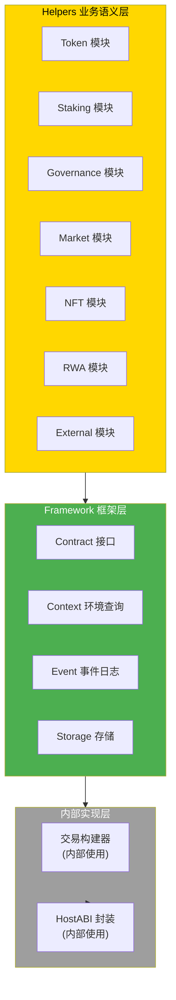

# Contract SDK Go - API 参考

**版本**: v1.0.0  
<<<<<<< Updated upstream
<<<<<<< Updated upstream
<<<<<<< Updated upstream
<<<<<<< Updated upstream
<<<<<<< Updated upstream
**最后更新**: 2025-01-23
=======
**最后更新**: 2025-11-23
>>>>>>> Stashed changes
=======
**最后更新**: 2025-11-23
>>>>>>> Stashed changes
=======
**最后更新**: 2025-11-23
>>>>>>> Stashed changes
=======
**最后更新**: 2025-11-23
>>>>>>> Stashed changes
=======
**最后更新**: 2025-11-23
>>>>>>> Stashed changes

---

## 📋 文档定位

> **⚠️ 重要提示**: Framework 层是 SDK 的内部实现层，合约开发者**应优先使用 Helpers 层的业务语义接口**。Framework 层主要用于环境查询、事件发出等基础能力。

**本文档目标**：
- 提供 Go SDK 的完整 API 参考
- 说明 Framework 层和 Helpers 层的接口
- 提供使用示例和最佳实践

---

## 🏗️ SDK 分层架构



---

## 🔧 Framework 层 API

### 环境查询

#### GetCaller

获取当前调用的调用者地址。

```go
func GetCaller() []byte
```

**返回值**：
- `[]byte` - 调用者地址（字节数组）

**示例**：
```go
import "github.com/weisyn/contract-sdk-go/framework"

caller := framework.GetCaller()
// caller 是调用者的地址
```

#### GetCallParams

获取当前调用的参数。

```go
func GetCallParams() []byte
```

**返回值**：
- `[]byte` - 调用参数（字节数组，通常是 JSON 格式）

**示例**：
```go
import "github.com/weisyn/contract-sdk-go/framework"

params := framework.GetCallParams()
// params 是调用参数
```

### 事件日志

#### EmitEvent

发出事件。

```go
func EmitEvent(eventType string, data []byte)
```

**参数**：
- `eventType` - 事件类型（字符串）
- `data` - 事件数据（字节数组）

**示例**：
```go
import "github.com/weisyn/contract-sdk-go/framework"

framework.EmitEvent("Transfer", []byte("from:alice,to:bob,amount:100"))
```

### 返回值设置

#### SetReturnData

设置返回值。

```go
func SetReturnData(data []byte)
```

**参数**：
- `data` - 返回数据（字节数组）

**示例**：
```go
import "github.com/weisyn/contract-sdk-go/framework"

framework.SetReturnData([]byte("success"))
```

### 错误码常量

```go
const (
    SUCCESS uint32 = 0
    ERROR_INVALID_PARAMS uint32 = 1
    ERROR_INSUFFICIENT_BALANCE uint32 = 2
    // ... 更多错误码
)
```

---

## 💼 Helpers 层 API

### Token 模块

#### Transfer

转账 Token。

```go
func Transfer(params []byte) uint32
```

**参数**：
- `params` - 转账参数（JSON 格式：`{"to": "address", "amount": 100}`）

**返回值**：
- `uint32` - 错误码（`framework.SUCCESS` 表示成功）

**示例**：
```go
import "github.com/weisyn/contract-sdk-go/helpers/token"

params := []byte(`{"to": "0x1234...", "amount": 100}`)
errCode := token.Transfer(params)
if errCode != framework.SUCCESS {
    return errCode
}
```

#### Mint

铸造 Token。

```go
func Mint(params []byte) uint32
```

**参数**：
- `params` - 铸造参数（JSON 格式：`{"to": "address", "amount": 100}`）

**返回值**：
- `uint32` - 错误码

#### BalanceOf

查询余额。

```go
func BalanceOf(address []byte) uint64
```

**参数**：
- `address` - 地址（字节数组）

**返回值**：
- `uint64` - 余额

---

### Staking 模块

#### Stake

质押。

```go
func Stake(params []byte) uint32
```

**参数**：
- `params` - 质押参数（JSON 格式：`{"amount": 100}`）

**返回值**：
- `uint32` - 错误码

#### Unstake

解质押。

```go
func Unstake(params []byte) uint32
```

**参数**：
- `params` - 解质押参数（JSON 格式：`{"amount": 100}`）

**返回值**：
- `uint32` - 错误码

---

### Governance 模块

#### CreateProposal

创建提案。

```go
func CreateProposal(params []byte) uint32
```

**参数**：
- `params` - 提案参数（JSON 格式）

**返回值**：
- `uint32` - 错误码

#### Vote

投票。

```go
func Vote(params []byte) uint32
```

**参数**：
- `params` - 投票参数（JSON 格式：`{"proposalId": 1, "option": "yes"}`）

**返回值**：
- `uint32` - 错误码

---

## 📖 进一步阅读

### 核心文档

- **[开发者指南](./DEVELOPER_GUIDE.md)** - 如何使用 Go SDK 开发合约
- **[业务场景实现指南](./BUSINESS_SCENARIOS.md)** - 如何实现业务场景
- **[WES Error Spec 实施](./WES_ERROR_SPEC_IMPLEMENTATION.md)** - 错误处理规范

### 模块文档

- **[Helpers 层文档](../helpers/README.md)** - 业务语义层详细说明
- **[Framework 层文档](../framework/README.md)** - 框架层详细说明

### 平台文档（主仓库）

- [HostABI 规范](../../../weisyn.git/docs/components/core/ispc/capabilities/hostabi-primitives.md) - HostABI 原语能力

---

<<<<<<< Updated upstream
<<<<<<< Updated upstream
<<<<<<< Updated upstream
<<<<<<< Updated upstream
<<<<<<< Updated upstream
**最后更新**: 2025-01-23  
=======
**最后更新**: 2025-11-23  
>>>>>>> Stashed changes
=======
**最后更新**: 2025-11-23  
>>>>>>> Stashed changes
=======
**最后更新**: 2025-11-23  
>>>>>>> Stashed changes
=======
**最后更新**: 2025-11-23  
>>>>>>> Stashed changes
=======
**最后更新**: 2025-11-23  
>>>>>>> Stashed changes
**维护者**: WES Core Team

