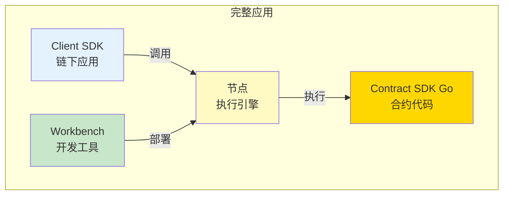
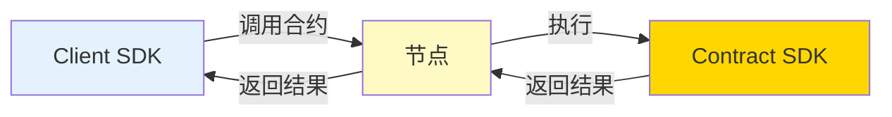
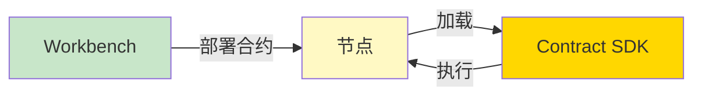

# 应用场景分析 - SDK 职责边界

**版本**: v1.0.0  
<<<<<<< Updated upstream
**最后更新**: 2025-01-23
=======
**最后更新**: 2025-11-23
>>>>>>> Stashed changes

---

## 📋 文档定位

> 📌 **重要说明**：本文档聚焦 **SDK 职责边界**分析。  
> 详细业务流图、跨子系统交互请参考主仓库文档。

**本文档目标**：
- 说明在某场景中，Go SDK 负责哪一段
- 分析 SDK 与 Client SDK、Workbench、节点的职责划分
- 帮助开发者理解 SDK 的边界和定位

**前置阅读**（平台级文档，来自主仓库）：
- [智能合约平台应用场景](../../../weisyn.git/docs/system/platforms/contracts/use-cases.md) - 平台级场景文档
- [业务场景分析](../../../weisyn.git/docs/system/platforms/contracts/use-cases.md) - 详细业务流图

---

## 🎯 SDK 职责定位

### 在完整应用中的位置

### SDK 职责

- ✅ **合约业务逻辑**：实现合约的业务逻辑
- ✅ **状态管理**：管理合约状态
- ✅ **事件发出**：发出合约事件
- ❌ **交易构建**：由 Framework 层内部处理
- ❌ **链下应用**：由 Client SDK 负责
- ❌ **开发工具**：由 Workbench 负责

---

## 📊 场景分析

### Token 转账场景

#### 完整流程

1. **链下应用**（Client SDK）：构建交易、签名
2. **节点**：验证交易、执行合约
3. **合约**（Contract SDK）：执行业务逻辑、更新状态
4. **节点**：返回结果、发出事件
5. **链下应用**（Client SDK）：监听事件、更新 UI

#### SDK 负责的部分

- ✅ 验证转账参数
- ✅ 检查余额
- ✅ 更新余额
- ✅ 发出事件
- ❌ 交易构建（由 Framework 层内部处理）
- ❌ 交易签名（由 Client SDK 负责）

---

## 🔗 与其他组件的交互

### 与 Client SDK 的交互

### 与 Workbench 的交互

---

## 📖 进一步阅读

### 核心文档

- **[SDK 内部架构](./SDK_ARCHITECTURE.md)** - SDK 内部分层架构设计
- **[场景可视化指南](./SCENARIOS_VISUAL_GUIDE.md)** - SDK 相关的简明架构图
- **[业务场景实现指南](./BUSINESS_SCENARIOS.md)** - 如何实现业务场景

### 平台文档（主仓库）

- [智能合约平台应用场景](../../../weisyn.git/docs/system/platforms/contracts/use-cases.md) - 平台级场景文档
- [业务场景分析](../../../weisyn.git/docs/system/platforms/contracts/use-cases.md) - 详细业务流图

---

<<<<<<< Updated upstream
**最后更新**: 2025-01-23  
=======
**最后更新**: 2025-11-23  
>>>>>>> Stashed changes
**维护者**: WES Core Team

