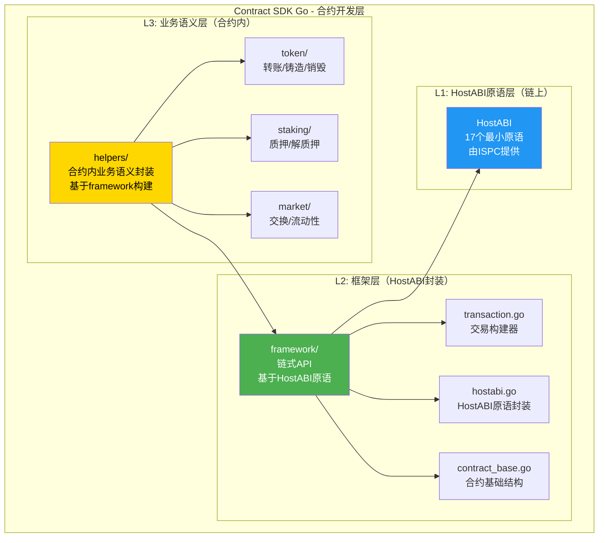

# Contract SDK Go 架构规划

**版本**: 1.0  
**状态**: ✅ 已完成  
**最后更新**: 2025-11-11  
**所有者**: WES Contract SDK 开发组

---

> **注意**: 本文档记录了 SDK 的架构设计规划。所有模块均已实现完成。

## 📋 文档目的

本文档基于 WES 系统架构文档（`docs/system/architecture/1-STRUCTURE_VIEW.md`）和 `client-sdk-go` 的设计模式，规划 `contract-sdk-go` 的架构和实现。

---

## 🎯 架构定位

### 在 WES 系统架构中的位置

根据 `1-STRUCTURE_VIEW.md` (212-429)，Contract SDK 位于：

```
🎨 应用层 & 开发者生态
  └── SDK 工具链
      └── Contract SDK (WASM)
          ├── Go/Rust/AS/C
          └── 📜 智能合约开发
```

**关键定位**：
- ✅ **链上合约开发**：用于编写 WASM 智能合约
- ✅ **编译为 WASM**：通过 TinyGo 编译为 WASM 字节码
- ✅ **通过交易部署**：编译后的 WASM 通过交易部署到链上
- ❌ **不是链下应用**：不用于 DApp、钱包等链下应用开发

### 与 Client SDK 的区别

| 维度 | Contract SDK | Client SDK |
|------|-------------|------------|
| **使用场景** | 链上合约开发（WASM） | 链下应用开发（DApp/钱包） |
| **编译目标** | WASM 字节码 | Go 可执行文件 |
| **运行环境** | 链上 ISPC 执行引擎 | 链下节点/客户端 |
| **API 基础** | HostABI 17个原语 | JSON-RPC/gRPC/WebSocket |
| **依赖关系** | 依赖 HostABI（链上） | 依赖 API 网关（链下） |
| **业务语义** | 合约内业务逻辑封装 | 链下业务服务调用 |

---

## 🏗️ 架构设计

### 分层架构



### 目录结构规划

```
contract-sdk-go/
├── framework/                    # L2: 框架层（HostABI封装）
│   ├── transaction.go           # 链式交易构建API
│   ├── hostabi.go               # HostABI原语封装
│   ├── contract_base.go         # 合约基础结构
│   ├── types.go                 # 类型定义
│   ├── errors.go                # 错误定义
│   └── README.md                # 框架层文档
│
├── helpers/             # L3: 业务语义层（合约内）
│   ├── token/                   # Token业务语义
│   │   ├── transfer.go          # 转账（基于framework）
│   │   ├── mint.go              # 铸造（基于framework）
│   │   ├── burn.go              # 销毁（基于framework）
│   │   ├── approve.go           # 授权（基于framework）
│   │   ├── freeze.go            # 冻结（基于framework）
│   │   ├── airdrop.go           # 空投（基于framework）
│   │   ├── types.go             # Token类型定义
│   │   ├── errors.go             # Token错误定义
│   │   └── README.md            # Token文档
│   │
│   ├── staking/                 # Staking业务语义
│   │   ├── stake.go             # 质押（基于framework）
│   │   ├── unstake.go           # 解质押（基于framework）
│   │   ├── delegate.go          # 委托（基于framework）
│   │   ├── types.go             # Staking类型定义
│   │   ├── errors.go            # Staking错误定义
│   │   └── README.md            # Staking文档
│   │
│   ├── market/                  # Market业务语义
│   │   ├── swap.go              # 交换（基于framework）
│   │   ├── liquidity.go        # 流动性（基于framework）
│   │   ├── vesting.go           # 归属（基于framework）
│   │   ├── escrow.go            # 托管（基于framework）
│   │   ├── types.go             # Market类型定义
│   │   ├── errors.go            # Market错误定义
│   │   └── README.md            # Market文档
│   │
│   ├── governance/              # Governance业务语义
│   │   ├── propose.go           # 提案（基于framework）
│   │   ├── vote.go              # 投票（基于framework）
│   │   ├── types.go             # Governance类型定义
│   │   ├── errors.go            # Governance错误定义
│   │   └── README.md            # Governance文档
│   │
│   ├── resource/                # Resource业务语义
│   │   ├── deploy.go            # 部署资源（基于framework）
│   │   ├── query.go             # 查询资源（基于framework）
│   │   ├── types.go             # Resource类型定义
│   │   ├── errors.go            # Resource错误定义
│   │   └── README.md            # Resource文档
│   │
│   └── README.md                # 业务语义层总览
│
├── examples/                     # 示例代码
│   ├── hello-world/             # Hello World示例
│   ├── simple-token/            # 简单代币合约
│   ├── token-with-helpers/      # 使用helpers的代币合约
│   ├── staking-contract/        # 质押合约示例
│   └── README.md                # 示例文档
│
├── tests/                        # 测试代码
│   ├── framework_test.go        # 框架层测试
│   ├── helpers_test.go          # 业务语义层测试
│   └── README.md                # 测试文档
│
├── scripts/                      # 构建脚本
│   ├── build.sh                 # 构建脚本
│   └── test.sh                  # 测试脚本
│
├── docs/                         # 文档
│   ├── ARCHITECTURE.md          # 架构文档
│   ├── API_REFERENCE.md         # API参考
│   └── DEVELOPER_GUIDE.md       # 开发者指南
│
├── go.mod                        # Go模块定义
├── README.md                     # SDK总览
└── ARCHITECTURE_PLAN.md          # 本文档
```

---

## 📐 层级职责

### L1: HostABI原语层（链上）

**定位**：由 ISPC 模块提供，不在 SDK 中实现

**职责**：
- 提供17个最小原语（无业务语义）
- 确定性区块视图（4个）
- 执行上下文（3个）
- UTXO查询（2个）
- 资源查询（2个）
- 交易草稿构建（4个）
- 执行追踪（2个）

**参考文档**：
- `docs/components/core/ispc/capabilities/hostabi-primitives.md`

---

### L2: 框架层（framework/）

**定位**：HostABI原语的封装，提供链式API

**职责**：
1. **HostABI封装**：封装17个原语为Go函数
2. **链式API**：提供Rust-like的链式交易构建API
3. **类型安全**：提供类型安全的API（Address、Amount、TokenID等）
4. **错误处理**：统一的错误码和错误处理
5. **合约基础**：提供ContractBase基础结构

**核心文件**：

#### `framework/transaction.go`
```go
// 链式交易构建API
type TransactionBuilder struct {
    draft *TransactionDraft
    err   error
}

func BeginTransaction() *TransactionBuilder
func (tb *TransactionBuilder) Transfer(from, to Address, tokenID TokenID, amount Amount) *TransactionBuilder
func (tb *TransactionBuilder) AddAssetOutput(to Address, tokenID TokenID, amount Amount) *TransactionBuilder
func (tb *TransactionBuilder) AddStateOutput(stateID []byte, version uint64, execHash []byte) *TransactionBuilder
func (tb *TransactionBuilder) Finalize() (success bool, txHash []byte, errCode uint32)
```

#### `framework/hostabi.go`
```go
// HostABI原语封装
func GetCaller() Address
func GetContractAddress() Address
func GetBlockHeight() uint64
func GetBlockTimestamp() uint64
func QueryUTXOBalance(address Address, tokenID TokenID) uint64
func QueryUTXOsByAddress(address Address, tokenID TokenID) []UTXO
func TxAddAssetOutput(to Address, tokenID TokenID, amount Amount) error
func TxAddStateOutput(stateID []byte, version uint64, execHash []byte) error
```

#### `framework/contract_base.go`
```go
// 合约基础结构
type ContractBase struct {
    Name    string
    Version string
}

func (cb *ContractBase) GetCaller() Address
func (cb *ContractBase) GetContractAddress() Address
func (cb *ContractBase) EmitEvent(topic string, data []byte) error
```

---

### L3: 业务语义层（helpers/）

**定位**：基于framework层构建业务语义API，供合约开发者使用

**职责**：
1. **业务语义封装**：提供Transfer、Mint、Stake等业务操作
2. **基于framework**：所有操作基于framework层构建
3. **类型安全**：提供类型安全的业务API
4. **错误处理**：业务级错误处理

**设计原则**：
- ✅ **不直接调用HostABI**：通过framework层调用
- ✅ **业务语义明确**：Transfer、Mint等操作清晰
- ✅ **类型安全**：使用framework的类型系统
- ✅ **可组合**：可以组合多个业务操作

**示例实现**：

#### `helpers/token/transfer.go`
```go
package token

import (
    "github.com/weisyn/contract-sdk-go/framework"
)

// Transfer 合约内转账操作
//
// 用途：在合约代码中执行转账
//
// 示例：
//  func Transfer() uint32 {
//      err := token.Transfer(
//          framework.GetCaller(),
//          recipientAddr,
//          nil,  // 原生币
//          framework.Amount(100),
//      )
//      if err != nil {
//          return framework.ERROR_INSUFFICIENT_BALANCE
//      }
//      return framework.SUCCESS
//  }
func Transfer(from, to framework.Address, tokenID framework.TokenID, amount framework.Amount) error {
    // 1. 查询余额（通过framework）
    balance := framework.QueryUTXOBalance(from, tokenID)
    if balance < uint64(amount) {
        return ErrInsufficientBalance
    }
    
    // 2. 构建交易（使用framework链式API）
    builder := framework.BeginTransaction()
    
    // 3. 选择UTXO（封装在helpers中）
    utxos := framework.QueryUTXOsByAddress(from, tokenID)
    selectedUTXOs := selectUTXOs(utxos, uint64(amount))
    
    // 4. 添加输入
    for _, utxo := range selectedUTXOs {
        builder.AddInput(utxo.OutPoint, false) // 消费型
    }
    
    // 5. 添加输出
    builder.AddAssetOutput(to, tokenID, amount)
    
    // 6. 找零（如果有）
    change := calculateChange(selectedUTXOs, uint64(amount))
    if change > 0 {
        builder.AddAssetOutput(from, tokenID, framework.Amount(change))
    }
    
    // 7. 完成构建
    success, _, errCode := builder.Finalize()
    if !success {
        return convertErrorCode(errCode)
    }
    
    return nil
}
```

---

## 🔄 与 Client SDK 的对比

### 架构对比

| 层级 | Contract SDK | Client SDK |
|------|-------------|------------|
| **L3: 业务语义层** | `helpers/`（合约内） | `services/`（链下） |
| **L2: 框架层** | `framework/`（HostABI封装） | `client/`（API网关封装） |
| **L1: 底层** | HostABI（链上ISPC） | API网关（链下节点） |

### API对比

#### Contract SDK（合约内）
```go
// 合约代码中使用
func Transfer() uint32 {
    err := token.Transfer(
        framework.GetCaller(),
        recipientAddr,
        nil,
        framework.Amount(100),
    )
    if err != nil {
        return framework.ERROR_INSUFFICIENT_BALANCE
    }
    return framework.SUCCESS
}
```

#### Client SDK（链下）
```go
// 链下应用中使用
tokenService := token.NewService(client)
result, err := tokenService.Transfer(ctx, &token.TransferRequest{
    From:   fromAddr,
    To:     toAddr,
    Amount: 1000,
})
```

---

## 📋 实施计划

### 阶段1：框架层完善（P0）

**目标**：完善framework层，提供完整的HostABI封装和链式API

**任务**：
- [ ] 完善 `framework/transaction.go` - 链式交易构建API
- [ ] 完善 `framework/hostabi.go` - HostABI原语封装
- [ ] 完善 `framework/contract_base.go` - 合约基础结构
- [ ] 完善 `framework/types.go` - 类型定义
- [ ] 完善 `framework/errors.go` - 错误定义
- [ ] 编写 `framework/README.md` - 框架层文档

**验收标准**：
- ✅ 所有17个HostABI原语都有对应的Go封装
- ✅ 链式API支持完整的交易构建流程
- ✅ 类型系统完整且类型安全
- ✅ 错误处理统一且清晰

---

### 阶段2：业务语义层创建（P1）

**目标**：创建helpers层，提供业务语义API

**任务**：
- [ ] 创建 `helpers/token/` - Token业务语义
  - [ ] `transfer.go` - 转账
  - [ ] `mint.go` - 铸造
  - [ ] `burn.go` - 销毁
  - [ ] `approve.go` - 授权
  - [ ] `freeze.go` - 冻结
  - [ ] `airdrop.go` - 空投
- [ ] 创建 `helpers/staking/` - Staking业务语义
- [ ] 创建 `helpers/market/` - Market业务语义
- [ ] 创建 `helpers/governance/` - Governance业务语义
- [ ] 创建 `helpers/resource/` - Resource业务语义
- [ ] 编写 `helpers/README.md` - 业务语义层文档

**验收标准**：
- ✅ 所有业务操作都基于framework层构建
- ✅ 不直接调用HostABI原语
- ✅ 类型安全且API清晰
- ✅ 错误处理完善

---

### 阶段3：迁移现有helpers（P2）

**目标**：将现有的helpers层迁移到helpers，或明确为链下服务

**任务**：
- [ ] 分析现有 `helpers/` 层的代码
- [ ] 确定哪些是合约内使用的（迁移到helpers）
- [ ] 确定哪些是链下使用的（标记为deprecated或迁移到client-sdk）
- [ ] 执行迁移或标记

**验收标准**：
- ✅ 合约内业务语义都在helpers中
- ✅ 链下业务服务都在client-sdk中
- ✅ 没有混淆的代码

---

### 阶段4：文档和示例（P3）

**目标**：完善文档和示例代码

**任务**：
- [ ] 编写 `ARCHITECTURE.md` - 架构文档
- [ ] 更新 `API_REFERENCE.md` - API参考
- [ ] 更新 `DEVELOPER_GUIDE.md` - 开发者指南
- [ ] 创建示例代码
  - [x] `examples/token/erc20-token/` - 使用helpers的代币合约 ✅ 已实现
  - [x] `examples/staking/basic-staking/` - 质押合约示例 ✅ 已实现

**验收标准**：
- ✅ 文档完整且清晰
- ✅ 示例代码可运行
- ✅ 开发者可以快速上手

---

## 🎯 设计原则

### 1. 分层清晰

- ✅ **L1（HostABI）**：由ISPC提供，不在SDK中实现
- ✅ **L2（framework）**：HostABI封装，提供链式API
- ✅ **L3（helpers）**：业务语义封装，基于framework构建

### 2. 职责单一

- ✅ **framework层**：只负责HostABI封装和交易构建
- ✅ **helpers层**：只负责业务语义封装
- ✅ **不混淆**：不将链下服务放在contract-sdk中

### 3. 类型安全

- ✅ **使用类型系统**：Address、Amount、TokenID等类型
- ✅ **编译期检查**：通过类型系统在编译期发现错误
- ✅ **运行时验证**：提供运行时验证和错误处理

### 4. 可组合性

- ✅ **基于framework构建**：所有业务操作都基于framework层
- ✅ **可组合操作**：可以组合多个业务操作
- ✅ **灵活扩展**：易于添加新的业务操作

---

## 📚 参考文档

### 架构文档
- `docs/system/architecture/1-STRUCTURE_VIEW.md` - 系统架构视图
- `docs/components/core/ispc/capabilities/hostabi-primitives.md` - HostABI原语能力
- `docs/components/core/tx/topics/minting.md` - 合约代币铸造设计

### 实现参考
- `_sdks/client-sdk-go/` - Client SDK实现参考
- `internal/core/ispc/hostabi/` - HostABI实现参考

---

## 📝 变更历史

| 版本 | 日期 | 变更内容 | 作者 |
|-----|------|---------|------|
| 1.0 | 2025-11-11 | 初始版本，创建架构规划 | WES Contract SDK 开发组 |

---

**文档状态**: 规划中  
**下一步**: 开始实施阶段1（框架层完善）

