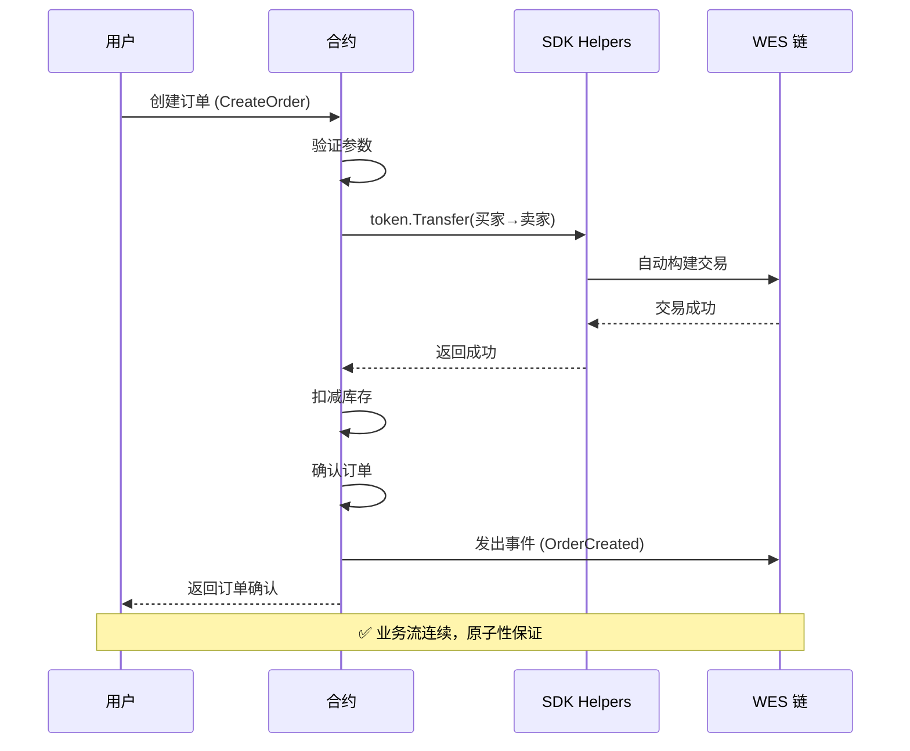
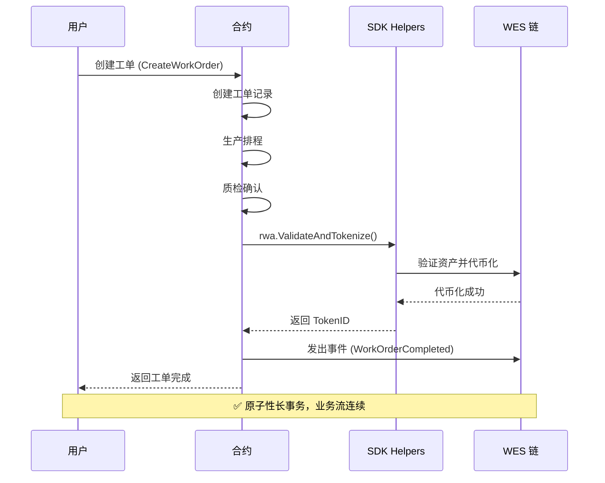
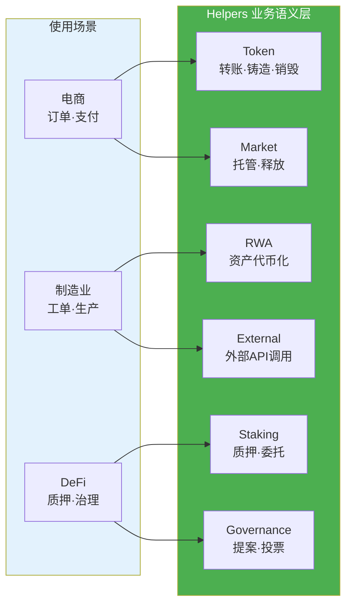

# 业务场景实现指南

**版本**: v1.0.0  
**状态**: ✅ 稳定  
**最后更新**: 2025-11-11

---

## 📋 概述

本文档从**用户视角**说明如何使用 WES 合约 SDK 实现常见的业务场景，包括电商、制造业等。重点关注**如何使用 SDK 提供的便捷操作**，而非底层技术细节。

---

## 🛒 电商场景

### 场景需求

**业务需求**：
- 用户下单
- 支付确认
- 库存扣减
- 订单确认

**关键要求**：
- 业务流连续，不中断
- 用户无需手动签名
- 自动完成整个流程

### 业务流程图



### 实现方案

**使用 SDK 提供的便捷操作**：

```go
package main

import (
	"github.com/weisyn/contract-sdk-go/helpers/token"
	"github.com/weisyn/contract-sdk-go/helpers/market"
	"github.com/weisyn/contract-sdk-go/framework"
)

//export CreateOrder
func CreateOrder() uint32 {
	params := framework.GetContractParams()
	orderID := params.ParseJSON("order_id")
	productID := params.ParseJSON("product_id")
	amount := params.ParseJSONUint64("amount")
	buyerStr := params.ParseJSON("buyer")
	sellerStr := params.ParseJSON("seller")
	
	// 解析地址
	buyer, err := framework.ParseAddressBase58(buyerStr)
	if err != nil {
		return framework.ERROR_INVALID_PARAMS
	}
	
	seller, err := framework.ParseAddressBase58(sellerStr)
	if err != nil {
		return framework.ERROR_INVALID_PARAMS
	}
	
	// 1. 创建订单（业务逻辑）
	order := createOrder(orderID, productID, amount, buyer, seller)
	
	// 2. 处理支付（使用SDK便捷操作）
	// SDK自动处理支付流程，业务流连续
	err = token.Transfer(
		buyer,
		seller,
		nil, // 默认代币
		framework.Amount(amount),
	)
	if err != nil {
		return framework.ERROR_EXECUTION_FAILED
	}
	
	// 3. 库存扣减（业务逻辑）
	reduceInventory(productID, 1)
	
	// 4. 订单确认（业务逻辑）
	confirmOrder(orderID)
	
	// 发出事件
	event := framework.NewEvent("OrderCreated")
	event.AddStringField("order_id", orderID)
	event.AddAddressField("buyer", buyer)
	event.AddAddressField("seller", seller)
	event.AddUint64Field("amount", amount)
	framework.EmitEvent(event)
	
	// ✅ 业务流连续，用户直接获得订单确认结果
	return framework.SUCCESS
}

//export EscrowOrder
func EscrowOrder() uint32 {
	params := framework.GetContractParams()
	orderID := params.ParseJSON("order_id")
	buyerStr := params.ParseJSON("buyer")
	sellerStr := params.ParseJSON("seller")
	amount := params.ParseJSONUint64("amount")
	
	buyer, _ := framework.ParseAddressBase58(buyerStr)
	seller, _ := framework.ParseAddressBase58(sellerStr)
	
	// 使用SDK的托管功能
	err := market.Escrow(
		buyer,
		seller,
		nil, // 代币ID
		framework.Amount(amount),
		orderID, // 托管ID
	)
	if err != nil {
		return framework.ERROR_EXECUTION_FAILED
	}
	
	return framework.SUCCESS
}

//export ReleaseOrder
func ReleaseOrder() uint32 {
	params := framework.GetContractParams()
	orderID := params.ParseJSON("order_id")
	sellerStr := params.ParseJSON("seller")
	buyerStr := params.ParseJSON("buyer")
	
	seller, _ := framework.ParseAddressBase58(sellerStr)
	buyer, _ := framework.ParseAddressBase58(buyerStr)
	
	// 使用SDK的释放功能
	err := market.Release(
		seller,
		buyer,
		nil, // 代币ID
		framework.Amount(0), // 从托管中释放
		orderID, // 托管ID
	)
	if err != nil {
		return framework.ERROR_EXECUTION_FAILED
	}
	
	return framework.SUCCESS
}
```

### 关键点

1. **使用 SDK 业务接口**：`token.Transfer()`、`market.Escrow()` 等
2. **业务流连续**：SDK 自动处理，无需用户手动签名
3. **专注业务逻辑**：开发者只需关注业务语义，无需关心底层实现

---

## 🏭 制造业场景

### 场景需求

**业务需求**：
- 工单创建
- 生产排程
- 质检确认
- 出库处理

**关键要求**：
- 业务流连续，不中断
- 自动完成整个流程

### 业务流程图



### 实现方案

```go
package main

import (
	"github.com/weisyn/contract-sdk-go/helpers/token"
	"github.com/weisyn/contract-sdk-go/helpers/rwa"
	"github.com/weisyn/contract-sdk-go/framework"
)

//export CreateWorkOrder
func CreateWorkOrder() uint32 {
	params := framework.GetContractParams()
	workOrderID := params.ParseJSON("work_order_id")
	productID := params.ParseJSON("product_id")
	quantity := params.ParseJSONUint64("quantity")
	
	// 1. 创建工单（业务逻辑）
	workOrder := createWorkOrder(workOrderID, productID, quantity)
	
	// 2. 生产排程（业务逻辑）
	scheduleProduction(workOrderID, quantity)
	
	// 3. 质检确认（业务逻辑）
	qualityCheck(workOrderID)
	
	// 4. 出库处理（使用SDK便捷操作）
	// 将生产的产品代币化
	result, err := rwa.ValidateAndTokenize(
		workOrderID,
		[]byte(`{"product_id":"`+productID+`","quantity":`+framework.Uint64ToString(quantity)+`}`),
		"", // 验证API（可选）
		nil, // 验证佐证（可选）
		"", // 估值API（可选）
		nil, // 估值佐证（可选）
	)
	if err != nil {
		return framework.ERROR_EXECUTION_FAILED
	}
	
	// 发出事件
	event := framework.NewEvent("WorkOrderCompleted")
	event.AddStringField("work_order_id", workOrderID)
	event.AddStringField("product_id", productID)
	event.AddUint64Field("quantity", quantity)
	event.AddStringField("token_id", result.TokenID)
	framework.EmitEvent(event)
	
	// ✅ 业务流连续，用户直接获得工单完成结果
	return framework.SUCCESS
}
```

### 关键点

1. **使用 SDK 业务接口**：`rwa.ValidateAndTokenize()` 等
2. **业务流连续**：SDK 自动处理，无需用户手动签名
3. **专注业务逻辑**：开发者只需关注业务语义

---

## 📊 SDK 提供的便捷操作

### SDK 模块概览



### Token 模块

**转账**：
```go
err := token.Transfer(from, to, tokenID, amount)
```

**铸造**：
```go
err := token.Mint(to, tokenID, amount)
```

**销毁**：
```go
err := token.Burn(from, tokenID, amount)
```

### Market 模块

**托管**：
```go
err := market.Escrow(buyer, seller, tokenID, amount, escrowID)
```

**释放**：
```go
err := market.Release(from, beneficiary, tokenID, amount, vestingID)
```

### RWA 模块

**验证并代币化**：
```go
result, err := rwa.ValidateAndTokenize(
	assetID,
	documents,
	validatorAPI,
	validatorEvidence,
	valuationAPI,
	valuationEvidence,
)
```

### Governance 模块

**投票**：
```go
result, err := governance.VoteAndCount(
	proposalID,
	voter,
	voteOption,
	votingPower,
)
```

---

## 🎯 最佳实践

### 1. 优先使用业务语义接口

**✅ 推荐**：使用 `helpers` 层的业务语义接口

```go
import "github.com/weisyn/contract-sdk-go/helpers/token"

err := token.Transfer(from, to, tokenID, amount)
```

**❌ 不推荐**：直接使用 Framework 层的底层接口（除非有特殊需求）

```go
import "github.com/weisyn/contract-sdk-go/framework"

// 不推荐：除非有特殊需求
framework.BeginTransaction().Transfer(...).Finalize()
```

### 2. 专注业务逻辑

**✅ 推荐**：专注于业务语义的实现

```go
func CreateOrder() uint32 {
	// 业务逻辑：创建订单
	order := createOrder(...)
	
	// 使用SDK便捷操作：处理支付
	err := token.Transfer(...)
	
	// 业务逻辑：确认订单
	confirmOrder(...)
	
	return framework.SUCCESS
}
```

### 3. 使用事件记录业务状态

**✅ 推荐**：使用事件记录重要的业务状态变化

```go
event := framework.NewEvent("OrderCreated")
event.AddStringField("order_id", orderID)
event.AddAddressField("buyer", buyer)
framework.EmitEvent(event)
```

---

## 📚 相关文档

- **[开发者指南](./DEVELOPER_GUIDE.md)** - 如何使用 SDK 开发合约
- **[API 参考](./API_REFERENCE.md)** - SDK 接口详细说明
- **[应用场景分析](./APPLICATION_SCENARIOS_ANALYSIS.md)** - 更多业务场景分析
- **[示例代码](../examples/README.md)** - 完整的示例代码

---

**最后更新**: 2025-11-11

