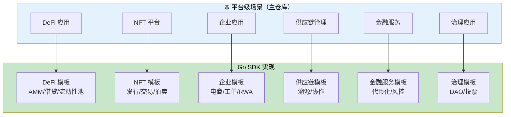
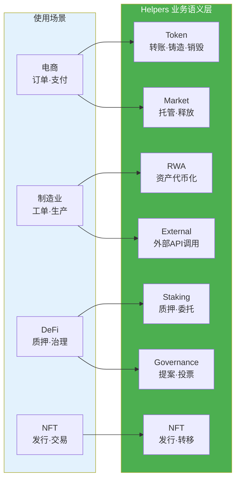

# 业务场景实现指南 - Go SDK 视角

**版本**: v2.0.0  
**状态**: ✅ 稳定  
**最后更新**: 2025-01-23

---

## 📋 文档定位

> 📌 **重要说明**：本文档聚焦 **Go SDK 视角**的业务场景实现指南。  
> 每个场景的前半部分会链接到主仓库的平台级场景文档，后半部分给出 Go SDK 版本的实现建议。

**本文档目标**：
- 将平台级场景文档中的场景映射到 Go SDK 实现
- 提供 Go SDK 版本的实现建议、模板指引和关键 API
- 帮助开发者快速找到适合的模板和 API

**前置阅读**（平台级文档，来自主仓库）：
- [智能合约平台应用场景](../../../weisyn.git/docs/system/platforms/contracts/use-cases.md) - 平台级应用场景文档
- [智能合约平台文档](../../../weisyn.git/docs/system/platforms/contracts/README.md) - 平台级文档总览

---

## 🎯 场景实现概览



---

## 💰 DeFi 应用

### 📖 平台级场景文档

> 📌 **平台级场景**：参考 [DeFi 应用](../../../weisyn.git/docs/system/platforms/contracts/use-cases.md#-defi-应用)（主仓库）

**平台级场景包括**：
- AMM DEX（去中心化交易所）
- 借贷协议
- 流动性池

### 🔧 Go SDK 实现

#### 1. AMM DEX

**推荐模板**：
- `templates/standard/defi/amm/` - AMM DEX 模板

**关键 API**：

```go
import (
    "github.com/weisyn/contract-sdk-go/helpers/token"
    "github.com/weisyn/contract-sdk-go/framework"
)

// 代币交换
func Swap() uint32 {
    params := framework.GetContractParams()
    fromTokenID := params.ParseJSON("from_token_id")
    toTokenID := params.ParseJSON("to_token_id")
    amountIn := params.ParseJSONInt("amount_in")
    
    caller := framework.GetCaller()
    
    // 1. 从用户账户扣除输入代币
    err := token.Transfer(caller, contractAddress, fromTokenID, framework.Amount(amountIn))
    if err != nil {
        return framework.ERROR_EXECUTION_FAILED
    }
    
    // 2. 计算输出代币数量（AMM 算法）
    amountOut := calculateSwapOutput(amountIn, fromTokenID, toTokenID)
    
    // 3. 向用户账户转入输出代币
    err = token.Transfer(contractAddress, caller, toTokenID, framework.Amount(amountOut))
    if err != nil {
        return framework.ERROR_EXECUTION_FAILED
    }
    
    return framework.SUCCESS
}
```

**实现要点**：
- 使用 `helpers/token` 模块进行代币转账
- 实现 AMM 算法（恒定乘积公式等）
- 使用事件记录交换信息

#### 2. 借贷协议

**推荐模板**：
- `templates/standard/defi/lending/` - 借贷协议模板

**关键 API**：

```go
import (
    "github.com/weisyn/contract-sdk-go/helpers/token"
    "github.com/weisyn/contract-sdk-go/framework"
)

// 存款
func Deposit() uint32 {
    params := framework.GetContractParams()
    tokenID := params.ParseJSON("token_id")
    amount := params.ParseJSONInt("amount")
    
    caller := framework.GetCaller()
    
    // 从用户账户转入合约
    err := token.Transfer(caller, contractAddress, tokenID, framework.Amount(amount))
    if err != nil {
        return framework.ERROR_EXECUTION_FAILED
    }
    
    // 记录存款信息
    // ...
    
    return framework.SUCCESS
}

// 借款
func Borrow() uint32 {
    params := framework.GetContractParams()
    tokenID := params.ParseJSON("token_id")
    amount := params.ParseJSONInt("amount")
    
    caller := framework.GetCaller()
    
    // 检查抵押品
    // ...
    
    // 从合约转出到用户账户
    err := token.Transfer(contractAddress, caller, tokenID, framework.Amount(amount))
    if err != nil {
        return framework.ERROR_EXECUTION_FAILED
    }
    
    return framework.SUCCESS
}
```

**实现要点**：
- 使用 `helpers/token` 模块管理资金
- 实现抵押品检查逻辑
- 实现利率计算逻辑

#### 3. 流动性池

**推荐模板**：
- `templates/standard/defi/liquidity-pool/` - 流动性池模板

**关键 API**：

```go
import (
    "github.com/weisyn/contract-sdk-go/helpers/token"
    "github.com/weisyn/contract-sdk-go/framework"
)

// 添加流动性
func AddLiquidity() uint32 {
    params := framework.GetContractParams()
    tokenAID := params.ParseJSON("token_a_id")
    tokenBID := params.ParseJSON("token_b_id")
    amountA := params.ParseJSONInt("amount_a")
    amountB := params.ParseJSONInt("amount_b")
    
    caller := framework.GetCaller()
    
    // 从用户账户转入代币
    err := token.Transfer(caller, contractAddress, tokenAID, framework.Amount(amountA))
    if err != nil {
        return framework.ERROR_EXECUTION_FAILED
    }
    
    err = token.Transfer(caller, contractAddress, tokenBID, framework.Amount(amountB))
    if err != nil {
        return framework.ERROR_EXECUTION_FAILED
    }
    
    // 发行流动性代币
    // ...
    
    return framework.SUCCESS
}
```

**实现要点**：
- 使用 `helpers/token` 模块管理流动性
- 实现流动性代币发行逻辑
- 实现手续费分配逻辑

---

## 🎨 NFT 平台

### 📖 平台级场景文档

> 📌 **平台级场景**：参考 [NFT 平台](../../../weisyn.git/docs/system/platforms/contracts/use-cases.md#-nft-平台)（主仓库）

**平台级场景包括**：
- 数字艺术
- 游戏道具
- 身份认证

### 🔧 Go SDK 实现

#### 1. NFT 发行与交易

**推荐模板**：
- `templates/standard/nft/` - NFT 模板集合

**关键 API**：

```go
import (
    "github.com/weisyn/contract-sdk-go/helpers/nft"
    "github.com/weisyn/contract-sdk-go/framework"
)

// 铸造 NFT
func MintNFT() uint32 {
    params := framework.GetContractParams()
    toStr := params.ParseJSON("to")
    tokenURI := params.ParseJSON("token_uri")
    
    to, err := framework.ParseAddressBase58(toStr)
    if err != nil {
        return framework.ERROR_INVALID_PARAMS
    }
    
    // 使用 NFT helpers 模块
    tokenID, err := nft.Mint(to, tokenURI)
    if err != nil {
        return framework.ERROR_EXECUTION_FAILED
    }
    
    // 发出事件
    event := framework.NewEvent("NFTMinted")
    event.AddAddressField("to", to)
    event.AddStringField("token_id", string(tokenID))
    event.AddStringField("token_uri", tokenURI)
    framework.EmitEvent(event)
    
    return framework.SUCCESS
}

// 转移 NFT
func TransferNFT() uint32 {
    params := framework.GetContractParams()
    toStr := params.ParseJSON("to")
    tokenIDStr := params.ParseJSON("token_id")
    
    to, err := framework.ParseAddressBase58(toStr)
    if err != nil {
        return framework.ERROR_INVALID_PARAMS
    }
    
    tokenID, err := framework.ParseTokenID(tokenIDStr)
    if err != nil {
        return framework.ERROR_INVALID_PARAMS
    }
    
    caller := framework.GetCaller()
    err = nft.Transfer(caller, to, tokenID)
    if err != nil {
        return framework.ERROR_EXECUTION_FAILED
    }
    
    return framework.SUCCESS
}
```

**实现要点**：
- 使用 `helpers/nft` 模块进行 NFT 操作
- 实现 NFT 元数据管理
- 实现 NFT 交易逻辑

---

## 🏢 企业应用

### 📖 平台级场景文档

> 📌 **平台级场景**：参考 [企业应用](../../../weisyn.git/docs/system/platforms/contracts/use-cases.md#-企业应用)（主仓库）

**平台级场景包括**：
- 电商平台
- 数字身份
- 合规审计

### 🔧 Go SDK 实现

#### 1. 电商场景：订单、支付、库存管理

**推荐模板**：
- `templates/standard/market/escrow/` - 托管模板
- `templates/standard/market/vesting/` - 分阶段释放模板

**关键 API**：

```go
import (
    "github.com/weisyn/contract-sdk-go/helpers/token"
    "github.com/weisyn/contract-sdk-go/helpers/market"
    "github.com/weisyn/contract-sdk-go/framework"
)

// 创建订单
func CreateOrder() uint32 {
    params := framework.GetContractParams()
    orderID := params.ParseJSON("order_id")
    productID := params.ParseJSON("product_id")
    amount := params.ParseJSONUint64("amount")
    buyerStr := params.ParseJSON("buyer")
    sellerStr := params.ParseJSON("seller")
    
    buyer, err := framework.ParseAddressBase58(buyerStr)
    if err != nil {
        return framework.ERROR_INVALID_PARAMS
    }
    
    seller, err := framework.ParseAddressBase58(sellerStr)
    if err != nil {
        return framework.ERROR_INVALID_PARAMS
    }
    
    // 1. 创建订单（业务逻辑）
    order := createOrder(orderID, productID, amount, buyer, seller)
    
    // 2. 处理支付（使用SDK便捷操作）
    // SDK自动处理支付流程，业务流连续
    err = token.Transfer(
        buyer,
        seller,
        nil, // 默认代币
        framework.Amount(amount),
    )
    if err != nil {
        return framework.ERROR_EXECUTION_FAILED
    }
    
    // 3. 库存扣减（业务逻辑）
    reduceInventory(productID, 1)
    
    // 4. 订单确认（业务逻辑）
    confirmOrder(orderID)
    
    // 发出事件
    event := framework.NewEvent("OrderCreated")
    event.AddStringField("order_id", orderID)
    event.AddAddressField("buyer", buyer)
    event.AddAddressField("seller", seller)
    event.AddUint64Field("amount", amount)
    framework.EmitEvent(event)
    
    return framework.SUCCESS
}

// 托管订单
func EscrowOrder() uint32 {
    params := framework.GetContractParams()
    orderID := params.ParseJSON("order_id")
    buyerStr := params.ParseJSON("buyer")
    sellerStr := params.ParseJSON("seller")
    amount := params.ParseJSONUint64("amount")
    
    buyer, _ := framework.ParseAddressBase58(buyerStr)
    seller, _ := framework.ParseAddressBase58(sellerStr)
    
    // 使用SDK的托管功能
    err := market.Escrow(
        buyer,
        seller,
        nil, // 代币ID
        framework.Amount(amount),
        orderID, // 托管ID
    )
    if err != nil {
        return framework.ERROR_EXECUTION_FAILED
    }
    
    return framework.SUCCESS
}

// 释放订单
func ReleaseOrder() uint32 {
    params := framework.GetContractParams()
    orderID := params.ParseJSON("order_id")
    sellerStr := params.ParseJSON("seller")
    buyerStr := params.ParseJSON("buyer")
    
    seller, _ := framework.ParseAddressBase58(sellerStr)
    buyer, _ := framework.ParseAddressBase58(buyerStr)
    
    // 使用SDK的释放功能
    err := market.Release(
        seller,
        buyer,
        nil, // 代币ID
        framework.Amount(0), // 从托管中释放
        orderID, // 托管ID
    )
    if err != nil {
        return framework.ERROR_EXECUTION_FAILED
    }
    
    return framework.SUCCESS
}
```

**实现要点**：
- 使用 `helpers/token` 模块处理支付
- 使用 `helpers/market` 模块实现托管和释放
- 业务流连续，SDK 自动处理，无需用户手动签名

#### 2. 制造业场景：工单、生产、质检

**推荐模板**：
- `templates/standard/rwa/` - RWA 模板

**关键 API**：

```go
import (
    "github.com/weisyn/contract-sdk-go/helpers/rwa"
    "github.com/weisyn/contract-sdk-go/framework"
)

// 创建工单
func CreateWorkOrder() uint32 {
    params := framework.GetContractParams()
    workOrderID := params.ParseJSON("work_order_id")
    productID := params.ParseJSON("product_id")
    quantity := params.ParseJSONUint64("quantity")
    
    // 1. 创建工单（业务逻辑）
    workOrder := createWorkOrder(workOrderID, productID, quantity)
    
    // 2. 生产排程（业务逻辑）
    scheduleProduction(workOrderID, quantity)
    
    // 3. 质检确认（业务逻辑）
    qualityCheck(workOrderID)
    
    // 4. 出库处理（使用SDK便捷操作）
    // 将生产的产品代币化
    result, err := rwa.ValidateAndTokenize(
        workOrderID,
        []byte(`{"product_id":"`+productID+`","quantity":`+framework.Uint64ToString(quantity)+`}`),
        "", // 验证API（可选）
        nil, // 验证佐证（可选）
        "", // 估值API（可选）
        nil, // 估值佐证（可选）
    )
    if err != nil {
        return framework.ERROR_EXECUTION_FAILED
    }
    
    // 发出事件
    event := framework.NewEvent("WorkOrderCompleted")
    event.AddStringField("work_order_id", workOrderID)
    event.AddStringField("product_id", productID)
    event.AddUint64Field("quantity", quantity)
    event.AddStringField("token_id", result.TokenID)
    framework.EmitEvent(event)
    
    return framework.SUCCESS
}
```

**实现要点**：
- 使用 `helpers/rwa` 模块进行资产验证和代币化
- 业务流连续，SDK 自动处理，无需用户手动签名
- 支持外部 API 调用（受控外部交互）

---

## 🔗 供应链管理

### 📖 平台级场景文档

> 📌 **平台级场景**：参考 [供应链管理](../../../weisyn.git/docs/system/platforms/contracts/use-cases.md#-供应链管理)（主仓库）

**平台级场景包括**：
- 溯源追踪
- 多方协作
- 自动化结算

### 🔧 Go SDK 实现

**推荐模板**：
- `templates/standard/rwa/` - RWA 模板（可用于溯源）

**关键 API**：

```go
import (
    "github.com/weisyn/contract-sdk-go/helpers/rwa"
    "github.com/weisyn/contract-sdk-go/helpers/external"
    "github.com/weisyn/contract-sdk-go/framework"
)

// 溯源记录
func RecordTrace() uint32 {
    params := framework.GetContractParams()
    productID := params.ParseJSON("product_id")
    location := params.ParseJSON("location")
    timestamp := params.ParseJSON("timestamp")
    
    // 调用外部 API 验证位置信息（受控外部交互）
    data, err := external.CallAPI(
        "https://api.example.com/verify-location",
        "POST",
        map[string]interface{}{
            "product_id": productID,
            "location": location,
            "timestamp": timestamp,
        },
        apiSignature,
        responseHash,
    )
    if err != nil {
        return framework.ERROR_EXECUTION_FAILED
    }
    
    // 记录溯源信息
    // ...
    
    return framework.SUCCESS
}
```

**实现要点**：
- 使用 `helpers/external` 模块调用外部 API 进行验证
- 使用 `helpers/rwa` 模块进行资产代币化
- 实现多方协作逻辑

---

## 💼 金融服务

### 📖 平台级场景文档

> 📌 **平台级场景**：参考 [金融服务](../../../weisyn.git/docs/system/platforms/contracts/use-cases.md#-金融服务)（主仓库）

**平台级场景包括**：
- 资产代币化
- 自动化风控
- 收益分配

### 🔧 Go SDK 实现

**推荐模板**：
- `templates/standard/rwa/` - RWA 模板
- `templates/standard/staking/` - 质押模板

**关键 API**：

```go
import (
    "github.com/weisyn/contract-sdk-go/helpers/rwa"
    "github.com/weisyn/contract-sdk-go/helpers/staking"
    "github.com/weisyn/contract-sdk-go/framework"
)

// 资产代币化
func TokenizeAsset() uint32 {
    params := framework.GetContractParams()
    assetID := params.ParseJSON("asset_id")
    documents := params.ParseJSON("documents")
    
    // 使用 RWA 模块进行资产验证和代币化
    result, err := rwa.ValidateAndTokenize(
        assetID,
        []byte(documents),
        validatorAPI,      // 验证服务API
        validatorEvidence, // 验证佐证
        valuationAPI,      // 估值服务API
        valuationEvidence, // 估值佐证
    )
    if err != nil {
        return framework.ERROR_EXECUTION_FAILED
    }
    
    // 发出事件
    event := framework.NewEvent("AssetTokenized")
    event.AddStringField("asset_id", assetID)
    event.AddStringField("token_id", result.TokenID)
    framework.EmitEvent(event)
    
    return framework.SUCCESS
}
```

**实现要点**：
- 使用 `helpers/rwa` 模块进行资产验证和代币化
- 支持外部 API 调用（受控外部交互）
- 实现收益分配逻辑

---

## 🗳️ 治理应用

### 📖 平台级场景文档

> 📌 **平台级场景**：参考 [治理应用](../../../weisyn.git/docs/system/platforms/contracts/use-cases.md#-治理应用)（主仓库）

**平台级场景包括**：
- DAO 治理
- 提案投票
- 社区决策

### 🔧 Go SDK 实现

**推荐模板**：
- `templates/standard/governance/dao/` - DAO 治理模板
- `templates/standard/governance/proposal-voting/` - 提案投票模板

**关键 API**：

```go
import (
    "github.com/weisyn/contract-sdk-go/helpers/governance"
    "github.com/weisyn/contract-sdk-go/framework"
)

// 创建提案
func Propose() uint32 {
    params := framework.GetContractParams()
    title := params.ParseJSON("title")
    content := params.ParseJSON("content")
    
    caller := framework.GetCaller()
    
    // 使用 Governance 模块创建提案
    proposalID, err := governance.Propose(caller, title, content)
    if err != nil {
        return framework.ERROR_EXECUTION_FAILED
    }
    
    // 发出事件
    event := framework.NewEvent("ProposalCreated")
    event.AddAddressField("proposer", caller)
    event.AddStringField("proposal_id", string(proposalID))
    framework.EmitEvent(event)
    
    return framework.SUCCESS
}

// 投票
func Vote() uint32 {
    params := framework.GetContractParams()
    proposalIDStr := params.ParseJSON("proposal_id")
    support := params.ParseJSONBool("support")
    
    proposalID, err := framework.ParseBytes(proposalIDStr)
    if err != nil {
        return framework.ERROR_INVALID_PARAMS
    }
    
    caller := framework.GetCaller()
    
    // 使用 Governance 模块投票
    result, err := governance.VoteAndCount(caller, proposalID, support)
    if err != nil {
        return framework.ERROR_EXECUTION_FAILED
    }
    
    // 发出事件
    event := framework.NewEvent("VoteRecorded")
    event.AddAddressField("voter", caller)
    event.AddStringField("proposal_id", string(proposalID))
    event.AddBoolField("support", support)
    event.AddUint64Field("total_votes", result.TotalVotes)
    framework.EmitEvent(event)
    
    return framework.SUCCESS
}
```

**实现要点**：
- 使用 `helpers/governance` 模块进行提案和投票
- 实现投票统计逻辑
- 实现提案执行逻辑

---

## 📊 SDK 提供的便捷操作

### SDK 模块概览



### 模块 API 速查

#### Token 模块

```go
import "github.com/weisyn/contract-sdk-go/helpers/token"

// 转账
err := token.Transfer(from, to, tokenID, amount)

// 铸造
err := token.Mint(to, tokenID, amount)

// 销毁
err := token.Burn(from, tokenID, amount)
```

#### Market 模块

```go
import "github.com/weisyn/contract-sdk-go/helpers/market"

// 托管
err := market.Escrow(buyer, seller, tokenID, amount, escrowID)

// 释放
err := market.Release(from, beneficiary, tokenID, amount, vestingID)
```

#### RWA 模块

```go
import "github.com/weisyn/contract-sdk-go/helpers/rwa"

// 验证并代币化
result, err := rwa.ValidateAndTokenize(
    assetID,
    documents,
    validatorAPI,
    validatorEvidence,
    valuationAPI,
    valuationEvidence,
)
```

#### Governance 模块

```go
import "github.com/weisyn/contract-sdk-go/helpers/governance"

// 投票并统计
result, err := governance.VoteAndCount(
    proposalID,
    voter,
    voteOption,
    votingPower,
)
```

#### External 模块

```go
import "github.com/weisyn/contract-sdk-go/helpers/external"

// 调用外部 API（受控外部交互）
data, err := external.CallAPI(
    url,
    method,
    params,
    apiSignature,
    responseHash,
)
```

> 📖 **详细 API 文档**：参考 [API 参考](./API_REFERENCE.md) 和 [Helpers 层文档](../helpers/README.md)

---

## 🎯 最佳实践

### 1. 优先使用业务语义接口

**✅ 推荐**：使用 `helpers` 层的业务语义接口

```go
import "github.com/weisyn/contract-sdk-go/helpers/token"

err := token.Transfer(from, to, tokenID, amount)
```

**❌ 不推荐**：直接使用 Framework 层的底层接口（除非有特殊需求）

```go
import "github.com/weisyn/contract-sdk-go/framework"

// 不推荐：除非有特殊需求
framework.BeginTransaction().Transfer(...).Finalize()
```

### 2. 专注业务逻辑

**✅ 推荐**：专注于业务语义的实现

```go
func CreateOrder() uint32 {
    // 业务逻辑：创建订单
    order := createOrder(...)
    
    // 使用SDK便捷操作：处理支付
    err := token.Transfer(...)
    
    // 业务逻辑：确认订单
    confirmOrder(...)
    
    return framework.SUCCESS
}
```

### 3. 使用事件记录业务状态

**✅ 推荐**：使用事件记录重要的业务状态变化

```go
event := framework.NewEvent("OrderCreated")
event.AddStringField("order_id", orderID)
event.AddAddressField("buyer", buyer)
framework.EmitEvent(event)
```

---

## 🔗 相关文档

### SDK 文档

- [开发者指南](./DEVELOPER_GUIDE.md) - 如何使用 Go SDK 开发合约
- [API 参考](./API_REFERENCE.md) - Go SDK 接口详细说明
- [合约模板](../README.md#-合约模板) - SDK 提供的合约开发模板
- [模板中心](../templates/README.md) - 模板详细说明和使用指南

### 平台文档（主仓库）

- [智能合约平台应用场景](../../../weisyn.git/docs/system/platforms/contracts/use-cases.md) - 平台级应用场景文档
- [智能合约平台文档](../../../weisyn.git/docs/system/platforms/contracts/README.md) - 平台级文档总览

---

**最后更新**: 2025-01-23
