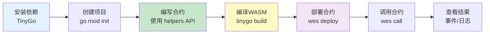
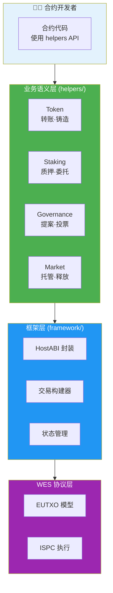
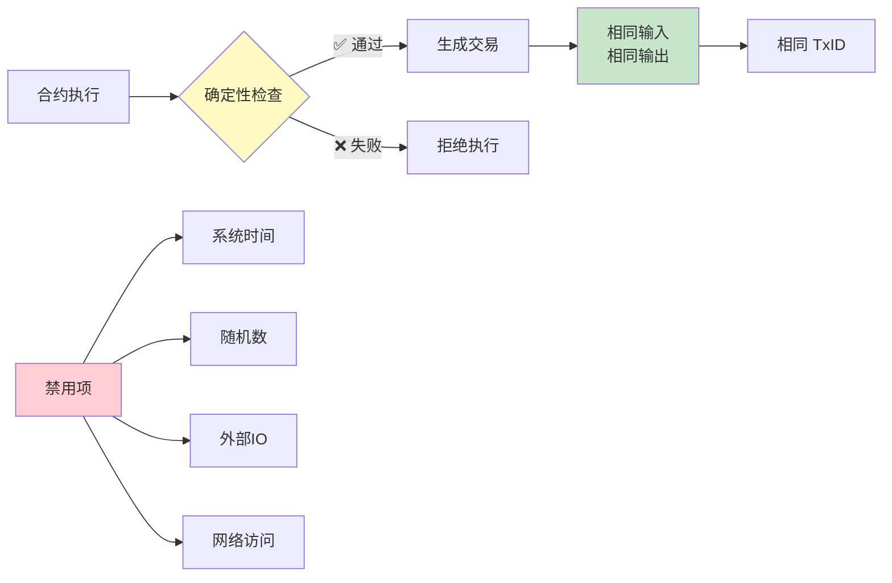
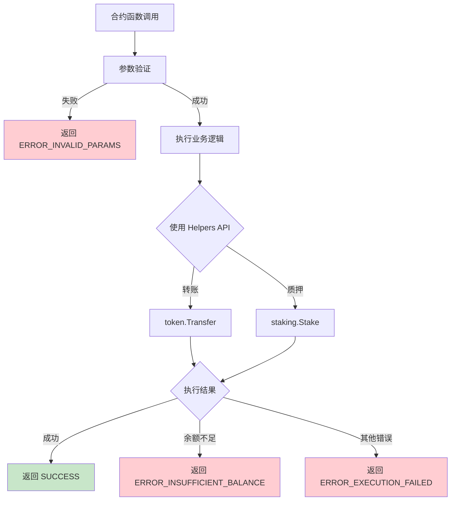
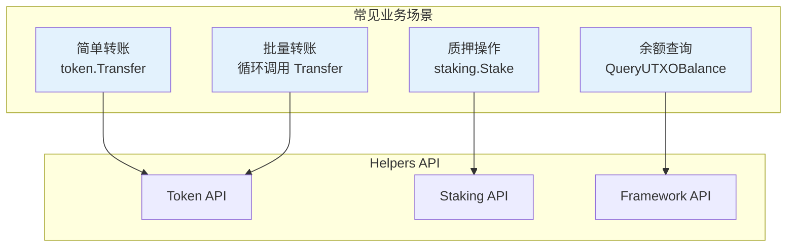

# WES 合约开发指南

**版本**: v1.0.0  
**状态**: ✅ 稳定  
**最后更新**: 2025-11-11

---

## 🚀 快速开始

### 开发流程概览



### 1. 安装依赖

```bash
# 安装TinyGo
brew install tinygo

# 验证安装
tinygo version
```

### 2. 创建新合约

```bash
# 创建项目目录
mkdir my-contract
cd my-contract

# 初始化go模块
go mod init my-contract
go mod edit -replace github.com/weisyn/contract-sdk-go=../contract-sdk-go
```

### 3. 编写合约

创建`main.go`：

```go
package main

import (
    "github.com/weisyn/contract-sdk-go/helpers/token"
    "github.com/weisyn/contract-sdk-go/framework"
)

//export Initialize
func Initialize() uint32 {
    // 初始化逻辑
    return framework.SUCCESS
}

//export Transfer
func Transfer() uint32 {
    // 获取参数
    params := framework.GetContractParams()
    toStr := params.ParseJSON("to")
    amount := params.ParseJSONInt("amount")
    
    // 解析地址
    to, err := framework.ParseAddressBase58(toStr)
    if err != nil {
        return framework.ERROR_INVALID_PARAMS
    }
    
    // 使用业务语义接口进行转账
    caller := framework.GetCaller()
    err = token.Transfer(caller, to, nil, framework.Amount(amount))
    if err != nil {
        return framework.ERROR_EXECUTION_FAILED
    }
    
    // 发出事件
    event := framework.NewEvent("Transfer")
    event.AddAddressField("from", caller)
    event.AddAddressField("to", to)
    event.AddUint64Field("amount", amount)
    framework.EmitEvent(event)
    
    return framework.SUCCESS
}

func main() {}
```

### 4. 编译合约

```bash
tinygo build -o contract.wasm \
    -target=wasi \
    -scheduler=none \
    -no-debug \
    -opt=2 \
    main.go
```

### 5. 部署合约

```bash
# 使用WES CLI部署
wes contract deploy --wasm contract.wasm
```

---

## 📚 核心概念

### SDK 分层架构

合约开发者只需关注业务语义层，SDK 自动处理底层细节：



### 1. 业务语义优先

**推荐使用 Helpers 层的业务语义接口**：

```go
import "github.com/weisyn/contract-sdk-go/helpers/token"
import "github.com/weisyn/contract-sdk-go/helpers/staking"

// 转账
err := token.Transfer(from, to, tokenID, amount)

// 质押
err := staking.Stake(staker, validator, tokenID, amount)
```

**优势**：
- 代码更简洁直观
- 自动处理余额检查、交易构建等
- 类型安全

### 2. 确定性保证

所有交易构建都是确定性的：



**确定性要求**：
- ✅ 禁用系统时间
- ✅ 禁用随机数
- ✅ 禁用外部IO
- ✅ 禁用网络访问

**验证方法**：100次重复执行产生相同TxID

### 3. 错误处理

合约执行流程中的错误处理：



**错误处理示例**：

```go
success, txHash, errCode := builder.Finalize()
if !success {
    // 错误处理
    switch errCode {
    case framework.ERROR_INSUFFICIENT_BALANCE:
        // 余额不足
    case framework.ERROR_INVALID_PARAMS:
        // 参数无效
    default:
        // 其他错误
    }
    return errCode
}
```

---

## 🎯 常见场景

### 场景流程图



### 场景1：简单转账

```go
import "github.com/weisyn/contract-sdk-go/helpers/token"

//export Transfer
func Transfer() uint32 {
    params := framework.GetContractParams()
    toStr := params.ParseJSON("to")
    amount := params.ParseJSONInt("amount")
    
    to, err := framework.ParseAddressBase58(toStr)
    if err != nil {
        return framework.ERROR_INVALID_PARAMS
    }
    
    caller := framework.GetCaller()
    err = token.Transfer(caller, to, nil, framework.Amount(amount))
    if err != nil {
        return framework.ERROR_EXECUTION_FAILED
    }
    
    return framework.SUCCESS
}
```

### 场景2：批量转账

```go
import "github.com/weisyn/contract-sdk-go/helpers/token"

//export BatchTransfer
func BatchTransfer() uint32 {
    params := framework.GetContractParams()
    recipients := params.ParseJSONArray("recipients")
    amounts := params.ParseJSONIntArray("amounts")
    
    caller := framework.GetCaller()
    
    for i, recipientStr := range recipients {
        recipient, err := framework.ParseAddressBase58(recipientStr)
        if err != nil {
            return framework.ERROR_INVALID_PARAMS
        }
        
        err = token.Transfer(caller, recipient, nil, framework.Amount(amounts[i]))
        if err != nil {
            return framework.ERROR_EXECUTION_FAILED
        }
    }
    
    return framework.SUCCESS
}
```

### 场景3：质押

```go
import "github.com/weisyn/contract-sdk-go/helpers/staking"

//export Stake
func Stake() uint32 {
    params := framework.GetContractParams()
    validatorStr := params.ParseJSON("validator")
    amount := params.ParseJSONInt("amount")
    
    validator, err := framework.ParseAddressBase58(validatorStr)
    if err != nil {
        return framework.ERROR_INVALID_PARAMS
    }
    
    caller := framework.GetCaller()
    err = staking.Stake(caller, validator, nil, framework.Amount(amount))
    if err != nil {
        return framework.ERROR_EXECUTION_FAILED
    }
    
    return framework.SUCCESS
}
```

### 场景4：查询余额

```go
//export GetBalance
func GetBalance() uint32 {
    params := framework.GetContractParams()
    addrStr := params.ParseJSON("address")
    
    addr, err := framework.ParseAddressBase58(addrStr)
    if err != nil {
        return framework.ERROR_INVALID_PARAMS
    }
    
    balance := framework.QueryUTXOBalance(addr, nil)
    
    // 返回JSON结果
    result := map[string]interface{}{
        "address": addrStr,
        "balance": uint64(balance),
    }
    
    framework.SetReturnJSON(result)
    return framework.SUCCESS
}
```

---

## 🔧 最佳实践

### 1. 参数验证

**始终验证输入参数**：

```go
// ✅ 推荐
if addrStr == "" || amount == 0 {
    return framework.ERROR_INVALID_PARAMS
}

addr, err := framework.ParseAddressBase58(addrStr)
if err != nil {
    return framework.ERROR_INVALID_PARAMS
}

// ❌ 不推荐
addr, _ := framework.ParseAddressBase58(addrStr)
```

### 2. 事件记录

**记录重要操作**：

```go
// ✅ 推荐
event := framework.NewEvent("Transfer")
event.AddAddressField("from", from)
event.AddAddressField("to", to)
event.AddUint64Field("amount", amount)
event.AddStringField("tx_hash", string(txHash))
framework.EmitEvent(event)

// ❌ 不推荐
// 不记录任何事件
```

### 3. 错误处理

**详细的错误处理**：

```go
// ✅ 推荐
success, txHash, errCode := builder.Finalize()
if !success {
    // 记录错误事件
    event := framework.NewEvent("TransferFailed")
    event.AddUint32Field("error_code", errCode)
    framework.EmitEvent(event)
    return errCode
}

// ❌ 不推荐
builder.Finalize()
return framework.SUCCESS
```

### 4. 批量操作

**使用 Helpers 层进行批量操作**：

```go
// ✅ 推荐（使用 Helpers 层）
import "github.com/weisyn/contract-sdk-go/helpers/token"

for _, recipient := range recipients {
    err := token.Transfer(caller, recipient, nil, amount)
    if err != nil {
        return framework.ERROR_EXECUTION_FAILED
    }
}
```

---

## 🧪 测试

### 单元测试

```go
// contract_test.go
package main

import (
    "testing"
)

func TestTransfer(t *testing.T) {
    // 测试逻辑
}
```

### 集成测试

使用WES测试框架：

```bash
wes contract test --wasm contract.wasm
```

### 确定性测试

```go
// 验证100次执行产生相同TxID
for i := 0; i < 100; i++ {
    success, txHash, _ := builder.Finalize()
    if !success {
        t.Fatal("build failed")
    }
    
    if i > 0 && !bytes.Equal(txHash, firstTxHash) {
        t.Fatal("TxID not deterministic")
    }
    
    if i == 0 {
        firstTxHash = txHash
    }
}
```

---

## 📝 示例合约

查看完整示例：

1. [ERC-20 代币合约](../examples/token/erc20-token/)
2. [基础质押合约](../examples/staking/basic-staking/)
3. [更多示例](../examples/README.md)

---

## 🆘 常见问题

### Q1: 如何调试合约？

**A**: 使用日志和事件：

```go
// 发出调试事件
event := framework.NewEvent("Debug")
event.AddStringField("message", "debug info")
framework.EmitEvent(event)
```

### Q2: 如何优化性能？

**A**: 
- 使用批量操作
- 减少链上存储
- 优化循环逻辑

### Q3: 如何处理大数运算？

**A**: 使用 Go 标准库或 SDK 提供的类型：

```go
// 使用 framework.Amount 类型（uint64）
amount := framework.Amount(1000000)

// 注意溢出检查
if amount > math.MaxUint64 {
    return framework.ERROR_EXECUTION_FAILED
}
```

### Q4: 为什么不能使用 `encoding/json`？

**A**: TinyGo WASM环境不支持标准库的`encoding/json`包。SDK提供了轻量级JSON解析工具：

**使用SDK提供的JSON解析**：
```go
// ✅ 正确：使用SDK提供的JSON解析
params := framework.GetContractParams()
toStr := params.ParseJSON("to")
amount := params.ParseJSONInt("amount")

// ❌ 错误：不能使用标准库
import "encoding/json"
var data map[string]interface{}
json.Unmarshal(jsonBytes, &data) // 编译失败
```

**SDK提供的JSON工具**：
- `ContractParams.ParseJSON(key)` - 解析字符串字段
- `ContractParams.ParseJSONInt(key)` - 解析整数字段
- SDK内部实现了轻量级JSON解析器（仅支持基本字段提取）

**限制**：
- ⚠️ 仅支持基本字段提取，不支持完整JSON解析
- ⚠️ 不支持数组解析（当前不需要）

**更多信息**：参考 [WASM 环境说明](../../docs/tutorials/contracts/wasm-environment.md#q5-为什么不能使用-encodingjson)

---

**文档版本**: v2.0.0  
**最后更新**: 2025-11-11

