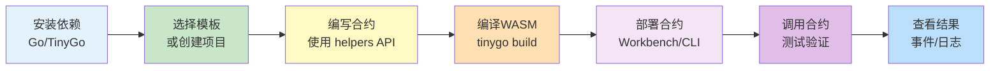
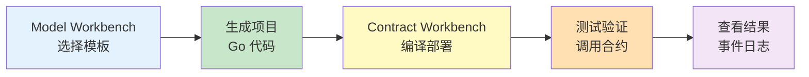
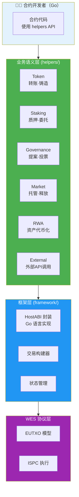
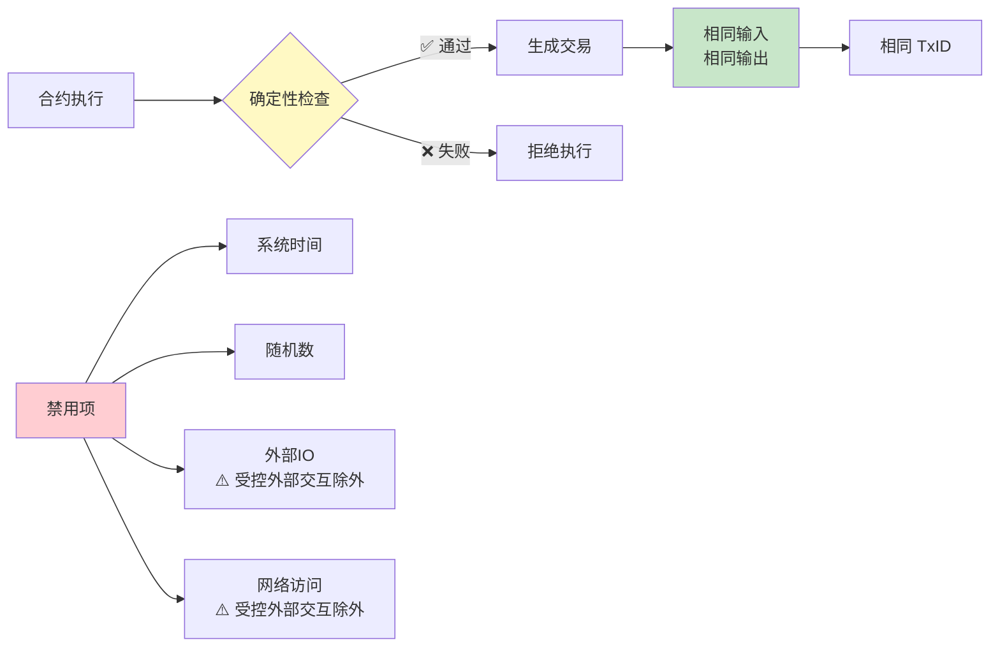
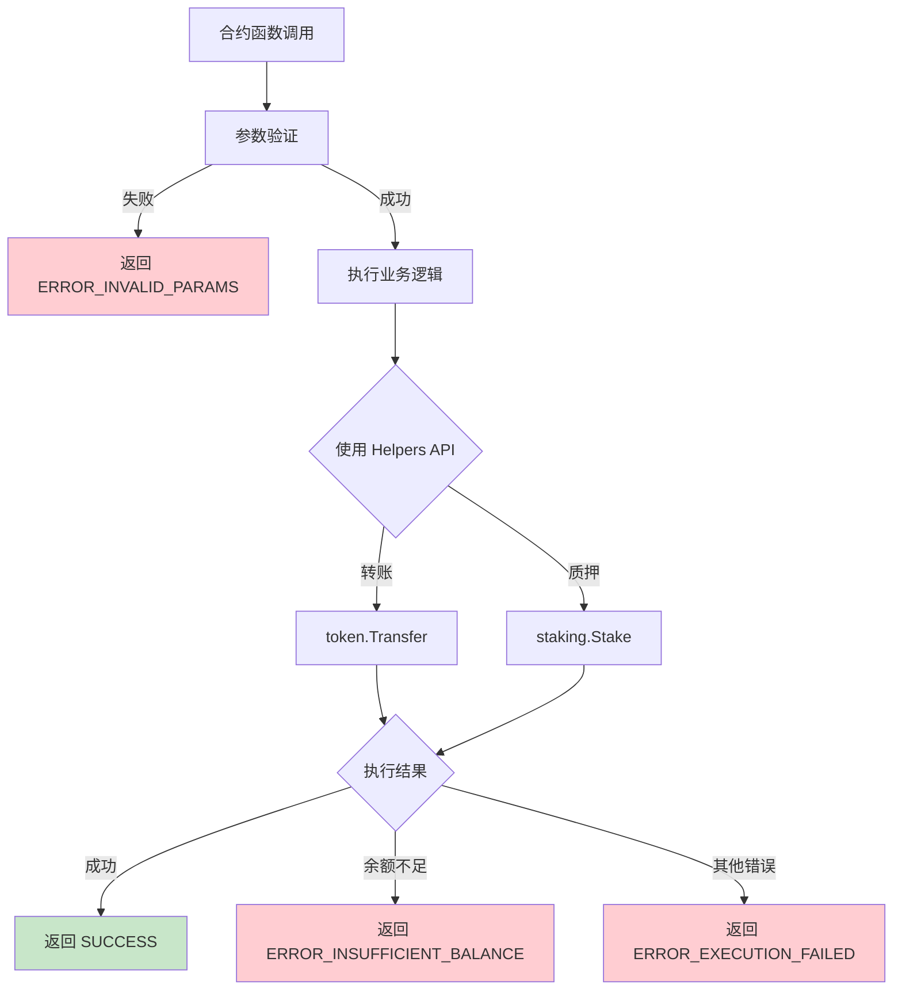

# WES 合约开发指南 - Go SDK 视角

**版本**: v2.0.0  
**状态**: ✅ 稳定  
**最后更新**: 2025-01-23

---

## 📋 文档定位

> 📌 **重要说明**：本文档聚焦 **Go SDK 视角**的合约开发指南。  
> 如需了解平台级概念（UTXO、ISPC 原理、WES 架构等），请参考 [平台文档索引](./README.md#-平台文档索引)。

**本文档目标**：
- 从"我已经看了主平台的『合约平台快速开始』"到"我现在具体用 Go SDK 干活"
- 提供 Go SDK 的安装与环境准备
- 说明如何选择并使用 `templates/` 中的 Go 模板
- 介绍与 Workbench 的协作流程
- 讲解常见开发模式（参数解析、错误处理、事件、调用外部 API 等）

**前置阅读**（平台级文档，来自主仓库）：
- [智能合约平台快速开始](../../../weisyn.git/docs/system/platforms/contracts/getting-started.md) - 平台级快速开始
- [合约核心概念](../../../weisyn.git/docs/tutorials/contracts/CONCEPTS.md) - 平台级核心概念
- [合约学习路径](../../../weisyn.git/docs/tutorials/contracts/LEARNING_PATH.md) - 平台级学习路径

---

## 🚀 快速开始

### 开发流程概览



### 1. 安装依赖

#### Go 环境

```bash
# 安装 Go 1.24+
# macOS
brew install go

# Linux/其他
# 见 https://golang.org/doc/install
```

#### TinyGo 环境

```bash
# 安装 TinyGo 0.31+
# macOS
brew install tinygo

# Linux/其他
# 见 https://tinygo.org/getting-started/install/

# 验证安装
tinygo version
```

> 📖 **更多信息**：参考 [工具链版本矩阵](../../../weisyn.git/docs/reference/contracts/toolchain-version-matrix.md)（主仓库）

### 2. 安装 Go SDK

```bash
go get github.com/weisyn/contract-sdk-go@latest
```

在 `go.mod` 中：

```go
module your-contract

go 1.24

require github.com/weisyn/contract-sdk-go v1.0.0
```

### 3. 使用模板创建项目（推荐）

**方式一：通过 Workbench 选择模板**

1. 打开 `model-workbench` 或 `contract-workbench`
2. 选择模板（例如：`Fungible Token (Go)`）
3. 点击「生成项目」→ 自动生成包含 `contract/`、配置文件的项目骨架

**方式二：直接使用 SDK 模板**

```bash
# 进入模板目录
cd /path/to/contract-sdk-go/templates/learning/simple-token

# 阅读 README.md，根据说明完成依赖安装
cat README.md

# 根据模板提供的 build.sh 或文档使用 TinyGo 编译
tinygo build -o contract.wasm \
  -target=wasi \
  -scheduler=none \
  -no-debug \
  -opt=2 \
  src/main.go
```

> 📖 **模板总览**：详见 [合约模板](../README.md#-合约模板) 和 [模板中心](../templates/README.md)

### 4. 创建新合约（手动方式）

如果不想使用模板，可以手动创建：

```bash
# 创建项目目录
mkdir my-contract
cd my-contract

# 初始化go模块
go mod init my-contract
go get github.com/weisyn/contract-sdk-go@latest
```

创建`main.go`：

```go
package main

import (
    "github.com/weisyn/contract-sdk-go/helpers/token"
    "github.com/weisyn/contract-sdk-go/framework"
)

//export Initialize
func Initialize() uint32 {
    // 初始化逻辑
    return framework.SUCCESS
}

//export Transfer
func Transfer() uint32 {
    // 获取参数
    params := framework.GetContractParams()
    toStr := params.ParseJSON("to")
    amount := params.ParseJSONInt("amount")
    
    // 解析地址
    to, err := framework.ParseAddressBase58(toStr)
    if err != nil {
        return framework.ERROR_INVALID_PARAMS
    }
    
    // 使用业务语义接口进行转账
    caller := framework.GetCaller()
    err = token.Transfer(caller, to, nil, framework.Amount(amount))
    if err != nil {
        return framework.ERROR_EXECUTION_FAILED
    }
    
    // 发出事件
    event := framework.NewEvent("Transfer")
    event.AddAddressField("from", caller)
    event.AddAddressField("to", to)
    event.AddUint64Field("amount", amount)
    framework.EmitEvent(event)
    
    return framework.SUCCESS
}

func main() {}
```

### 5. 编译合约

```bash
tinygo build -o contract.wasm \
    -target=wasi \
    -scheduler=none \
    -no-debug \
    -opt=2 \
    main.go
```

### 6. 部署合约

**方式一：通过 Workbench 部署**

1. 在 `contract-workbench` 或 `model-workbench` 中导入生成的 WASM 与 `metadata.json`
2. 点击「部署」按钮完成部署与测试

**方式二：通过 CLI 部署**

```bash
# 使用WES CLI部署
wes contract deploy --wasm contract.wasm
```

> 📖 **更多信息**：参考 [合约平台快速开始](../../../weisyn.git/docs/system/platforms/contracts/getting-started.md)（主仓库）

---

## 🎨 与 Workbench 协作

### Workbench 工作流



**推荐工作流**：

1. **在 Model Workbench 中选择模板**
   - 浏览可用模板（Fungible Token、NFT、Staking 等）
   - 选择适合你业务场景的模板
   - 生成包含 Go 代码的项目骨架

2. **在本地开发环境完善代码**
   - 根据业务需求修改生成的代码
   - 添加业务逻辑和验证规则
   - 使用 Go SDK 的 helpers API

3. **在 Contract Workbench 中编译和部署**
   - 导入项目代码
   - 编译为 WASM
   - 部署到测试网络
   - 进行测试和调试

4. **查看执行结果**
   - 在 Workbench 中查看事件日志
   - 验证合约执行结果
   - 调试和优化

> 📖 **Workbench 文档**：
> - [Model Workbench](../../workbench/model-workbench.git/README.md)
> - [Contract Workbench](../../workbench/contract-workbench.git/README.md)

---

## 📚 核心概念（Go SDK 视角）

### SDK 分层架构

合约开发者只需关注业务语义层，SDK 自动处理底层细节：



> 📖 **平台架构文档**：如需了解 WES 7 层架构、EUTXO 模型、ISPC 原理等平台级概念，请参考：
> - [WES 系统架构](../../../weisyn.git/docs/system/architecture/1-STRUCTURE_VIEW.md)（主仓库）
> - [ISPC 核心组件文档](../../../weisyn.git/docs/components/core/ispc/README.md)（主仓库）

### 1. 业务语义优先

**推荐使用 Helpers 层的业务语义接口**：

```go
import "github.com/weisyn/contract-sdk-go/helpers/token"
import "github.com/weisyn/contract-sdk-go/helpers/staking"

// 转账
err := token.Transfer(from, to, tokenID, amount)

// 质押
err := staking.Stake(staker, validator, tokenID, amount)
```

**优势**：
- 代码更简洁直观
- 自动处理余额检查、交易构建等
- 类型安全（Go 语言类型系统）

### 2. 确定性保证

所有交易构建都是确定性的：



**确定性要求**：
- ✅ 禁用系统时间（`time.Now()` 等）
- ✅ 禁用随机数（`math/rand` 等）
- ✅ 禁用外部IO（文件读写等）
- ✅ 禁用网络访问（`net/http` 等）
- ⚠️ **例外**：受控外部交互（通过 `helpers/external` 模块）

**验证方法**：100次重复执行产生相同TxID

> 📖 **更多信息**：参考 [ISPC 核心组件文档](../../../weisyn.git/docs/components/core/ispc/README.md)（主仓库）

### 3. 错误处理

合约执行流程中的错误处理：



**错误处理示例**：

```go
// 使用 Helpers API 时，错误会自动处理
err := token.Transfer(caller, to, nil, framework.Amount(amount))
if err != nil {
    // Helpers API 内部已经处理了错误码映射
    return framework.ERROR_EXECUTION_FAILED
}

return framework.SUCCESS
```

> 📖 **错误规范**：参考 [WES Error Specification](../../../weisyn.git/docs/error-spec/README.md)（主仓库）和 [Go SDK 错误实现](./WES_ERROR_SPEC_IMPLEMENTATION.md)

---

## 🎯 常见开发模式

### 1. 参数解析

**使用 SDK 提供的 JSON 解析工具**：

```go
// 获取合约参数
params := framework.GetContractParams()

// 解析字符串字段
toStr := params.ParseJSON("to")

// 解析整数字段
amount := params.ParseJSONInt("amount")

// 解析地址
to, err := framework.ParseAddressBase58(toStr)
if err != nil {
    return framework.ERROR_INVALID_PARAMS
}
```

> ⚠️ **注意**：TinyGo WASM 环境不支持标准库的 `encoding/json` 包。SDK 提供了轻量级 JSON 解析工具。  
> 📖 **更多信息**：参考 [WASM 环境说明](../../../weisyn.git/docs/tutorials/contracts/wasm-environment.md)（主仓库）

### 2. 事件记录

**记录重要操作**：

```go
// 创建事件
event := framework.NewEvent("Transfer")
event.AddAddressField("from", from)
event.AddAddressField("to", to)
event.AddUint64Field("amount", amount)
event.AddStringField("tx_hash", string(txHash))

// 发出事件
framework.EmitEvent(event)
```

### 3. 调用外部 API（受控外部交互）

**使用 `helpers/external` 模块**：

```go
import "github.com/weisyn/contract-sdk-go/helpers/external"

// 调用外部 API（受控机制，替代传统预言机）
data, err := external.CallAPI(
    "https://api.example.com/price",
    "GET",
    map[string]interface{}{"symbol": "BTC"},
    apiSignature,    // API 数字签名（佐证）
    responseHash,    // 响应数据哈希（佐证）
)
if err != nil {
    return framework.ERROR_EXECUTION_FAILED
}

// 使用返回的数据
// ...
```

> 📖 **更多信息**：参考 [ISPC 创新分析](./ISPC_INNOVATION_ANALYSIS.md) 和 [受控外部交互](../../../weisyn.git/docs/components/core/ispc/capabilities/external-interaction.md)（主仓库）

### 4. 常见场景示例

#### 场景1：简单转账

```go
import "github.com/weisyn/contract-sdk-go/helpers/token"

//export Transfer
func Transfer() uint32 {
    params := framework.GetContractParams()
    toStr := params.ParseJSON("to")
    amount := params.ParseJSONInt("amount")
    
    to, err := framework.ParseAddressBase58(toStr)
    if err != nil {
        return framework.ERROR_INVALID_PARAMS
    }
    
    caller := framework.GetCaller()
    err = token.Transfer(caller, to, nil, framework.Amount(amount))
    if err != nil {
        return framework.ERROR_EXECUTION_FAILED
    }
    
    return framework.SUCCESS
}
```

#### 场景2：批量转账

```go
import "github.com/weisyn/contract-sdk-go/helpers/token"

//export BatchTransfer
func BatchTransfer() uint32 {
    params := framework.GetContractParams()
    recipients := params.ParseJSONArray("recipients")
    amounts := params.ParseJSONIntArray("amounts")
    
    caller := framework.GetCaller()
    
    for i, recipientStr := range recipients {
        recipient, err := framework.ParseAddressBase58(recipientStr)
        if err != nil {
            return framework.ERROR_INVALID_PARAMS
        }
        
        err = token.Transfer(caller, recipient, nil, framework.Amount(amounts[i]))
        if err != nil {
            return framework.ERROR_EXECUTION_FAILED
        }
    }
    
    return framework.SUCCESS
}
```

#### 场景3：质押

```go
import "github.com/weisyn/contract-sdk-go/helpers/staking"

//export Stake
func Stake() uint32 {
    params := framework.GetContractParams()
    validatorStr := params.ParseJSON("validator")
    amount := params.ParseJSONInt("amount")
    
    validator, err := framework.ParseAddressBase58(validatorStr)
    if err != nil {
        return framework.ERROR_INVALID_PARAMS
    }
    
    caller := framework.GetCaller()
    err = staking.Stake(caller, validator, nil, framework.Amount(amount))
    if err != nil {
        return framework.ERROR_EXECUTION_FAILED
    }
    
    return framework.SUCCESS
}
```

#### 场景4：查询余额

```go
//export GetBalance
func GetBalance() uint32 {
    params := framework.GetContractParams()
    addrStr := params.ParseJSON("address")
    
    addr, err := framework.ParseAddressBase58(addrStr)
    if err != nil {
        return framework.ERROR_INVALID_PARAMS
    }
    
    balance := framework.QueryUTXOBalance(addr, nil)
    
    // 返回JSON结果
    result := map[string]interface{}{
        "address": addrStr,
        "balance": uint64(balance),
    }
    
    framework.SetReturnJSON(result)
    return framework.SUCCESS
}
```

> 📖 **更多场景**：参考 [业务场景实现指南](./BUSINESS_SCENARIOS.md)

---

## 🔧 最佳实践

### 1. 参数验证

**始终验证输入参数**：

```go
// ✅ 推荐
if addrStr == "" || amount == 0 {
    return framework.ERROR_INVALID_PARAMS
}

addr, err := framework.ParseAddressBase58(addrStr)
if err != nil {
    return framework.ERROR_INVALID_PARAMS
}

// ❌ 不推荐
addr, _ := framework.ParseAddressBase58(addrStr)
```

### 2. 事件记录

**记录重要操作**：

```go
// ✅ 推荐
event := framework.NewEvent("Transfer")
event.AddAddressField("from", from)
event.AddAddressField("to", to)
event.AddUint64Field("amount", amount)
event.AddStringField("tx_hash", string(txHash))
framework.EmitEvent(event)

// ❌ 不推荐
// 不记录任何事件
```

### 3. 错误处理

**详细的错误处理**：

```go
// ✅ 推荐
err := token.Transfer(caller, to, nil, framework.Amount(amount))
if err != nil {
    // 记录错误事件
    event := framework.NewEvent("TransferFailed")
    event.AddUint32Field("error_code", framework.ERROR_EXECUTION_FAILED)
    framework.EmitEvent(event)
    return framework.ERROR_EXECUTION_FAILED
}

// ❌ 不推荐
token.Transfer(caller, to, nil, framework.Amount(amount))
return framework.SUCCESS
```

### 4. 批量操作

**使用 Helpers 层进行批量操作**：

```go
// ✅ 推荐（使用 Helpers 层）
import "github.com/weisyn/contract-sdk-go/helpers/token"

for _, recipient := range recipients {
    err := token.Transfer(caller, recipient, nil, amount)
    if err != nil {
        return framework.ERROR_EXECUTION_FAILED
    }
}
```

---

## 🧪 测试

### 单元测试

```go
// contract_test.go
package main

import (
    "testing"
)

func TestTransfer(t *testing.T) {
    // 测试逻辑
}
```

### 集成测试

使用 WES 测试框架：

```bash
wes contract test --wasm contract.wasm
```

> 📖 **更多信息**：参考 [集成测试指南](../../../weisyn.git/docs/tutorials/contracts/integration-testing.md)（主仓库）

### 确定性测试

```go
// 验证100次执行产生相同TxID
for i := 0; i < 100; i++ {
    success, txHash, _ := builder.Finalize()
    if !success {
        t.Fatal("build failed")
    }
    
    if i > 0 && !bytes.Equal(txHash, firstTxHash) {
        t.Fatal("TxID not deterministic")
    }
    
    if i == 0 {
        firstTxHash = txHash
    }
}
```

---

## 🔨 编译 & 性能 & 限制

### TinyGo 编译选项

```bash
tinygo build -o contract.wasm \
    -target=wasi \
    -scheduler=none \
    -no-debug \
    -opt=2 \
    main.go
```

**关键选项说明**：
- `-target=wasi`：目标平台为 WASI
- `-scheduler=none`：禁用调度器（合约是单线程执行）
- `-no-debug`：禁用调试信息（减小体积）
- `-opt=2`：最高优化级别

### 性能优化建议

- ✅ 使用批量操作减少交易数量
- ✅ 减少链上存储（避免存储大量数据）
- ✅ 优化循环逻辑（避免嵌套循环）
- ✅ 使用 Helpers 层 API（自动优化）

### Go/TinyGo 限制

> ⚠️ **重要**：TinyGo 对 Go 标准库的支持有限，某些功能不可用。

**不支持的功能**：
- ❌ `encoding/json` 标准库（使用 SDK 提供的 JSON 解析工具）
- ❌ `time.Now()` 等时间函数（确定性要求）
- ❌ `math/rand` 等随机数函数（确定性要求）
- ❌ `net/http` 等网络库（使用 `helpers/external` 模块）
- ❌ `os` 包的文件操作（确定性要求）

**Unsafe 指针警告**：
- ⚠️ Go/TinyGo 在 WASM 环境中使用 Unsafe 指针需要特别注意
- 📖 **详细说明**：参考 [Unsafe 指针警告](./UNSAFE_POINTER_WARNINGS.md)

> 📖 **更多信息**：参考 [WASM 环境说明](../../../weisyn.git/docs/tutorials/contracts/wasm-environment.md)（主仓库）

---

## 📝 示例合约

查看完整示例：

1. **[合约模板](../README.md#-合约模板)** - SDK 提供的合约开发模板
2. **[模板中心](../templates/README.md)** - 模板详细说明和使用指南

**推荐模板**：
- `templates/learning/hello-world` - 最小可运行合约
- `templates/learning/simple-token` - 基础可转账代币
- `templates/standard/token/` - 多种代币形态
- `templates/standard/staking/` - 质押场景模板

---

## 🆘 常见问题

### Q1: 如何调试合约？

**A**: 使用事件记录调试信息：

```go
// 发出调试事件
event := framework.NewEvent("Debug")
event.AddStringField("message", "debug info")
event.AddUint64Field("value", 123)
framework.EmitEvent(event)
```

在 Workbench 或日志中查看事件。

### Q2: 如何优化性能？

**A**: 
- 使用批量操作（减少交易数量）
- 减少链上存储（避免存储大量数据）
- 优化循环逻辑（避免嵌套循环）
- 使用 Helpers 层 API（自动优化）

### Q3: 如何处理大数运算？

**A**: 使用 Go 标准库或 SDK 提供的类型：

```go
// 使用 framework.Amount 类型（uint64）
amount := framework.Amount(1000000)

// 注意溢出检查
if amount > math.MaxUint64 {
    return framework.ERROR_EXECUTION_FAILED
}
```

### Q4: 为什么不能使用 `encoding/json`？

**A**: TinyGo WASM 环境不支持标准库的 `encoding/json` 包。SDK 提供了轻量级 JSON 解析工具：

```go
// ✅ 正确：使用SDK提供的JSON解析
params := framework.GetContractParams()
toStr := params.ParseJSON("to")
amount := params.ParseJSONInt("amount")

// ❌ 错误：不能使用标准库
import "encoding/json"
var data map[string]interface{}
json.Unmarshal(jsonBytes, &data) // 编译失败
```

**SDK 提供的 JSON 工具**：
- `ContractParams.ParseJSON(key)` - 解析字符串字段
- `ContractParams.ParseJSONInt(key)` - 解析整数字段
- SDK 内部实现了轻量级 JSON 解析器（仅支持基本字段提取）

**限制**：
- ⚠️ 仅支持基本字段提取，不支持完整 JSON 解析
- ⚠️ 不支持数组解析（当前不需要）

> 📖 **更多信息**：参考 [WASM 环境说明](../../../weisyn.git/docs/tutorials/contracts/wasm-environment.md)（主仓库）

### Q5: 如何使用外部 API？

**A**: 使用 `helpers/external` 模块进行受控外部交互：

```go
import "github.com/weisyn/contract-sdk-go/helpers/external"

data, err := external.CallAPI(
    "https://api.example.com/price",
    "GET",
    map[string]interface{}{"symbol": "BTC"},
    apiSignature,    // API 数字签名（佐证）
    responseHash,    // 响应数据哈希（佐证）
)
```

> 📖 **更多信息**：参考 [ISPC 创新分析](./ISPC_INNOVATION_ANALYSIS.md)

---

## 🔗 相关文档

### SDK 文档

- [文档中心](./README.md) - SDK 文档索引
- [API 参考](./API_REFERENCE.md) - Go SDK 接口详细说明
- [业务场景实现指南](./BUSINESS_SCENARIOS.md) - 如何用 Go SDK 实现业务场景
- [ISPC 创新分析](./ISPC_INNOVATION_ANALYSIS.md) - Go SDK 如何使用 ISPC
- [Unsafe 指针警告](./UNSAFE_POINTER_WARNINGS.md) - Go/TinyGo Unsafe 指针注意事项

### 平台文档（主仓库）

- [智能合约平台文档](../../../weisyn.git/docs/system/platforms/contracts/README.md) - 平台级文档
- [合约核心概念](../../../weisyn.git/docs/tutorials/contracts/CONCEPTS.md) - 平台级核心概念
- [WASM 环境说明](../../../weisyn.git/docs/tutorials/contracts/wasm-environment.md) - WASM 环境详解
- [集成测试指南](../../../weisyn.git/docs/tutorials/contracts/integration-testing.md) - 合约集成测试

---

**文档版本**: v2.0.0  
**最后更新**: 2025-01-23
