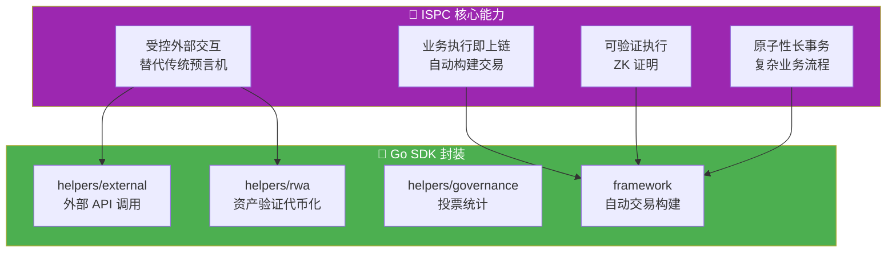

# ISPC 创新分析 - Go SDK 如何使用 ISPC

**版本**: v2.0.0  
**状态**: ✅ 稳定  
**最后更新**: 2025-01-23

---

## 📋 文档定位

> 📌 **重要说明**：本文档聚焦 **Go SDK 视角**的 ISPC 使用指南。  
> 如需了解 ISPC 核心范式、受控外部交互机制等平台级概念，请参考主仓库文档。

**本文档目标**：
- 说明对 Go 合约开发者，ISPC 带来哪些能力
- 这些能力在 Go SDK 中分别由哪些 helpers / framework API 暴露
- 典型"外部调用 + ZK / 证明"的开发模式

**前置阅读**（平台级文档，来自主仓库）：
- [ISPC 核心组件文档](../../../weisyn.git/docs/components/core/ispc/README.md) - ISPC 核心范式和实现细节
- [受控外部交互](../../../weisyn.git/docs/components/core/ispc/capabilities/external-interaction.md) - 受控外部交互机制
- [WASM 引擎文档](../../../weisyn.git/docs/components/core/ispc/capabilities/unified-engines.md) - WASM 执行引擎架构
- [ZK 证明文档](../../../weisyn.git/docs/components/core/ispc/capabilities/zk-proof.md) - ZK 证明生成与验证

---

## 🎯 ISPC 对 Go 合约开发者的价值

### ISPC 核心能力



**ISPC 带来的核心能力**：
1. ✅ **受控外部交互**：直接调用外部 API，无需传统预言机
2. ✅ **业务执行即上链**：执行结果自动构建 Transaction 并上链
3. ✅ **可验证执行**：执行过程自动生成 ZK 证明
4. ✅ **原子性长事务**：跨系统业务流程在一个原子边界内执行

---

## 🔧 Go SDK 中的 ISPC 能力

### 1. 受控外部交互（helpers/external）

**传统区块链**：需要中心化的预言机服务获取外部数据  
**WES ISPC**：合约可以直接调用外部 API，无需传统预言机

#### Go SDK API

```go
import "github.com/weisyn/contract-sdk-go/helpers/external"

// 直接调用外部 API（受控机制，替代传统预言机）
data, err := external.CallAPI(
    "https://api.example.com/price",
    "GET",
    map[string]interface{}{"symbol": "BTC"},
    apiSignature,    // API 数字签名（佐证）
    responseHash,    // 响应数据哈希（佐证）
)
if err != nil {
    return framework.ERROR_EXECUTION_FAILED
}

// ✅ 单次调用，多点验证，自动生成 ZK 证明
// ✅ 执行结果自动上链
```

**关键特性**：
- ✅ **受控机制**：通过"受控声明+佐证+验证"机制，而非直接调用
- ✅ **可验证的外部数据**：所有外部数据都有密码学验证的佐证
- ✅ **无需传统预言机**：不需要中心化的预言机服务
- ✅ **单次调用保证**：只有执行节点调用一次，验证节点只验证证明

> 📖 **平台级文档**：参考 [受控外部交互](../../../weisyn.git/docs/components/core/ispc/capabilities/external-interaction.md)（主仓库）

#### 使用示例

```go
// 调用价格 API
func GetPrice() uint32 {
    params := framework.GetContractParams()
    symbol := params.ParseJSON("symbol")
    
    // 调用外部 API（受控外部交互）
    data, err := external.CallAPI(
        "https://api.example.com/price",
        "GET",
        map[string]interface{}{"symbol": symbol},
        apiSignature,
        responseHash,
    )
    if err != nil {
        return framework.ERROR_EXECUTION_FAILED
    }
    
    // 使用返回的数据
    // ...
    
    return framework.SUCCESS
}
```

### 2. 业务执行即上链（自动交易构建）

**传统区块链范式**：
```
用户 → 构建交易 → 签名 → 提交 → 节点执行 → 状态变更
```

**ISPC 范式**：
```
用户 → 调用业务逻辑 → ISPC执行（可能包含外部调用）→ 
自动生成ZK证明 → 自动构建Transaction → 自动上链 → 
用户直接获得业务结果
```

#### Go SDK 实现

**使用 Helpers 层 API**：

```go
import "github.com/weisyn/contract-sdk-go/helpers/token"

// 业务执行，自动上链
err := token.Transfer(from, to, tokenID, amount)
// → ISPC执行：检查余额 → 构建交易 → 自动上链
// → 用户直接获得：{success: true, txHash: "..."}
```

**关键特性**：
- ✅ **自动交易构建**：SDK 自动处理交易构建，用户无需关心
- ✅ **自动上链**：执行结果自动构建 Transaction 并上链
- ✅ **用户直接获得结果**：用户无需知道 Transaction 的存在

### 3. RWA 场景的 ISPC 范式实现

**传统区块链方式**（不推荐）：

```go
// 1. 用户调用合约
TokenizeAsset(assetID, documents)

// 2. 合约内部（需要应用层实现）
// - 调用预言机获取资产验证结果
// - 调用估值服务获取资产价值
// - 构建交易并上链

// 3. 问题：
// - 需要预言机（中心化瓶颈）
// - 需要应用层实现复杂逻辑
// - 用户需要知道Transaction的存在
```

**ISPC 范式方式**（推荐）：

```go
import "github.com/weisyn/contract-sdk-go/helpers/rwa"

// 1. SDK提供业务执行接口
result, err := rwa.ValidateAndTokenize(
    assetID,
    documents,
    validatorAPI,      // 验证服务API
    validatorEvidence,  // 验证机构签名等
    valuationAPI,       // 估值服务API
    valuationEvidence,  // 估值服务签名等
)

// 2. ISPC执行（自动）
// - 声明资产验证状态预期（declareExternalState）
// - 提供验证佐证（provideEvidence：验证机构签名、文档哈希等）
// - 运行时验证（verifyOracleData）
// - 声明估值状态预期（declareExternalState）
// - 提供估值佐证（provideEvidence：估值服务签名、估值数据哈希等）
// - 运行时验证（verifyOracleData）
// - 执行代币化逻辑
// - 自动生成ZK证明（包含所有外部交互的验证过程）
// - 自动构建Transaction
// - 自动上链

// 3. 用户直接获得结果
// {
//   success: true,
//   tokenID: "RWA_RE_001",
//   validated: true,
//   validationProof: "0x...",  // 验证过程的ZK证明
//   valuation: 1000000,
//   valuationProof: "0x...",    // 估值过程的ZK证明
//   txHash: "0x..."
// }

// 4. 优势：
// - 无需传统预言机（通过ISPC受控机制）
// - SDK封装复杂逻辑
// - 用户无需知道Transaction
// - 执行过程可验证（ZK证明包含外部交互验证）
// - 单次外部调用（只有执行节点调用，验证节点只验证证明）
```

### 4. Governance 场景的 ISPC 范式实现

**传统区块链方式**（不推荐）：

```go
// 只是记录投票状态，没有实际业务逻辑
func Vote(voter framework.Address, proposalID []byte, support bool) error {
    // 只是构建StateOutput，没有实际业务执行
    success, _, errCode := internal.BeginTransaction().
        AddStateOutput(stateID, voteValue, execHash).
        Finalize()
    // ...
}
```

**ISPC 范式方式**（推荐）：

```go
import "github.com/weisyn/contract-sdk-go/helpers/governance"

// 执行投票业务逻辑
result, err := governance.VoteAndCount(voter, proposalID, support)
// → ISPC执行：记录投票 → 统计票数 → 检查阈值 → 自动上链
// → 用户直接获得：{success: true, totalVotes: 100, passed: true}
```

---

## 📊 对比分析

### 传统区块链范式 vs ISPC 范式

| 维度 | 传统区块链 | ISPC 范式 |
|------|-----------|---------|
| **外部数据获取** | 需要预言机（中心化） | 直接调用外部API（受控） |
| **业务执行** | 应用层实现 | SDK提供，ISPC执行 |
| **交易构建** | 用户需要构建 | 自动构建 |
| **上链方式** | 用户需要提交 | 自动上链 |
| **用户获得** | Transaction哈希 | 业务结果 |
| **可验证性** | 需要重复执行 | ZK证明验证 |

### Go SDK 中的体现

| ISPC 能力 | Go SDK API | 使用场景 |
|----------|-----------|---------|
| **受控外部交互** | `helpers/external.CallAPI()` | 调用外部 API、数据库查询 |
| **业务执行即上链** | `helpers/token.Transfer()` 等 | 所有业务语义接口 |
| **RWA 代币化** | `helpers/rwa.ValidateAndTokenize()` | 资产验证和代币化 |
| **投票统计** | `helpers/governance.VoteAndCount()` | 提案投票和统计 |

---

## 🎯 典型开发模式

### 模式1：外部 API 调用 + 业务逻辑

```go
import (
    "github.com/weisyn/contract-sdk-go/helpers/external"
    "github.com/weisyn/contract-sdk-go/helpers/token"
    "github.com/weisyn/contract-sdk-go/framework"
)

func ProcessOrder() uint32 {
    params := framework.GetContractParams()
    orderID := params.ParseJSON("order_id")
    
    // 1. 调用外部 API 验证订单（受控外部交互）
    data, err := external.CallAPI(
        "https://api.example.com/verify-order",
        "POST",
        map[string]interface{}{"order_id": orderID},
        apiSignature,
        responseHash,
    )
    if err != nil {
        return framework.ERROR_EXECUTION_FAILED
    }
    
    // 2. 执行业务逻辑（自动上链）
    err = token.Transfer(buyer, seller, nil, framework.Amount(amount))
    if err != nil {
        return framework.ERROR_EXECUTION_FAILED
    }
    
    // 3. 用户直接获得结果
    return framework.SUCCESS
}
```

### 模式2：RWA 资产代币化

```go
import "github.com/weisyn/contract-sdk-go/helpers/rwa"

func TokenizeAsset() uint32 {
    params := framework.GetContractParams()
    assetID := params.ParseJSON("asset_id")
    documents := params.ParseJSON("documents")
    
    // ISPC执行：验证 → 估值 → 代币化 → 自动上链
    result, err := rwa.ValidateAndTokenize(
        assetID,
        []byte(documents),
        validatorAPI,
        validatorEvidence,
        valuationAPI,
        valuationEvidence,
    )
    if err != nil {
        return framework.ERROR_EXECUTION_FAILED
    }
    
    // 用户直接获得：{success: true, tokenID: "...", txHash: "..."}
    return framework.SUCCESS
}
```

### 模式3：投票统计

```go
import "github.com/weisyn/contract-sdk-go/helpers/governance"

func Vote() uint32 {
    params := framework.GetContractParams()
    proposalIDStr := params.ParseJSON("proposal_id")
    support := params.ParseJSONBool("support")
    
    proposalID, _ := framework.ParseBytes(proposalIDStr)
    caller := framework.GetCaller()
    
    // ISPC执行：记录投票 → 统计票数 → 检查阈值 → 自动上链
    result, err := governance.VoteAndCount(caller, proposalID, support)
    if err != nil {
        return framework.ERROR_EXECUTION_FAILED
    }
    
    // 用户直接获得：{success: true, totalVotes: 100, passed: true}
    return framework.SUCCESS
}
```

---

## 🔗 相关文档

### SDK 文档

- [开发者指南](./DEVELOPER_GUIDE.md) - 如何使用 Go SDK 开发合约
- [业务场景实现指南](./BUSINESS_SCENARIOS.md) - 如何用 Go SDK 实现业务场景
- [API 参考](./API_REFERENCE.md) - Go SDK 接口详细说明

### 平台文档（主仓库）

- [ISPC 核心组件文档](../../../weisyn.git/docs/components/core/ispc/README.md) - ISPC 核心范式和实现细节
- [受控外部交互](../../../weisyn.git/docs/components/core/ispc/capabilities/external-interaction.md) - 受控外部交互机制
- [WASM 引擎文档](../../../weisyn.git/docs/components/core/ispc/capabilities/unified-engines.md) - WASM 执行引擎架构
- [ZK 证明文档](../../../weisyn.git/docs/components/core/ispc/capabilities/zk-proof.md) - ZK 证明生成与验证

---

**最后更新**: 2025-01-23
