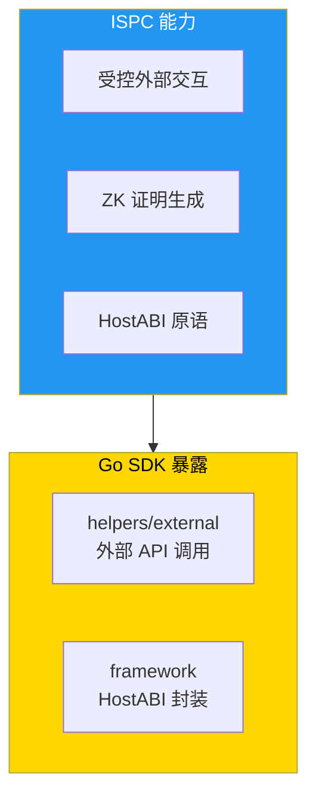

# ISPC 创新分析 - Go SDK 视角

**版本**: v1.0.0  
<<<<<<< Updated upstream
<<<<<<< Updated upstream
<<<<<<< Updated upstream
<<<<<<< Updated upstream
<<<<<<< Updated upstream
<<<<<<< Updated upstream
**最后更新**: 2025-01-23
=======
**最后更新**: 2025-11-23
>>>>>>> Stashed changes
=======
**最后更新**: 2025-11-23
>>>>>>> Stashed changes
=======
**最后更新**: 2025-11-23
>>>>>>> Stashed changes
=======
**最后更新**: 2025-11-23
>>>>>>> Stashed changes
=======
**最后更新**: 2025-11-23
>>>>>>> Stashed changes
=======
**最后更新**: 2025-11-23
>>>>>>> Stashed changes

---

## 📋 文档定位

> 📌 **重要说明**：本文档聚焦 **SDK 集成**视角的 ISPC 分析。  
> ISPC 核心范式、受控外部交互机制请参考主仓库文档。

**本文档目标**：
- 说明对 Go 合约开发者，ISPC 带来哪些能力
- 说明这些能力在 Go SDK 中分别由哪些 helpers / framework API 暴露
- 讲解典型"外部调用 + ZK / 证明"的开发模式

**前置阅读**（平台级文档，来自主仓库）：
- [ISPC 组件文档](../../../weisyn.git/docs/components/core/ispc/README.md) - ISPC 核心范式
- [受控外部交互](../../../weisyn.git/docs/components/core/ispc/capabilities/external-interaction.md) - 受控外部交互机制
- [ZK 证明文档](../../../weisyn.git/docs/components/core/ispc/capabilities/zk-proof.md) - ZK 证明生成与验证

---

## 🎯 ISPC 对 Go 合约开发者的价值

### 核心能力

1. **受控外部交互**：合约可以安全地调用外部 API
2. **ZK 证明生成**：合约可以生成 ZK 证明
3. **统一执行引擎**：WASM 统一执行引擎
4. **HostABI 原语**：17 个最小原语能力

### SDK 中的映射



---

## 🔧 SDK API 映射

### 受控外部交互

#### External 模块

```go
import "github.com/weisyn/contract-sdk-go/helpers/external"

// 调用外部 API
result, errCode := external.Call("https://api.example.com/data", nil)
```

### HostABI 原语

#### Framework 层

```go
import "github.com/weisyn/contract-sdk-go/framework"

// 环境查询
caller := framework.GetCaller()
params := framework.GetCallParams()

// 事件发出
framework.EmitEvent("EventType", data)

// 返回值设置
framework.SetReturnData(data)
```

---

## 🎯 典型开发模式

### 外部调用 + ZK 证明

```go
import (
    "github.com/weisyn/contract-sdk-go/framework"
    "github.com/weisyn/contract-sdk-go/helpers/external"
)

//export ProcessExternalData
func ProcessExternalData() uint32 {
    // 1. 调用外部 API
    result, errCode := external.Call("https://api.example.com/data", nil)
    if errCode != framework.SUCCESS {
        return errCode
    }
    
    // 2. 处理数据
    // ...
    
    // 3. 发出事件
    framework.EmitEvent("DataProcessed", result)
    
    return framework.SUCCESS
}
```

---

## 📖 进一步阅读

### 核心文档

- **[开发者指南](./DEVELOPER_GUIDE.md)** - 如何使用 Go SDK 开发合约
- **[API 参考](./API_REFERENCE.md)** - 详细的 API 文档
- **[SDK 内部架构](./SDK_ARCHITECTURE.md)** - SDK 内部分层架构设计

### 平台文档（主仓库）

- [ISPC 组件文档](../../../weisyn.git/docs/components/core/ispc/README.md) - ISPC 核心范式
- [受控外部交互](../../../weisyn.git/docs/components/core/ispc/capabilities/external-interaction.md) - 受控外部交互机制
- [ZK 证明文档](../../../weisyn.git/docs/components/core/ispc/capabilities/zk-proof.md) - ZK 证明生成与验证

---

<<<<<<< Updated upstream
<<<<<<< Updated upstream
<<<<<<< Updated upstream
<<<<<<< Updated upstream
<<<<<<< Updated upstream
<<<<<<< Updated upstream
**最后更新**: 2025-01-23  
=======
**最后更新**: 2025-11-23  
>>>>>>> Stashed changes
=======
**最后更新**: 2025-11-23  
>>>>>>> Stashed changes
=======
**最后更新**: 2025-11-23  
>>>>>>> Stashed changes
=======
**最后更新**: 2025-11-23  
>>>>>>> Stashed changes
=======
**最后更新**: 2025-11-23  
>>>>>>> Stashed changes
=======
**最后更新**: 2025-11-23  
>>>>>>> Stashed changes
**维护者**: WES Core Team

