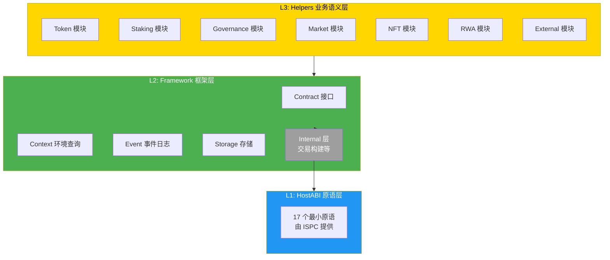
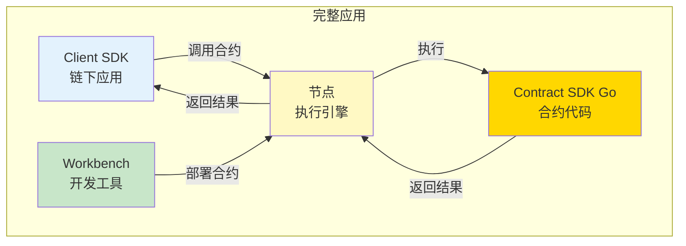
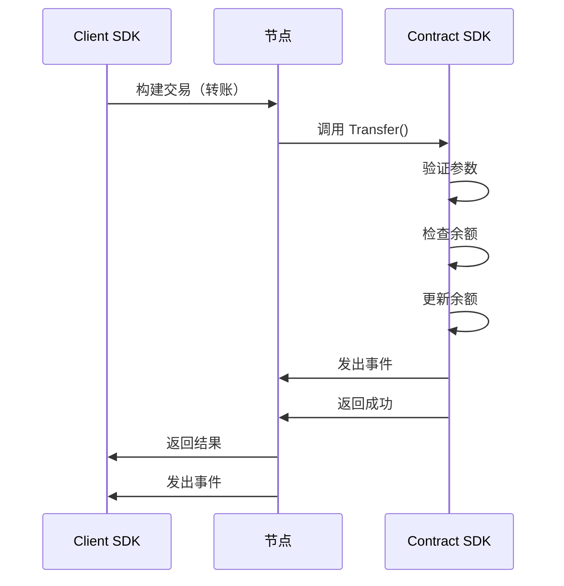

# 场景与架构可视化指南

**版本**: v1.0.0  
**最后更新**: 2025-01-23

---

## 📋 文档定位

> 📌 **重要说明**：本文档提供 SDK 相关的简明架构/场景图。  
> 详细业务流图请参考主仓库文档。

**本文档目标**：
- 提供 SDK 内部分层架构图
- 提供 SDK 与平台其他组件的交互图
- 帮助快速理解 SDK 的结构和关系

---

## 🏗️ SDK 内部分层架构

### 三层架构图

---

## 🔗 SDK 与平台组件的交互

### 完整应用架构

---

## 💰 Token 转账场景流程

### 完整流程

---

## 📖 进一步阅读

### 核心文档

- **[SDK 内部架构](./SDK_ARCHITECTURE.md)** - SDK 内部分层架构设计
- **[应用场景分析](./APPLICATION_SCENARIOS_ANALYSIS.md)** - SDK 职责边界分析
- **[业务场景实现指南](./BUSINESS_SCENARIOS.md)** - 如何实现业务场景

### 平台文档（主仓库）

- [智能合约平台架构](../../../weisyn.git/docs/system/platforms/contracts/technical-architecture.md) - 平台技术架构
- [业务场景分析](../../../weisyn.git/docs/system/platforms/contracts/use-cases.md) - 详细业务流图

---

**最后更新**: 2025-01-23  
**维护者**: WES Core Team

