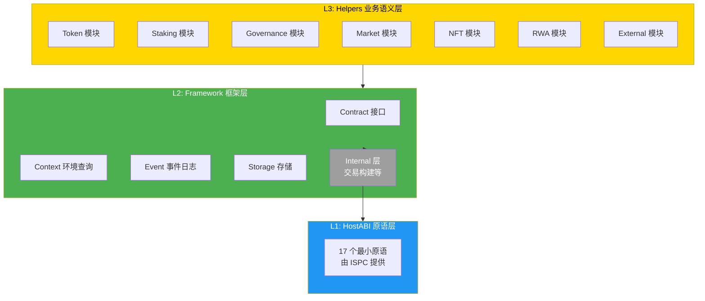
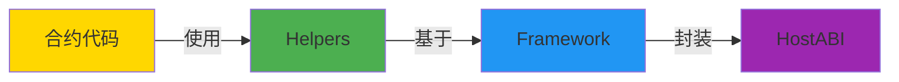

# Contract SDK Go - SDK 内部架构

**版本**: v1.0.0  
**最后更新**: 2025-11-23

---

## 📋 文档定位

> 📌 **重要说明**：本文档聚焦 **SDK 自身**的架构设计。  
> 如需了解 WES 平台的 7 层架构、ISPC 核心范式等，请参考主仓库文档。

**本文档目标**：
- 说明 SDK 的内部分层架构
- 解释模块组织方式和依赖关系
- 记录设计决策和架构原则

**前置阅读**（平台级文档，来自主仓库）：
- [WES 系统架构](../../../weisyn.git/docs/system/architecture/1-STRUCTURE_VIEW.md) - 系统架构详解
- [智能合约平台架构](../../../weisyn.git/docs/system/platforms/contracts/technical-architecture.md) - 平台技术架构

---

## 🏗️ SDK 分层架构

### 三层架构



### 核心原则

1. **业务语义优先**：合约开发者只需使用 Helpers 层的业务接口
2. **分层清晰**：每层职责单一，依赖关系明确
3. **零外部依赖**：仅依赖 Go 标准库
4. **WASM 优化**：专为 TinyGo WASM 编译优化

---

## 📦 模块组织

### Helpers 层模块

```
helpers/
├── token/          # Token 模块
├── staking/        # Staking 模块
├── governance/      # Governance 模块
├── market/         # Market 模块
├── nft/            # NFT 模块
├── rwa/            # RWA 模块
└── external/       # External 模块
```

### Framework 层模块

```
framework/
├── contract.go     # Contract 接口
├── context.go      # Context 环境查询
├── event.go        # Event 事件日志
├── storage.go      # Storage 存储
└── internal/       # 内部实现
    ├── transaction_builder.go
    └── hostabi/     # HostABI 封装
```

---

## 🔄 依赖关系

### 模块依赖



### 设计决策

1. **合约开发者只使用 Helpers 层**：不直接使用 Framework 层
2. **Framework 层封装 HostABI**：提供 Go 友好的接口
3. **Internal 层处理交易构建**：合约开发者无需关心

---

## 📖 进一步阅读

### 核心文档

- **[应用场景分析](./APPLICATION_SCENARIOS_ANALYSIS.md)** - SDK 职责边界分析
- **[ISPC 创新分析](./ISPC_INNOVATION_ANALYSIS.md)** - Go SDK 如何使用 ISPC
- **[架构规划](./ARCHITECTURE_PLAN.md)** - SDK 架构规划文档

### 平台文档（主仓库）

- [WES 系统架构](../../../weisyn.git/docs/system/architecture/1-STRUCTURE_VIEW.md) - 系统架构详解
- [智能合约平台架构](../../../weisyn.git/docs/system/platforms/contracts/technical-architecture.md) - 平台技术架构

---

**最后更新**: 2025-11-23  
**维护者**: WES Core Team

