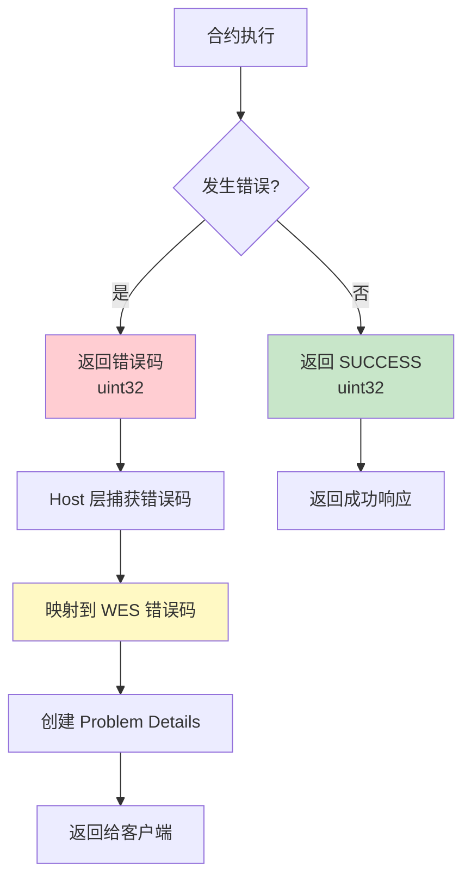

# WES Error Specification 实施文档 - Go SDK 视角

**版本**: v1.0.0  
**最后更新**: 2025-11-23

---

## 📋 文档定位

> 📌 **重要说明**：本文档聚焦 **Go SDK 视角**的错误规范对接说明。  
> 如需了解 WES Error Specification 的完整规范定义，请参考主仓库文档。

**本文档目标**：
- 说明 Go SDK 如何把 Host 层问题映射到 Go 侧错误码
- 说明开发者在合约里应该如何处理/返回错误（结合 helpers & framework 的 error 设计）

**前置阅读**（平台级文档，来自主仓库）：
- [WES Error Specification](../../../weisyn.git/docs/error-spec/README.md) - 错误规范总览
- [错误码定义](../../../weisyn.git/docs/error-spec/wes-error-codes.yaml) - 错误码定义文件
- [Problem Details 规范](../../../weisyn.git/docs/error-spec/wes-problem-details.md) - Problem Details 格式规范

---

## 🎯 Go SDK 错误处理概览

### 错误处理流程



**关键点**：
- ✅ **合约层**：返回 `uint32` 错误码
- ✅ **Host 层**：捕获错误码并映射到 WES 错误码
- ✅ **服务层**：创建 Problem Details 格式的错误响应

---

## 🔧 SDK 错误码定义

### Framework 层错误码

```go
const (
    SUCCESS uint32 = 0
    ERROR_INVALID_PARAMS uint32 = 1
    ERROR_INSUFFICIENT_BALANCE uint32 = 2
    ERROR_UNAUTHORIZED uint32 = 3
    // ... 更多错误码
)
```

### Helpers 层错误处理

```go
import "github.com/weisyn/contract-sdk-go/helpers/token"

// Helpers API 内部已经处理了错误码映射
errCode := token.Transfer(params)
if errCode != framework.SUCCESS {
    return errCode
}
```

---

## 📝 开发者使用指南

### 错误处理模式

```go
import "github.com/weisyn/contract-sdk-go/framework"

//export MyFunction
func MyFunction() uint32 {
    // 1. 参数验证
    params := framework.GetCallParams()
    if len(params) == 0 {
        return framework.ERROR_INVALID_PARAMS
    }
    
    // 2. 业务逻辑
    // ...
    
    // 3. 返回成功
    return framework.SUCCESS
}
```

### 使用 Helpers API

```go
import "github.com/weisyn/contract-sdk-go/helpers/token"

//export Transfer
func Transfer() uint32 {
    // token.Transfer 内部已经处理了错误码映射
    return token.Transfer(params)
}
```

---

## 📖 进一步阅读

### 核心文档

- **[开发者指南](./DEVELOPER_GUIDE.md)** - 如何使用 Go SDK 开发合约
- **[API 参考](./API_REFERENCE.md)** - 详细的 API 文档

### 平台文档（主仓库）

- [WES Error Specification](../../../weisyn.git/docs/error-spec/README.md) - 错误规范总览
- [错误码定义](../../../weisyn.git/docs/error-spec/wes-error-codes.yaml) - 错误码定义文件
- [Problem Details 规范](../../../weisyn.git/docs/error-spec/wes-problem-details.md) - Problem Details 格式规范

---

**最后更新**: 2025-11-23  
**维护者**: WES Core Team

