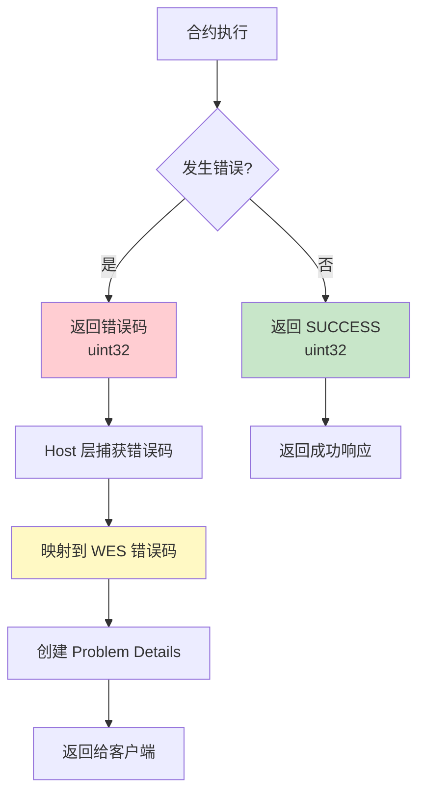
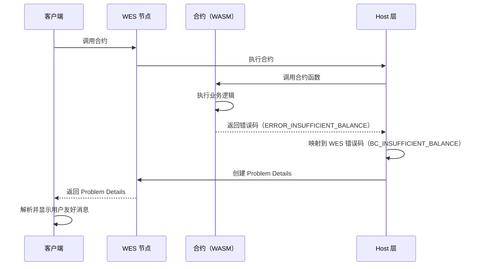

# WES Error Specification 实施文档 - Go SDK 视角

**版本**: v2.0.0  
**状态**: ✅ 稳定  
**最后更新**: 2025-01-23

---

## 📋 文档定位

> 📌 **重要说明**：本文档聚焦 **Go SDK 视角**的错误规范对接说明。  
> 如需了解 WES Error Specification 的完整规范定义，请参考主仓库文档。

**本文档目标**：
- 说明 Go SDK 如何把 Host 层问题映射到 Go 侧的 error / 返回码
- 说明开发者在合约里应该如何处理/返回错误（结合 helpers & framework 的 error 设计）

**前置阅读**（平台级文档，来自主仓库）：
- [WES Error Specification](../../../weisyn.git/docs/error-spec/README.md) - 错误规范总览
- [错误码定义](../../../weisyn.git/docs/error-spec/wes-error-codes.yaml) - 错误码定义文件
- [Problem Details 规范](../../../weisyn.git/docs/error-spec/wes-problem-details.md) - Problem Details 格式规范

---

## 🎯 Go SDK 错误处理概览

### 错误处理流程



**关键点**：
- ✅ **合约层**：返回 `uint32` 错误码
- ✅ **Host 层**：捕获错误码并映射到 WES 错误码
- ✅ **服务层**：创建 Problem Details 格式的错误响应
- ✅ **客户端**：接收 Problem Details 并显示用户友好的错误消息

---

## 🔧 Go SDK 错误码定义

### 错误码常量

**文件**: `framework/errors.go`

```go
package framework

const (
    SUCCESS                  uint32 = 0  // 成功
    ERROR_INVALID_PARAMS     uint32 = 1  // 参数无效
    ERROR_INSUFFICIENT_BALANCE uint32 = 2  // 余额不足
    ERROR_UNAUTHORIZED       uint32 = 3  // 未授权
    ERROR_NOT_FOUND          uint32 = 4  // 资源不存在
    ERROR_ALREADY_EXISTS     uint32 = 5  // 资源已存在
    ERROR_EXECUTION_FAILED   uint32 = 6  // 执行失败
    ERROR_INVALID_STATE      uint32 = 7  // 状态无效
    ERROR_TIMEOUT            uint32 = 8  // 超时
    ERROR_NOT_IMPLEMENTED    uint32 = 9  // 未实现
    ERROR_PERMISSION_DENIED  uint32 = 10 // 权限不足
    ERROR_UNKNOWN            uint32 = 999 // 未知错误
)
```

### 错误码映射

**文件**: `framework/error_mapping.go`

```go
// ContractErrorCodeToWESCode 将合约错误码映射到 WES 错误码
func ContractErrorCodeToWESCode(code uint32) string {
    switch code {
    case ERROR_INVALID_PARAMS:
        return "COMMON_VALIDATION_ERROR"
    case ERROR_INSUFFICIENT_BALANCE:
        return "BC_INSUFFICIENT_BALANCE"
    case ERROR_UNAUTHORIZED:
        return "COMMON_VALIDATION_ERROR"
    case ERROR_NOT_FOUND:
        return "BC_CONTRACT_NOT_FOUND"
    case ERROR_ALREADY_EXISTS:
        return "COMMON_VALIDATION_ERROR"
    case ERROR_EXECUTION_FAILED:
        return "BC_CONTRACT_INVOCATION_FAILED"
    case ERROR_INVALID_STATE:
        return "BC_CONTRACT_INVOCATION_FAILED"
    case ERROR_TIMEOUT:
        return "COMMON_TIMEOUT"
    case ERROR_NOT_IMPLEMENTED:
        return "BC_CONTRACT_INVOCATION_FAILED"
    case ERROR_PERMISSION_DENIED:
        return "COMMON_VALIDATION_ERROR"
    case ERROR_UNKNOWN:
        return "COMMON_INTERNAL_ERROR"
    default:
        return "COMMON_INTERNAL_ERROR"
    }
}
```

> 📖 **完整错误码定义**：参考 [错误码定义](../../../weisyn.git/docs/error-spec/wes-error-codes.yaml)（主仓库）

---

## 📊 错误码映射表

| 合约错误码 | WES 错误码 | HTTP 状态码 | 用户消息 |
|-----------|-----------|-----------|---------|
| `SUCCESS` (0) | - | 200 | - |
| `ERROR_INVALID_PARAMS` (1) | `COMMON_VALIDATION_ERROR` | 400 | 参数验证失败，请检查输入参数。 |
| `ERROR_INSUFFICIENT_BALANCE` (2) | `BC_INSUFFICIENT_BALANCE` | 422 | 余额不足，无法完成交易。 |
| `ERROR_UNAUTHORIZED` (3) | `COMMON_VALIDATION_ERROR` | 401 | 未授权操作，请检查权限。 |
| `ERROR_NOT_FOUND` (4) | `BC_CONTRACT_NOT_FOUND` | 404 | 资源不存在。 |
| `ERROR_ALREADY_EXISTS` (5) | `COMMON_VALIDATION_ERROR` | 409 | 资源已存在。 |
| `ERROR_EXECUTION_FAILED` (6) | `BC_CONTRACT_INVOCATION_FAILED` | 422 | 合约执行失败，请检查合约逻辑。 |
| `ERROR_INVALID_STATE` (7) | `BC_CONTRACT_INVOCATION_FAILED` | 422 | 合约状态无效，请检查合约状态。 |
| `ERROR_TIMEOUT` (8) | `COMMON_TIMEOUT` | 408 | 执行超时，请稍后重试。 |
| `ERROR_NOT_IMPLEMENTED` (9) | `BC_CONTRACT_INVOCATION_FAILED` | 501 | 功能未实现。 |
| `ERROR_PERMISSION_DENIED` (10) | `COMMON_VALIDATION_ERROR` | 403 | 权限不足，无法执行此操作。 |
| `ERROR_UNKNOWN` (999) | `COMMON_INTERNAL_ERROR` | 500 | 未知错误，请稍后重试或联系管理员。 |

> 📖 **Problem Details 格式**：参考 [Problem Details 规范](../../../weisyn.git/docs/error-spec/wes-problem-details.md)（主仓库）

---

## 💻 在合约中使用错误码

### 基本用法

```go
package main

import "github.com/weisyn/contract-sdk-go/framework"

//export Transfer
func Transfer() uint32 {
    params := framework.GetContractParams()
    toStr := params.ParseJSON("to")
    amount := params.ParseJSONInt("amount")
    
    // 参数验证
    if toStr == "" || amount == 0 {
        return framework.ERROR_INVALID_PARAMS
    }
    
    // 解析地址
    to, err := framework.ParseAddressBase58(toStr)
    if err != nil {
        return framework.ERROR_INVALID_PARAMS
    }
    
    // 检查余额
    caller := framework.GetCaller()
    balance := framework.QueryUTXOBalance(caller, nil)
    if balance < framework.Amount(amount) {
        return framework.ERROR_INSUFFICIENT_BALANCE
    }
    
    // 执行转账
    // ...
    
    return framework.SUCCESS
}
```

### 使用 Helpers API 的错误处理

**Helpers API 会自动处理错误**：

```go
import (
    "github.com/weisyn/contract-sdk-go/helpers/token"
    "github.com/weisyn/contract-sdk-go/framework"
)

//export Transfer
func Transfer() uint32 {
    params := framework.GetContractParams()
    toStr := params.ParseJSON("to")
    amount := params.ParseJSONInt("amount")
    
    to, err := framework.ParseAddressBase58(toStr)
    if err != nil {
        return framework.ERROR_INVALID_PARAMS
    }
    
    caller := framework.GetCaller()
    
    // Helpers API 内部已经处理了错误码映射
    err = token.Transfer(caller, to, nil, framework.Amount(amount))
    if err != nil {
        // token.Transfer 内部已经处理了余额检查等
        // 如果失败，返回通用执行失败错误码
        return framework.ERROR_EXECUTION_FAILED
    }
    
    return framework.SUCCESS
}
```

### 错误事件记录

**推荐做法**：记录错误事件，便于调试和审计

```go
//export Transfer
func Transfer() uint32 {
    params := framework.GetContractParams()
    toStr := params.ParseJSON("to")
    amount := params.ParseJSONInt("amount")
    
    // 参数验证
    if toStr == "" || amount == 0 {
        // 记录错误事件
        event := framework.NewEvent("TransferFailed")
        event.AddUint32Field("error_code", framework.ERROR_INVALID_PARAMS)
        event.AddStringField("reason", "invalid params")
        framework.EmitEvent(event)
        return framework.ERROR_INVALID_PARAMS
    }
    
    // 执行转账
    err := token.Transfer(caller, to, nil, framework.Amount(amount))
    if err != nil {
        // 记录错误事件
        event := framework.NewEvent("TransferFailed")
        event.AddUint32Field("error_code", framework.ERROR_EXECUTION_FAILED)
        event.AddStringField("reason", err.Error())
        framework.EmitEvent(event)
        return framework.ERROR_EXECUTION_FAILED
    }
    
    return framework.SUCCESS
}
```

---

## 🔄 与区块链服务层的集成

### 错误处理流程



**关键步骤**：
1. **合约返回错误码**：例如 `ERROR_INSUFFICIENT_BALANCE` (2)
2. **Host 层转换**：映射到 `BC_INSUFFICIENT_BALANCE`，创建 Problem Details
3. **客户端接收**：客户端 SDK 解析 Problem Details，显示用户友好的错误消息

---

## 📝 最佳实践

### 1. 始终验证参数

```go
// ✅ 推荐
if addrStr == "" || amount == 0 {
    return framework.ERROR_INVALID_PARAMS
}

addr, err := framework.ParseAddressBase58(addrStr)
if err != nil {
    return framework.ERROR_INVALID_PARAMS
}

// ❌ 不推荐
addr, _ := framework.ParseAddressBase58(addrStr)
```

### 2. 使用合适的错误码

```go
// ✅ 推荐：使用具体的错误码
if balance < amount {
    return framework.ERROR_INSUFFICIENT_BALANCE
}

// ❌ 不推荐：使用通用错误码
if balance < amount {
    return framework.ERROR_EXECUTION_FAILED
}
```

### 3. 记录错误事件

```go
// ✅ 推荐：记录错误事件，便于调试
if err != nil {
    event := framework.NewEvent("TransferFailed")
    event.AddUint32Field("error_code", framework.ERROR_EXECUTION_FAILED)
    event.AddStringField("reason", err.Error())
    framework.EmitEvent(event)
    return framework.ERROR_EXECUTION_FAILED
}
```

### 4. 使用 Helpers API

```go
// ✅ 推荐：使用 Helpers API，自动处理错误
err := token.Transfer(caller, to, nil, framework.Amount(amount))
if err != nil {
    return framework.ERROR_EXECUTION_FAILED
}

// ❌ 不推荐：手动实现所有错误处理逻辑
// （除非有特殊需求）
```

---

## 🔗 相关文档

### SDK 文档

- [开发者指南](./DEVELOPER_GUIDE.md) - 如何使用 Go SDK 开发合约
- [API 参考](./API_REFERENCE.md) - Go SDK 接口详细说明

### 平台文档（主仓库）

- [WES Error Specification](../../../weisyn.git/docs/error-spec/README.md) - 错误规范总览
- [错误码定义](../../../weisyn.git/docs/error-spec/wes-error-codes.yaml) - 错误码定义文件
- [Problem Details 规范](../../../weisyn.git/docs/error-spec/wes-problem-details.md) - Problem Details 格式规范
- [实施报告](../../../weisyn.git/docs/error-spec/IMPLEMENTATION_SUMMARY.md) - 实施总结

---

**最后更新**: 2025-01-23
