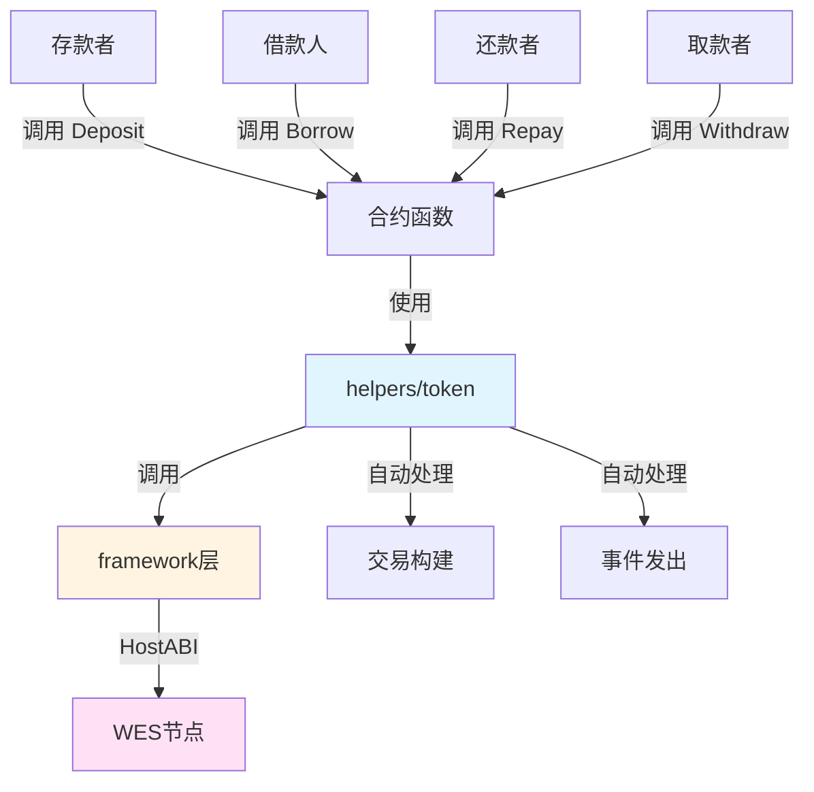

# 借贷协议合约示例

**分类**: Advanced DeFi 示例  
**难度**: ⭐⭐⭐⭐ 高级  
**最后更新**: 2025-11-11

---

## 📋 概述

本示例展示如何使用 WES Contract SDK Go 构建 DeFi 借贷协议合约。通过本示例，您可以学习如何使用 `helpers/token` 和 `helpers/market` 模块实现完整的借贷功能，包括存款、借款、还款、取款等。

---

## 🎯 核心功能

本示例实现了完整的借贷协议功能：

| 功能 | 函数 | 说明 |
|------|------|------|
| ✅ **存款** | `Deposit` | 存入代币作为抵押品，获得存款凭证代币 |
| ✅ **借款** | `Borrow` | 使用抵押品借出代币 |
| ✅ **还款** | `Repay` | 偿还借款本金和利息，释放抵押品 |
| ✅ **取款** | `Withdraw` | 取出存款和收益 |

---

## 🏗️ 架构设计



**架构说明**：
- **合约层**：开发者编写的合约函数
- **Token/Market层**：业务语义API，自动处理交易构建、事件发出
- **Framework层**：HostABI封装，提供基础原语
- **节点层**：WES节点，执行合约并上链

---

## 📚 功能详解

### 1. Deposit - 存款

**功能说明**：用户存入代币作为抵押品，获得存款凭证代币。

**参数格式**：
```json
{
  "token_id": "TOKEN_001",
  "amount": 10000
}
```

**特点**：
- 用户存入代币，获得存款凭证代币（cToken）
- 存款凭证代币可以交易，代表存款份额
- 存款可以获得利息收益

**⚠️ 注意**：这是一个简化实现
- 实际应用中需要实现存款凭证代币的铸造和管理
- 存款利率计算
- 存款总额统计

**使用示例**：
```bash
wes contract call --address {contract_addr} \
  --function Deposit \
  --params '{"token_id":"TOKEN_001","amount":10000}'
```

---

### 2. Borrow - 借款

**功能说明**：使用抵押品借出代币。

**参数格式**：
```json
{
  "token_id": "TOKEN_002",
  "amount": 5000
}
```

**特点**：
- 需要提供足够的抵押品
- 需要满足抵押率要求（如150%）
- 需要支付借款利息

**⚠️ 注意**：这是一个简化实现
- 实际应用中需要实现抵押品价值查询（需要价格预言机或ISPC受控机制）
- 抵押率检查（确保抵押品价值足够）
- 借款利率计算
- 借款总额统计

**使用示例**：
```bash
wes contract call --address {contract_addr} \
  --function Borrow \
  --params '{"token_id":"TOKEN_002","amount":5000}'
```

---

### 3. Repay - 还款

**功能说明**：偿还借款本金和利息，释放抵押品。

**参数格式**：
```json
{
  "token_id": "TOKEN_002",
  "amount": 5500
}
```

**特点**：
- 偿还借款本金和利息
- 释放抵押品（部分或全部）
- 减少借款余额

**⚠️ 注意**：这是一个简化实现
- 实际应用中需要实现借款信息查询（从状态输出）
- 利息计算（根据借款时间和利率）
- 抵押品释放逻辑

**使用示例**：
```bash
wes contract call --address {contract_addr} \
  --function Repay \
  --params '{"token_id":"TOKEN_002","amount":5500}'
```

---

### 4. Withdraw - 取款

**功能说明**：取出存款和收益。

**参数格式**：
```json
{
  "token_id": "TOKEN_001",
  "amount": 10500
}
```

**特点**：
- 取出存款本金和收益
- 需要销毁存款凭证代币
- 收益根据存款时间和利率计算

**⚠️ 注意**：这是一个简化实现
- 实际应用中需要实现存款信息查询（从状态输出）
- 收益计算（根据存款时间和利率）
- 存款凭证代币的销毁

**使用示例**：
```bash
wes contract call --address {contract_addr} \
  --function Withdraw \
  --params '{"token_id":"TOKEN_001","amount":10500}'
```

---

## 🚀 快速开始

### 1. 编译合约

```bash
cd advanced/defi/lending
bash build.sh
```

编译完成后会生成 `main.wasm` 文件。

### 2. 部署合约

```bash
# 使用 WES CLI 部署
wes contract deploy --wasm main.wasm
```

### 3. 调用合约

```bash
# 存款
wes contract call --address {contract_addr} \
  --function Deposit \
  --params '{"token_id":"TOKEN_001","amount":10000}'
```

---

## 📊 SDK vs 应用层职责

| 职责 | SDK 提供 | 应用层实现 |
|------|---------|-----------|
| **代币转移** | ✅ 自动处理 | - |
| **资产托管** | ✅ 自动处理 | - |
| **交易构建** | ✅ 自动处理 | - |
| **事件发出** | ✅ 自动处理 | - |
| **利率计算** | ❌ | ✅ 需要实现（根据市场供需动态调整） |
| **抵押率检查** | ❌ | ✅ 需要实现（确保抵押品价值足够） |
| **清算机制** | ❌ | ✅ 需要实现（抵押品不足时清算） |
| **存款凭证代币管理** | ❌ | ✅ 需要实现（铸造、销毁、交易） |
| **价格查询** | ❌ | ✅ 需要实现（使用ISPC受控机制或价格预言机） |

---

## 💡 设计理念

### 借贷协议的特点

- ✅ **流动性提供**：存款者提供流动性，获得收益
- ✅ **杠杆交易**：借款人可以使用抵押品借出代币
- ✅ **风险控制**：通过抵押率控制风险
- ✅ **自动化**：利率和清算可以自动化执行

### SDK 提供"积木"

SDK 提供基础能力（Transfer、Escrow、Mint、Burn），开发者可以：

- ✅ 直接使用基础功能创建借贷协议应用
- ✅ 添加业务规则实现定制需求
- ✅ 组合多个功能实现复杂场景

### 应用层搭建"建筑"

应用层在 SDK 基础上实现：

- ✅ 利率计算（根据市场供需动态调整）
- ✅ 抵押率检查（确保抵押品价值足够）
- ✅ 清算机制（抵押品不足时清算）
- ✅ 存款凭证代币管理（铸造、销毁、交易）
- ✅ 价格查询（使用ISPC受控机制或价格预言机）

---

## 🔗 相关文档

- [Token 模块文档](../../../helpers/token/README.md) - Token 模块详细说明
- [Market 模块文档](../../../helpers/market/README.md) - Market 模块详细说明
- [Framework 文档](../../../framework/README.md) - Framework 层说明
- [示例总览](../../README.md) - 所有示例索引
- [示例总览](../../README.md) - 示例组织结构规划

---

**最后更新**: 2025-11-11

