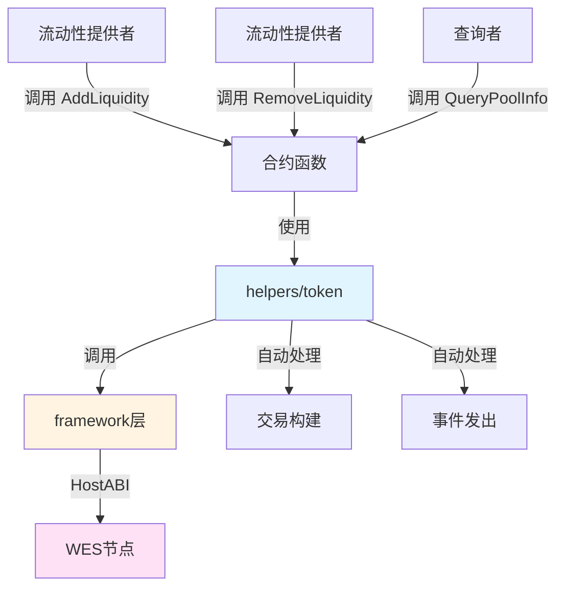

# 流动性池合约示例

**分类**: Advanced DeFi 示例  
**难度**: ⭐⭐⭐⭐ 高级  
**最后更新**: 2025-11-11

---

## 📋 概述

本示例展示如何使用 WES Contract SDK Go 构建流动性池合约。通过本示例，您可以学习如何使用 `helpers/token` 和 `helpers/market` 模块实现完整的流动性池功能，包括添加流动性、移除流动性、查询池信息等。

---

## 🎯 核心功能

本示例实现了完整的流动性池功能：

| 功能 | 函数 | 说明 |
|------|------|------|
| ✅ **添加流动性** | `AddLiquidity` | 向流动性池添加代币，获得LP Token |
| ✅ **移除流动性** | `RemoveLiquidity` | 从流动性池移除代币，销毁LP Token |
| ✅ **查询池信息** | `QueryPoolInfo` | 查询流动性池的详细信息 |

---

## 🏗️ 架构设计



**架构说明**：
- **合约层**：开发者编写的合约函数
- **Token/Market层**：业务语义API，自动处理交易构建、事件发出
- **Framework层**：HostABI封装，提供基础原语
- **节点层**：WES节点，执行合约并上链

---

## 📚 功能详解

### 1. AddLiquidity - 添加流动性

**功能说明**：向流动性池添加代币，获得流动性凭证代币（LP Token）。

**参数格式**：
```json
{
  "token_id": "TOKEN_001",
  "amount": 10000
}
```

**特点**：
- 用户存入代币，获得流动性凭证代币（LP Token）
- LP Token代表用户在池中的份额
- 流动性提供者获得收益分成

**⚠️ 注意**：这是一个简化实现
- 实际应用中需要实现流动性份额计算
- 首次添加流动性的特殊处理
- 流动性凭证代币的铸造

**使用示例**：
```bash
wes contract call --address {contract_addr} \
  --function AddLiquidity \
  --params '{"token_id":"TOKEN_001","amount":10000}'
```

---

### 2. RemoveLiquidity - 移除流动性

**功能说明**：从流动性池移除代币，销毁流动性凭证代币。

**参数格式**：
```json
{
  "token_id": "TOKEN_001",
  "lp_token_amount": 100
}
```

**特点**：
- 根据LP Token数量计算应返还的代币数量
- 销毁LP Token
- 返还代币给用户

**⚠️ 注意**：这是一个简化实现
- 实际应用中需要实现应返还代币数量计算
- LP Token销毁

**使用示例**：
```bash
wes contract call --address {contract_addr} \
  --function RemoveLiquidity \
  --params '{"token_id":"TOKEN_001","lp_token_amount":100}'
```

---

### 3. QueryPoolInfo - 查询池信息

**功能说明**：查询流动性池的详细信息。

**参数格式**：
```json
{
  "token_id": "TOKEN_001"
}
```

**⚠️ 注意**：这是一个简化实现
- 实际应用中，应该从状态输出查询池信息
- 包括池中代币余额、LP Token总量、总流动性等

**使用示例**：
```bash
wes contract call --address {contract_addr} \
  --function QueryPoolInfo \
  --params '{"token_id":"TOKEN_001"}'
```

---

## 🚀 快速开始

### 1. 编译合约

```bash
cd advanced/defi/liquidity-pool
bash build.sh
```

编译完成后会生成 `main.wasm` 文件。

### 2. 部署合约

```bash
# 使用 WES CLI 部署
wes contract deploy --wasm main.wasm
```

### 3. 调用合约

```bash
# 添加流动性
wes contract call --address {contract_addr} \
  --function AddLiquidity \
  --params '{"token_id":"TOKEN_001","amount":10000}'
```

---

## 📊 SDK vs 应用层职责

| 职责 | SDK 提供 | 应用层实现 |
|------|---------|-----------|
| **代币转移** | ✅ 自动处理 | - |
| **交易构建** | ✅ 自动处理 | - |
| **事件发出** | ✅ 自动处理 | - |
| **流动性份额计算** | ❌ | ✅ 需要实现 |
| **收益分配机制** | ❌ | ✅ 需要实现 |
| **流动性凭证代币管理** | ❌ | ✅ 需要实现（铸造、销毁、交易） |

---

## 💡 设计理念

### 流动性池的特点

- ✅ **流动性提供**：用户提供流动性，获得收益
- ✅ **份额管理**：LP Token代表用户在池中的份额
- ✅ **收益分配**：流动性提供者获得收益分成
- ✅ **自动化**：流动性管理可以自动化执行

### SDK 提供"积木"

SDK 提供基础能力（Transfer、Mint、Burn），开发者可以：

- ✅ 直接使用基础功能创建流动性池应用
- ✅ 添加业务规则实现定制需求
- ✅ 组合多个功能实现复杂场景

### 应用层搭建"建筑"

应用层在 SDK 基础上实现：

- ✅ 流动性份额计算（LP Token数量 = (amount / totalReserve) * totalLPTokens）
- ✅ 收益分配机制（根据LP Token份额分配收益）
- ✅ 流动性凭证代币管理（铸造、销毁、交易）

---

## 🔗 相关文档

- [Token 模块文档](../../../helpers/token/README.md) - Token 模块详细说明
- [Market 模块文档](../../../helpers/market/README.md) - Market 模块详细说明
- [Framework 文档](../../../framework/README.md) - Framework 层说明
- [示例总览](../../README.md) - 所有示例索引
- [示例总览](../../README.md) - 示例组织结构规划

---

**最后更新**: 2025-11-11

