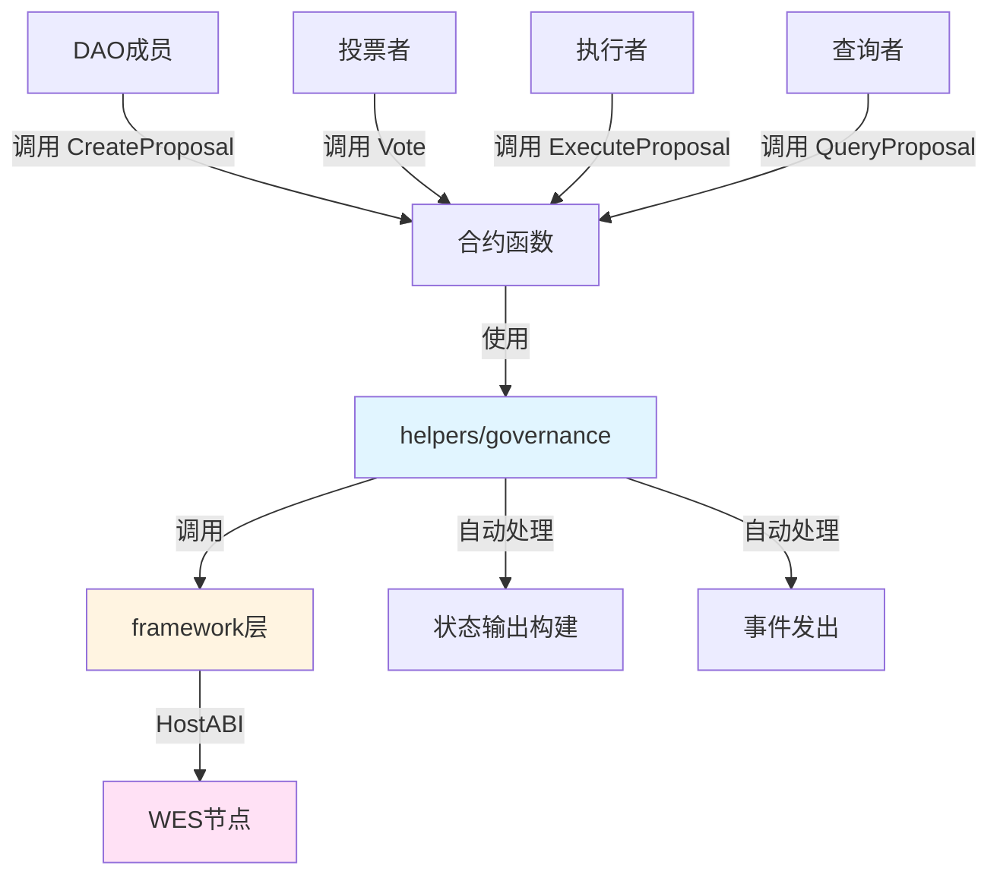

# DAO治理合约示例

**分类**: Governance 治理示例  
**难度**: ⭐⭐⭐ 高级  
**最后更新**: 2025-11-11

---

## 📋 概述

本示例展示如何使用 WES Contract SDK Go 构建DAO（去中心化自治组织）治理合约。通过本示例，您可以学习如何使用 `helpers/governance` 和 `helpers/token` 模块实现完整的DAO治理功能，包括提案创建、投票、执行等。

---

## 🎯 核心功能

本示例实现了完整的DAO治理功能：

| 功能 | 函数 | 说明 |
|------|------|------|
| ✅ **创建提案** | `CreateProposal` | 创建新的治理提案 |
| ✅ **投票** | `Vote` | 使用治理代币进行投票 |
| ✅ **执行提案** | `ExecuteProposal` | 执行已通过的提案 |
| ✅ **查询提案** | `QueryProposal` | 查询提案的详细信息 |

---

## 🏗️ 架构设计



**架构说明**：
- **合约层**：开发者编写的合约函数
- **Governance层**：业务语义API，自动处理状态输出构建、事件发出
- **Framework层**：HostABI封装，提供基础原语
- **节点层**：WES节点，执行合约并上链

---

## 📚 功能详解

### 1. CreateProposal - 创建提案

**功能说明**：创建新的治理提案。

**参数格式**：
```json
{
  "proposal_id": "proposal_001",
  "title": "Proposal Title",
  "description": "Proposal description",
  "voting_period": 604800,
  "threshold": 50
}
```

**特点**：
- 支持设置提案内容和投票参数
- 投票期限和通过阈值可配置

**⚠️ 注意**：这是一个简化实现
- 实际应用中，应该使用状态输出存储提案信息
- 包括提案内容、投票期限、通过阈值、投票结果等

**使用示例**：
```bash
wes contract call --address {contract_addr} \
  --function CreateProposal \
  --params '{"proposal_id":"proposal_001","title":"Proposal Title","voting_period":604800,"threshold":50}'
```

---

### 2. Vote - 投票

**功能说明**：使用治理代币进行投票。

**参数格式**：
```json
{
  "proposal_id": "proposal_001",
  "support": true
}
```

**特点**：
- 投票权重 = 持有的代币数量
- 使用 `governance.Vote()` 进行投票

**⚠️ 注意**：这是一个简化实现
- 实际应用中，应该检查提案是否存在
- 检查投票期限
- 检查是否已投票（防止重复投票）
- 计算投票权重（持有的代币数量 + 委托的代币数量）

**使用示例**：
```bash
wes contract call --address {contract_addr} \
  --function Vote \
  --params '{"proposal_id":"proposal_001","support":true}'
```

---

### 3. ExecuteProposal - 执行提案

**功能说明**：执行已通过的提案。

**参数格式**：
```json
{
  "proposal_id": "proposal_001"
}
```

**⚠️ 注意**：这是一个简化实现
- 实际应用中，应该检查提案是否已通过
- 检查提案是否已执行（防止重复执行）
- 执行提案内容（调用其他合约、转移资金等）
- 更新提案状态（使用状态输出）

**使用示例**：
```bash
wes contract call --address {contract_addr} \
  --function ExecuteProposal \
  --params '{"proposal_id":"proposal_001"}'
```

---

### 4. QueryProposal - 查询提案

**功能说明**：查询提案的详细信息。

**参数格式**：
```json
{
  "proposal_id": "proposal_001"
}
```

**⚠️ 注意**：这是一个简化实现
- 实际应用中，应该从状态输出查询提案信息
- 包括提案内容、投票期限、通过阈值、投票结果、执行状态等

**使用示例**：
```bash
wes contract call --address {contract_addr} \
  --function QueryProposal \
  --params '{"proposal_id":"proposal_001"}'
```

---

## 🚀 快速开始

### 1. 编译合约

```bash
cd governance/dao
bash build.sh
```

编译完成后会生成 `main.wasm` 文件。

### 2. 部署合约

```bash
# 使用 WES CLI 部署
wes contract deploy --wasm main.wasm
```

### 3. 调用合约

```bash
# 创建提案
wes contract call --address {contract_addr} \
  --function CreateProposal \
  --params '{"proposal_id":"proposal_001","title":"Proposal Title","voting_period":604800,"threshold":50}'
```

---

## 📊 SDK vs 应用层职责

| 职责 | SDK 提供 | 应用层实现 |
|------|---------|-----------|
| **投票操作** | ✅ 自动处理 | - |
| **状态输出构建** | ✅ 自动处理 | - |
| **事件发出** | ✅ 自动处理 | - |
| **提案管理** | ❌ | ✅ 需要实现（使用状态输出） |
| **投票结果统计** | ❌ | ✅ 需要实现 |
| **提案执行逻辑** | ❌ | ✅ 需要实现 |
| **投票权重计算** | ❌ | ✅ 需要实现（考虑委托） |

---

## 💡 设计理念

### DAO治理的特点

- ✅ **去中心化决策**：代币持有者共同决策
- ✅ **提案执行自动化**：通过的提案自动执行
- ✅ **透明公开**：所有提案和投票记录在链上

### SDK 提供"积木"

SDK 提供基础能力（Vote），开发者可以：

- ✅ 直接使用基础功能创建DAO治理应用
- ✅ 添加业务规则实现定制需求
- ✅ 组合多个功能实现复杂场景

### 应用层搭建"建筑"

应用层在 SDK 基础上实现：

- ✅ 提案管理（使用状态输出存储提案信息）
- ✅ 投票结果统计（统计支持票和反对票）
- ✅ 提案执行逻辑（调用其他合约、转移资金等）
- ✅ 投票权重计算（考虑委托的代币数量）

---

## 🔗 相关文档

- [Governance 模块文档](../../helpers/governance/README.md) - Governance 模块详细说明
- [Token 模块文档](../../helpers/token/README.md) - Token 模块详细说明
- [Framework 文档](../../framework/README.md) - Framework 层说明
- [示例总览](../README.md) - 所有示例索引
- [示例总览](../README.md) - 示例组织结构规划

---

**最后更新**: 2025-11-11

