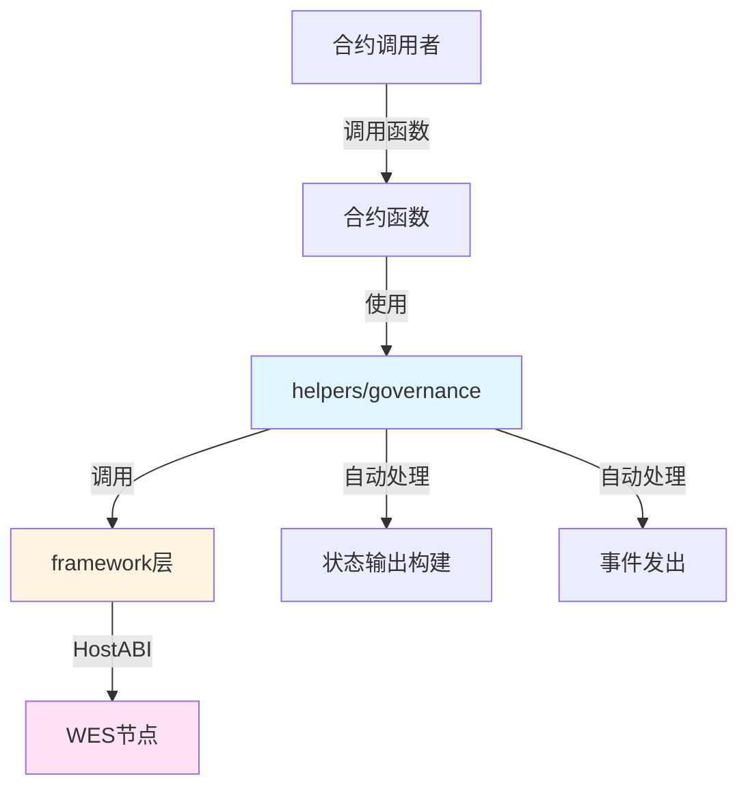

# 提案投票治理合约示例

**分类**: Governance 治理示例  
**难度**: ⭐⭐ 进阶  
**最后更新**: 2025-11-11

---

## 📋 概述

本示例展示如何使用 WES Contract SDK Go 构建去中心化治理相关的智能合约。通过本示例，您可以学习如何使用 `helpers/governance` 模块提供的业务语义API，简化治理合约的开发。

---

## 🎯 核心功能

本示例实现了完整的治理功能：

| 功能 | 函数 | 说明 |
|------|------|------|
| ✅ **创建提案** | `Propose` | 创建治理提案，自动处理状态输出和事件发出 |
| ✅ **投票** | `Vote` | 对提案进行投票，支持支持/反对两种方式 |

---

## 🏗️ 架构设计



**架构说明**：
- **合约层**：开发者编写的合约函数
- **Helpers层**：业务语义API，自动处理状态输出构建、事件发出
- **Framework层**：HostABI封装，提供基础原语
- **节点层**：WES节点，执行合约并上链

---

## 📚 功能详解

### 1. Propose - 创建提案

**功能说明**：使用 `governance.Propose()` 创建治理提案。

**参数格式**：
```json
{
  "proposal_id": "proposal_123",
  "proposal_data": "Increase token supply by 10%"
}
```

**SDK自动处理**：
- ✅ 状态输出构建（自动构建提案状态输出）
- ✅ 事件发出（自动发出 Propose 事件）

**⚠️ 注意**：实际应用中需要业务规则检查
- 提案创建权限检查（谁可以创建提案）
- 提案格式验证（提案内容是否符合规范）
- 提案ID唯一性检查

**使用示例**：
```bash
wes contract call --address {contract_addr} \
  --function Propose \
  --params '{"proposal_id":"proposal_123","proposal_data":"Increase token supply by 10%"}'
```

---

### 2. Vote - 投票

**功能说明**：使用 `governance.Vote()` 对提案进行投票。

**参数格式**：
```json
{
  "proposal_id": "proposal_123",
  "support": true
}
```

**SDK自动处理**：
- ✅ 状态输出构建（自动构建投票状态输出）
- ✅ 事件发出（自动发出 Vote 事件）

**⚠️ 注意**：实际应用中需要业务规则检查
- 提案存在性检查（提案是否已创建）
- 投票权限检查（谁可以投票，是否已投票）
- 投票时间窗口检查（是否在投票期内）
- 投票权重计算（基于代币持有量或其他规则）

**使用示例**：
```bash
# 支持提案
wes contract call --address {contract_addr} \
  --function Vote \
  --params '{"proposal_id":"proposal_123","support":true}'

# 反对提案
wes contract call --address {contract_addr} \
  --function Vote \
  --params '{"proposal_id":"proposal_123","support":false}'
```

---

## 🚀 快速开始

### 1. 编译合约

```bash
cd governance/proposal-voting
bash build.sh
```

编译完成后会生成 `main.wasm` 文件。

### 2. 部署合约

```bash
# 使用 WES CLI 部署
wes contract deploy --wasm main.wasm
```

### 3. 调用合约

```bash
# 创建提案
wes contract call --address {contract_addr} \
  --function Propose \
  --params '{"proposal_id":"proposal_123","proposal_data":"Increase token supply by 10%"}'

# 投票
wes contract call --address {contract_addr} \
  --function Vote \
  --params '{"proposal_id":"proposal_123","support":true}'
```

---

## 📊 SDK vs 应用层职责

| 职责 | SDK 提供 | 应用层实现 |
|------|---------|-----------|
| **状态输出构建** | ✅ 自动处理 | - |
| **事件发出** | ✅ 自动处理 | - |
| **提案创建权限** | ❌ | ✅ 需要实现 |
| **提案格式验证** | ❌ | ✅ 需要实现 |
| **提案ID唯一性** | ❌ | ✅ 需要实现 |
| **投票权限检查** | ❌ | ✅ 需要实现 |
| **投票时间窗口** | ❌ | ✅ 需要实现 |
| **投票权重计算** | ❌ | ✅ 需要实现 |
| **投票统计** | ❌ | ✅ 需要实现（可使用 `governance.VoteAndCount()`） |

---

## 💡 设计理念

### SDK 提供"积木"

SDK 提供基础能力（Propose、Vote），开发者可以：

- ✅ 直接使用基础功能
- ✅ 添加业务规则实现定制需求
- ✅ 组合多个功能实现复杂场景（如使用 `governance.VoteAndCount()` 实现投票统计）

### 应用层搭建"建筑"

应用层在 SDK 基础上实现：

- ✅ 权限管理（谁可以创建提案、谁可以投票）
- ✅ 业务规则（提案格式、投票时间窗口、投票权重）
- ✅ 投票统计（使用 `governance.VoteAndCount()` 或自定义统计逻辑）

---

## 🔗 相关文档

- [Governance 模块文档](../../helpers/governance/README.md) - Governance 模块详细说明
- [Framework 文档](../../framework/README.md) - Framework 层说明
- [示例总览](../README.md) - 所有示例索引
- [示例总览](../README.md) - 示例组织结构规划

---

**最后更新**: 2025-11-11
