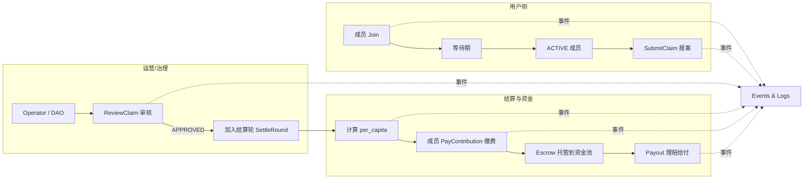
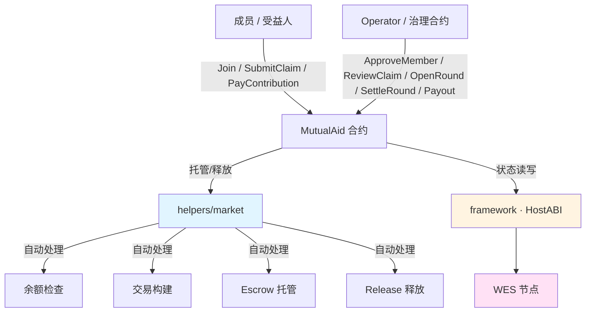

# 互助险合约模板（Mutual Aid Insurance · Production Ready）

**分类**: Insurance 互助险模板  
**难度**: ⭐⭐⭐ 中高级  
**最后更新**: 2025-12-07

---

## 📋 概述

本模板在 WES 上实现了一个接近「相互宝」模式的 **生产级互助险合约**，特点是：

- **事后分摊**：先发生案件，再由全体成员按人均金额 AA 分摊；
- **定额/封顶给付**：每个案件有固定或上限给付额度；
- **完整链上状态**：对计划、成员、案件、结算轮次、分摊账本等做了 **结构化持久化存储**；
- **WES 风格同步返回**：所有写操作（`Initialize/Join/.../Payout`）都会通过 `SetReturnJSON` **直接返回业务结果**，无需再二次查询；
- **Helpers 集成**：通过 `helpers/market.Escrow/Release` 实现资金托管与给付。

它适合作为：

- 互助险/健康保障类产品的 **标准合约模板**；
- 保险公司/互联网平台在 WES 上搭建互助业务的参考实现；
- 结合 `standard/governance/dao` 做「案件 = 提案」的治理扩展基础。

> 本模板默认部署在 consortium/private 链模式，建议配合链下 KYC / 风控服务使用。

---

## 🧩 业务与状态模型

### 1. 核心业务流程（配图）



### 2. 状态 ID 与结构

合约采用「轻量 KV + 固定长度编码」的方式管理状态。主要 StateID 如下：

| StateID / 前缀 | 说明 |
|----------------|------|
| `plan_config` | 互助计划配置（`PlanConfig`） |
| `operator` | 计划运营方地址 |
| `member_{address}` | 成员信息（`Member`） |
| `member_count_active` | 当前活跃成员数 |
| `claim_{claim_id}` | 理赔案件信息（`Claim`） |
| `round_{round_id}` | 结算轮信息（`Round`） |
| `current_round_id` | 当前轮次 ID |
| `member_round_due_{address}_{round_id}` | 成员在某轮的应缴/实缴记录（`MemberRoundDue`） |
| `member_month_stat_{address}_{yyyymm}` | 成员在某自然月的缴费统计（`MemberMonthStat`） |

对应结构（在 `main.go` 中通过自定义编码实现）：

- `PlanConfig`（编码函数：`encodePlanConfig/decodePlanConfig`）
  - `plan_id`, `name`, `token_id`
  - `coverage_amount`：单次给付金额
  - `service_fee_bp`：服务费率（万分比）
  - `settlement_period`：结算周期（秒）
  - `waiting_period`：等待期（秒）
  - `min_members`：计划生效的最小成员数
  - `monthly_cap_per_member`：单成员月度分摊上限

- `Member`（`encodeMember/decodeMember`）
  - `status`：`PENDING/ACTIVE/SUSPENDED/EXITED/BLACKLISTED`
  - `join_time`
  - `total_paid` / `total_received`
  - `arrears_amount`
  - `last_settled_round`

- `Claim`（`encodeClaim/decodeClaim`）
  - `plan_id`, `claim_id`
  - `applicant` / `insured`（20 字节地址二进制，查询时转 Base58）
  - `status`：`SUBMITTED/UNDER_REVIEW/APPROVED/REJECTED/PAID/...`
  - `round_id`
  - `evidence_hash` / `investigation_hash`
  - `requested_amount` / `approved_amount`
  - `event_time`

- `Round`（`encodeRound/decodeRound`）
  - `plan_id`, `round_id`, `status`：`OPEN/SETTLED/CLOSED`
  - `period_start` / `period_end`
  - `total_approved_payout`
  - `total_service_fee`
  - `per_capita_contribution`
  - `payers_count`

- `MemberRoundDue`（`encodeMemberRoundDue/decodeMemberRoundDue`）
  - `due_amount` / `paid_amount`
  - `settled`：是否结清

- `MemberMonthStat`（`encodeMemberMonthStat/decodeMemberMonthStat`）
  - `paid_amount`
  - `cap_reached`：是否达到月度上限

---

## 🏗️ 合约架构（配图）



**架构要点：**

- 合约层只关心「业务语义」：成员、案件、轮次、分摊；
- `helpers/market` 负责资金托管与给付；
- `framework` 封装 HostABI，提供参数解析、事件、状态输出等；
- WES 节点负责 EUTXO 模型下的交易执行与安全。

---

## 🔌 导出接口一览

### 写操作（均返回 JSON 业务结果）

| 函数 | 说明 |
|------|------|
| `Initialize` | 初始化互助计划，设置 `PlanConfig`、`operator` 和成员计数 |
| `Join` | 成员申请加入计划，记录为 `PENDING`，等待审核 |
| `ApproveMember` | Operator 审核并激活成员为 `ACTIVE` |
| `Exit` | 成员退出计划，状态置为 `EXITED`，更新活跃成员数 |
| `SubmitClaim` | 成员（或其为被保人）提交理赔申请 |
| `ReviewClaim` | Operator 审核案件，通过/拒绝并确定批准金额 |
| `OpenRound` | 开启新的结算轮次 |
| `SettleRound` | 结算轮次，计算人均分摊额，更新轮次状态为 `SETTLED` |
| `PayContribution` | 成员为某轮次缴纳分摊（调用 `market.Escrow`） |
| `Payout` | 为已批准案件执行理赔给付（调用 `market.Release`） |

### 查询接口（只读）

| 函数 | 说明 |
|------|------|
| `GetPlanInfo` | 查询计划配置与当前活跃成员数 |
| `GetMemberInfo` | 查询成员在计划中的状态与统计 |
| `GetClaimInfo` | 查询理赔案件详情 |
| `GetRoundInfo` | 查询结算轮详情 |

所有查询接口均使用 `framework.SetReturnJSON` 返回结构化 JSON。

---

## 📚 核心函数与流程说明

> 下面只列出参数与返回结构摘要，详细字段请参考 `main.go` 中的函数注释。

### 1. Initialize —— 初始化互助计划

**请求参数（JSON）示例：**

```json
{
  "plan_id": "plan_xianghubao_001",
  "name": "相互宝互助计划",
  "token_id": "",
  "coverage_amount": 300000,
  "service_fee_bp": 800,
  "settlement_period": 2592000,
  "waiting_period": 86400,
  "min_members": 1000,
  "monthly_cap_per_member": 10000
}
```

**状态变更：**

- 写入 `plan_config`；
- 写入 `operator`（调用者地址）；
- 写入 `member_count_active = 0`。

**返回 JSON（示例）：**

```json
{
  "plan_id": "plan_xianghubao_001",
  "name": "相互宝互助计划",
  "token_id": "",
  "coverage_amount": 300000,
  "service_fee_bp": 800,
  "settlement_period": 2592000,
  "waiting_period": 86400,
  "min_members": 1000,
  "monthly_cap_per_member": 10000,
  "operator": "Cf1...",
  "member_count_active": 0,
  "initialized_at": 1736200000
}
```

---

### 2. Join / ApproveMember / Exit —— 成员生命周期

**Join**

- 检查成员是否已存在；
- 创建 `member_{address}`，状态 `PENDING`；
- 返回等待期与预计生效时间。

**ApproveMember**（仅 Operator）

- 将成员由 `PENDING` 置为 `ACTIVE`；
- `member_count_active` + 1；
- 返回当前成员视图和最新活跃成员数。

**Exit**

- 检查成员为 `ACTIVE`；
- 将状态置为 `EXITED`；
- `member_count_active` - 1；
- 保留 `total_paid/total_received/arrears_amount` 等统计。

---

### 3. SubmitClaim / ReviewClaim —— 理赔案件生命周期

**SubmitClaim**

- 申请人必须为 `ACTIVE` 成员且已过等待期；
- `claim_{id}` 初始化为 `SUBMITTED`；
- 记录 `applicant/insured`、`requested_amount`、`event_time`、`evidence_hash` 等；
- 返回完整案件视图。

**ReviewClaim**（仅 Operator）

- 支持 `APPROVE / REJECT` 决策；
- 检查当前状态在 `SUBMITTED/UNDER_REVIEW`；
- 通过时校验 `approved_amount <= requested_amount`；
- 写回 `status`、`approved_amount`、`round_id` 等；
- 返回更新后的案件 JSON。

> 当前版本未直接与 `governance/dao` 集成，但在设计上已预留 `review_round_id` 等字段，可在 v2 中将案件映射为 DAO 提案。

---

### 4. OpenRound / SettleRound —— 轮次与分摊

**OpenRound**

- 创建 `round_{round_id}`，状态 `OPEN`；
- 记录时间区间 `period_start/period_end`；
- 将 `current_round_id` 设置为该轮次；
- 返回轮次基本信息。

**SettleRound**

- 仅 Operator；
- 要求轮次状态为 `OPEN`；
- 从 `plan_config` 读取 `service_fee_bp`，从 `round` 读取 `total_approved_payout`（当前实现假设已通过其他流程写入，后续可扩展为自动汇总 APPROVED 案件）；
- 读取 `member_count_active` 计算 `per_capita_contribution`；
- 更新 `round` 状态为 `SETTLED`；
- 返回本轮结算结果（含人均分摊额）。

---

### 5. PayContribution —— 缴纳分摊（含月度上限）

**要点：**

- 仅 `ACTIVE` 成员可调用；
- 轮次必须处于 `SETTLED` 状态；
- 使用 `member_round_due_{addr}_{round_id}` 记录应缴/实缴/是否结清；
- 使用 `member_month_stat_{addr}_{yyyymm}` 记录当月累计缴费与上限标记；
- 从 `plan_config` 中读取 `monthly_cap_per_member`，若超限则拒绝；
- 通过 `market.Escrow` 将资金托管到资金池。

**返回 JSON（示例）：**

```json
{
  "plan_id": "plan_xianghubao_001",
  "round_id": "round_202501_01",
  "payer": "Cf1...",
  "amount": 3240,
  "due_amount": 3240,
  "paid_amount": 3240,
  "settled": true,
  "month_paid_amount": 6480,
  "monthly_cap_per_member": 10000,
  "cap_reached": false,
  "total_paid": 6480,
  "contribution_id": "contrib_202501_0001"
}
```

---

### 6. Payout —— 理赔给付

- 仅 Operator；
- 案件状态必须为 `APPROVED`；
- 检查给付金额不超过 `approved_amount`；
- 调用 `market.Release(from, beneficiary, token_id, amount, vesting_id)` 从资金池转出；
- 将案件状态更新为 `PAID`；
- 若被保人是成员，更新其 `total_received`；
- 返回案件最终状态与被保人累计领取金额。

---

## 🔍 查询接口

所有查询接口都是 **只读** 且返回 JSON：

- `GetPlanInfo`：返回计划配置 + operator + `member_count_active`；
- `GetMemberInfo`：返回成员状态与收支统计；
- `GetClaimInfo`：返回案件详情（地址字段为 Base58）；
- `GetRoundInfo`：返回轮次结算结果。

这些接口适合在 BaaS / Explorer / 前端中直接调用，无需解析事件。

---

## ⚖️ SDK vs 应用层职责

| 职责 | SDK / 模板提供 | 应用层需要补充 |
|------|----------------|----------------|
| Escrow / Release 资金操作 | ✅ `helpers/market` | - |
| 余额检查 / 交易构建 | ✅ `helpers/market` | - |
| 状态存储与编码 | ✅ 本模板已实现 | 如需扩展字段需修改编码 |
| 成员资格、健康告知规则 | ⚠️ 仅预留钩子 | ✅ 结合 KYC/风控实现 |
| 黑名单、风控规则 | ⚠️ 状态字段已预留 | ✅ 具体策略与触发条件 |
| 案件投票治理 | ❌ 仅预留字段 | ✅ 结合 `governance/dao` |
| total_approved_payout 汇总 | ⚠️ 简化为外部写入 | ✅ 在 v2 中实现自动聚合 |
| 月度分摊上限策略 | ✅ 基础约束（cap） | ✅ 复杂分层限额策略 |

---

## 🚀 快速开始

### 1. 编译合约

```bash
cd standard/insurance/mutual-aid
bash build.sh
```

成功后会生成 `main.wasm`。

### 2. 部署合约

```bash
wes contract deploy --wasm main.wasm
```

记录返回的合约地址 `{contract_addr}`。

### 3. 调用示例（写 + 查）

```bash
# 初始化计划（仅 operator 调用一次）
wes contract call --address {contract_addr} \
  --function Initialize \
  --params '{
    "plan_id":"plan_xianghubao_001",
    "name":"相互宝互助计划",
    "token_id":"",
    "coverage_amount":300000,
    "service_fee_bp":800,
    "settlement_period":2592000,
    "waiting_period":86400,
    "min_members":1000,
    "monthly_cap_per_member":10000
  }'

# 成员加入
wes contract call --address {contract_addr} \
  --function Join \
  --params '{"plan_id":"plan_xianghubao_001"}'

# 审核并激活成员（operator 调用）
wes contract call --address {contract_addr} \
  --function ApproveMember \
  --params '{
    "plan_id":"plan_xianghubao_001",
    "member":"{member_base58}"
  }'

# 提交理赔申请
wes contract call --address {contract_addr} \
  --function SubmitClaim \
  --params '{
    "plan_id":"plan_xianghubao_001",
    "claim_id":"claim_202501_0001",
    "insured":"{insured_base58}",
    "requested_amount":300000,
    "event_time":1736200000,
    "evidence_hash":"0xabc"
  }'

# 查询计划信息
wes contract query --address {contract_addr} \
  --function GetPlanInfo \
  --params '{"plan_id":"plan_xianghubao_001"}'
```

---

## 💡 后续扩展建议

- **治理集成 v2**：将 `ReviewClaim` / `FinalizeClaim` 与 `standard/governance/dao` 绑定，实现「案件 = 治理提案」的投票裁决；
- **多计划/多链隔离**：结合 WES 的 `chain_id/network_namespace` 与 access_control，在不同 namespace 部署不同互助计划；
- **更复杂的费率与上限模型**：支持按人群/产品分层的月度上限、年度上限、家庭共保等；
- **审计与可视化**：基于所有事件和查询接口，为运营方和成员提供 **Explorer / Dashboard**，可视化每轮分摊和资金流向。


