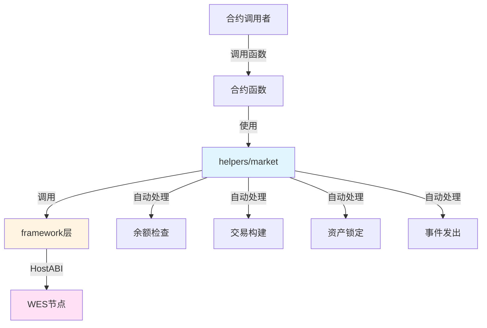

# 市场托管合约示例

**分类**: Market 市场示例  
**难度**: ⭐⭐ 进阶  
**最后更新**: 2025-11-11

---

## 📋 概述

本示例展示如何使用 WES Contract SDK Go 构建市场交易相关的智能合约。通过本示例，您可以学习如何使用 `helpers/market` 模块提供的业务语义API，简化市场合约的开发。

---

## 🎯 核心功能

本示例实现了完整的市场功能：

| 功能 | 函数 | 说明 |
|------|------|------|
| ✅ **托管** | `Escrow` | 创建代币托管，自动处理余额检查和资产锁定 |
| ✅ **分阶段释放** | `Release` | 创建分阶段释放计划，适用于分红、租金分配等 |

**⚠️ 注意**：本模块仅提供原子操作，不包含组合场景（如Swap、Liquidity等）。

---

## 🏗️ 架构设计



**架构说明**：
- **合约层**：开发者编写的合约函数
- **Helpers层**：业务语义API，自动处理余额检查、交易构建、资产锁定、事件发出
- **Framework层**：HostABI封装，提供基础原语
- **节点层**：WES节点，执行合约并上链

---

## 📚 功能详解

### 1. Escrow - 托管

**功能说明**：使用 `market.Escrow()` 创建代币托管。

**参数格式**：
```json
{
  "buyer": "Cf1Kes6snEUeykiJJgrAtKPNPrAzPdPmSn",
  "seller": "Df2Lft7toFVfjlKKhsBtLQOQsQbQeRnTn",
  "amount": 10000,
  "escrow_id": "escrow_123"
}
```

**SDK自动处理**：
- ✅ 余额检查（确保买方余额充足）
- ✅ 交易构建（自动构建 UTXO 交易）
- ✅ 资产锁定（自动锁定托管资产）
- ✅ 事件发出（自动发出 Escrow 事件）

**⚠️ 注意**：实际应用中需要业务规则检查
- 托管条件验证（交易条件、质押条件等）
- 托管金额限制
- 托管ID唯一性检查

**使用示例**：
```bash
wes contract call --address {contract_addr} \
  --function Escrow \
  --params '{"buyer":"Cf1Kes6snEUeykiJJgrAtKPNPrAzPdPmSn","seller":"Df2Lft7toFVfjlKKhsBtLQOQsQbQeRnTn","amount":10000,"escrow_id":"escrow_123"}'
```

---

### 2. Release - 分阶段释放

**功能说明**：使用 `market.Release()` 创建分阶段释放计划。

**参数格式**：
```json
{
  "from": "Cf1Kes6snEUeykiJJgrAtKPNPrAzPdPmSn",
  "beneficiary": "Df2Lft7toFVfjlKKhsBtLQOQsQbQeRnTn",
  "total_amount": 100000,
  "vesting_id": "vesting_123"
}
```

**SDK自动处理**：
- ✅ 交易构建（自动构建 UTXO 交易）
- ✅ 事件发出（自动发出 Release 事件）

**⚠️ 注意**：实际应用中需要业务规则检查
- 释放条件验证（时间锁、高度锁等）
- 释放计划ID唯一性检查
- 分阶段释放逻辑（线性释放、阶梯释放等）需要在合约中实现

**使用示例**：
```bash
wes contract call --address {contract_addr} \
  --function Release \
  --params '{"from":"Cf1Kes6snEUeykiJJgrAtKPNPrAzPdPmSn","beneficiary":"Df2Lft7toFVfjlKKhsBtLQOQsQbQeRnTn","total_amount":100000,"vesting_id":"vesting_123"}'
```

---

## 🚀 快速开始

### 1. 编译合约

```bash
cd market/escrow
bash build.sh
```

编译完成后会生成 `main.wasm` 文件。

### 2. 部署合约

```bash
# 使用 WES CLI 部署
wes contract deploy --wasm main.wasm
```

### 3. 调用合约

```bash
# 创建托管
wes contract call --address {contract_addr} \
  --function Escrow \
  --params '{"buyer":"Cf1Kes6snEUeykiJJgrAtKPNPrAzPdPmSn","seller":"Df2Lft7toFVfjlKKhsBtLQOQsQbQeRnTn","amount":10000,"escrow_id":"escrow_123"}'
```

---

## ⚠️ 不包含的功能

以下功能属于组合场景，**不应由SDK提供**，应由应用层实现：

- ❌ **Swap** - 交换（需要价格计算、滑点保护等业务逻辑）
- ❌ **AddLiquidity** - 添加流动性（需要份额计算、比例管理等业务逻辑）
- ❌ **RemoveLiquidity** - 移除流动性（需要份额计算、比例管理等业务逻辑）

---

## 📊 SDK vs 应用层职责

| 职责 | SDK 提供 | 应用层实现 |
|------|---------|-----------|
| **余额检查** | ✅ 自动处理 | - |
| **交易构建** | ✅ 自动处理 | - |
| **资产锁定** | ✅ 自动处理 | - |
| **事件发出** | ✅ 自动处理 | - |
| **托管条件验证** | ❌ | ✅ 需要实现 |
| **托管金额限制** | ❌ | ✅ 需要实现 |
| **释放条件验证** | ❌ | ✅ 需要实现 |
| **分阶段释放逻辑** | ❌ | ✅ 需要实现 |

---

## 💡 设计理念

### SDK 提供"积木"

SDK 提供基础能力（Escrow、Release），开发者可以：

- ✅ 直接使用基础功能
- ✅ 添加业务规则实现定制需求
- ✅ 组合多个功能实现复杂场景

### 应用层搭建"建筑"

应用层在 SDK 基础上实现：

- ✅ 托管条件管理（交易条件、质押条件）
- ✅ 释放计划管理（时间锁、高度锁、分阶段释放逻辑）
- ✅ 组合场景（Swap、Liquidity等）

---

## 🔗 相关文档

- [Market 模块文档](../../helpers/market/README.md) - Market 模块详细说明
- [Framework 文档](../../framework/README.md) - Framework 层说明
- [示例总览](../README.md) - 所有示例索引
- [示例总览](../README.md) - 示例组织结构规划

---

**最后更新**: 2025-11-11
