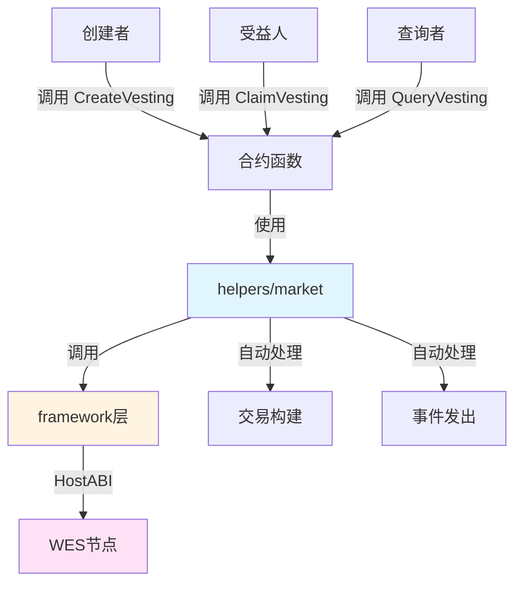

# 分阶段释放合约示例

**分类**: Market 市场示例  
**难度**: ⭐⭐ 进阶  
**最后更新**: 2025-11-11

---

## 📋 概述

本示例展示如何使用 WES Contract SDK Go 构建分阶段释放（Vesting）合约。通过本示例，您可以学习如何使用 `helpers/market` 模块实现代币的分阶段解锁和释放，适用于代币分配、员工激励、投资解锁等场景。

---

## 🎯 核心功能

本示例实现了完整的分阶段释放功能：

| 功能 | 函数 | 说明 |
|------|------|------|
| ✅ **创建释放计划** | `CreateVesting` | 创建分阶段释放计划 |
| ✅ **领取释放代币** | `ClaimVesting` | 领取已解锁的代币 |
| ✅ **查询释放计划** | `QueryVesting` | 查询释放计划的详细信息 |

---

## 🏗️ 架构设计



**架构说明**：
- **合约层**：开发者编写的合约函数
- **Market层**：业务语义API，自动处理交易构建、事件发出
- **Framework层**：HostABI封装，提供基础原语
- **节点层**：WES节点，执行合约并上链

---

## 📚 功能详解

### 1. CreateVesting - 创建释放计划

**功能说明**：使用 `market.Release()` 创建分阶段释放计划。

**参数格式**：
```json
{
  "beneficiary": "Df2Lft7toFVfjlKKhsBtLQOQsQbQeRnTn",
  "token_id": "TOKEN_001",
  "total_amount": 1000000,
  "vesting_id": "vesting_001",
  "start_time": 1640995200,
  "duration": 31536000
}
```

**特点**：
- 支持线性释放（Linear Vesting）
- 支持阶段性释放（Cliff Vesting）
- 支持自定义释放时间表

**使用示例**：
```bash
wes contract call --address {contract_addr} \
  --function CreateVesting \
  --params '{"beneficiary":"Df2Lft7toFVfjlKKhsBtLQOQsQbQeRnTn","total_amount":1000000,"vesting_id":"vesting_001"}'
```

---

### 2. ClaimVesting - 领取释放的代币

**功能说明**：根据释放计划领取已解锁的代币。

**参数格式**：
```json
{
  "vesting_id": "vesting_001",
  "amount": 10000
}
```

**⚠️ 注意**：这是一个简化实现
- 实际应用中，应该检查释放时间是否已到
- 计算已解锁的代币数量
- 检查是否已领取完毕
- 更新释放计划状态（使用状态输出）

**使用示例**：
```bash
wes contract call --address {contract_addr} \
  --function ClaimVesting \
  --params '{"vesting_id":"vesting_001","amount":10000}'
```

---

### 3. QueryVesting - 查询释放计划

**功能说明**：查询释放计划的详细信息。

**参数格式**：
```json
{
  "vesting_id": "vesting_001"
}
```

**⚠️ 注意**：这是一个简化实现
- 实际应用中，应该从状态输出查询释放计划信息
- 包括总金额、已释放金额、待释放金额、释放时间表等

**使用示例**：
```bash
wes contract call --address {contract_addr} \
  --function QueryVesting \
  --params '{"vesting_id":"vesting_001"}'
```

---

## 🚀 快速开始

### 1. 编译合约

```bash
cd market/vesting
bash build.sh
```

编译完成后会生成 `main.wasm` 文件。

### 2. 部署合约

```bash
# 使用 WES CLI 部署
wes contract deploy --wasm main.wasm
```

### 3. 调用合约

```bash
# 创建释放计划
wes contract call --address {contract_addr} \
  --function CreateVesting \
  --params '{"beneficiary":"Df2Lft7toFVfjlKKhsBtLQOQsQbQeRnTn","total_amount":1000000,"vesting_id":"vesting_001"}'
```

---

## 📊 SDK vs 应用层职责

| 职责 | SDK 提供 | 应用层实现 |
|------|---------|-----------|
| **释放计划创建** | ✅ 自动处理 | - |
| **交易构建** | ✅ 自动处理 | - |
| **事件发出** | ✅ 自动处理 | - |
| **释放时间表** | ❌ | ✅ 需要实现（使用状态输出） |
| **释放条件检查** | ❌ | ✅ 需要实现 |
| **可领取数量计算** | ❌ | ✅ 需要实现 |
| **释放计划状态管理** | ❌ | ✅ 需要实现（使用状态输出） |

---

## 💡 设计理念

### 分阶段释放的应用场景

- ✅ **代币分配**：项目方代币分配，分阶段解锁
- ✅ **员工激励**：员工期权分阶段解锁
- ✅ **投资解锁**：投资代币分阶段解锁
- ✅ **奖励发放**：奖励代币分阶段发放

### SDK 提供"积木"

SDK 提供基础能力（Release），开发者可以：

- ✅ 直接使用基础功能创建释放计划
- ✅ 添加业务规则实现定制需求
- ✅ 组合多个功能实现复杂场景

### 应用层搭建"建筑"

应用层在 SDK 基础上实现：

- ✅ 释放时间表管理（使用状态输出存储）
- ✅ 释放条件检查（时间、解锁比例等）
- ✅ 可领取数量计算（根据时间表计算）
- ✅ 释放计划状态管理（已释放、待释放等）

---

## 🔗 相关文档

- [Market 模块文档](../../helpers/market/README.md) - Market 模块详细说明
- [Framework 文档](../../framework/README.md) - Framework 层说明
- [示例总览](../README.md) - 所有示例索引
- [示例总览](../README.md) - 示例组织结构规划

---

**最后更新**: 2025-11-11

