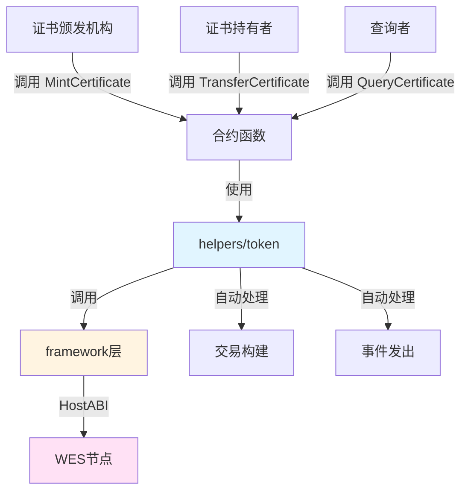

# 证书凭证NFT合约示例

**分类**: NFT 示例  
**难度**: ⭐⭐ 进阶  
**最后更新**: 2025-11-11

---

## 📋 概述

本示例展示如何使用 WES Contract SDK Go 构建证书凭证NFT合约。通过本示例，您可以学习如何使用 `helpers/token` 模块创建和管理证书凭证NFT，实现学历证书、职业资格证书等的链上认证和管理。

---

## 🎯 核心功能

本示例实现了完整的证书凭证NFT功能：

| 功能 | 函数 | 说明 |
|------|------|------|
| ✅ **铸造证书** | `MintCertificate` | 铸造唯一的证书凭证NFT |
| ✅ **转移证书** | `TransferCertificate` | 转移证书所有权 |
| ✅ **查询证书** | `QueryCertificate` | 查询证书信息和所有者 |

---

## 🏗️ 架构设计



**架构说明**：
- **合约层**：开发者编写的合约函数
- **Token层**：业务语义API，自动处理交易构建、事件发出
- **Framework层**：HostABI封装，提供基础原语
- **节点层**：WES节点，执行合约并上链

---

## 📚 功能详解

### 1. MintCertificate - 铸造证书

**功能说明**：使用 `token.Mint()` 铸造唯一的证书凭证NFT。

**参数格式**：
```json
{
  "to": "Df2Lft7toFVfjlKKhsBtLQOQsQbQeRnTn",
  "token_id": "CERT_001",
  "certificate_name": "Bachelor Degree",
  "issuer": "University Name"
}
```

**特点**：
- 每个证书都有唯一的tokenID
- 证书包含元数据（名称、颁发机构等）
- 证书不可分割，转移时数量为1

**使用示例**：
```bash
wes contract call --address {contract_addr} \
  --function MintCertificate \
  --params '{"to":"Df2Lft7toFVfjlKKhsBtLQOQsQbQeRnTn","token_id":"CERT_001","certificate_name":"Bachelor Degree","issuer":"University Name"}'
```

---

### 2. TransferCertificate - 转移证书

**功能说明**：使用 `token.Transfer()` 转移证书所有权。

**参数格式**：
```json
{
  "to": "Cf1Kes6snEUeykiJJgrAtKPNPrAzPdPmSn",
  "token_id": "CERT_001"
}
```

**使用示例**：
```bash
wes contract call --address {contract_addr} \
  --function TransferCertificate \
  --params '{"to":"Cf1Kes6snEUeykiJJgrAtKPNPrAzPdPmSn","token_id":"CERT_001"}'
```

---

### 3. QueryCertificate - 查询证书

**功能说明**：查询证书的详细信息和所有者。

**参数格式**：
```json
{
  "token_id": "CERT_001"
}
```

**使用示例**：
```bash
wes contract call --address {contract_addr} \
  --function QueryCertificate \
  --params '{"token_id":"CERT_001"}'
```

---

## 🚀 快速开始

### 1. 编译合约

```bash
cd nft/certificates
bash build.sh
```

编译完成后会生成 `main.wasm` 文件。

### 2. 部署合约

```bash
# 使用 WES CLI 部署
wes contract deploy --wasm main.wasm
```

### 3. 调用合约

```bash
# 铸造证书
wes contract call --address {contract_addr} \
  --function MintCertificate \
  --params '{"to":"Df2Lft7toFVfjlKKhsBtLQOQsQbQeRnTn","token_id":"CERT_001","certificate_name":"Bachelor Degree","issuer":"University Name"}'
```

---

## 📊 SDK vs 应用层职责

| 职责 | SDK 提供 | 应用层实现 |
|------|---------|-----------|
| **NFT铸造** | ✅ 自动处理 | - |
| **NFT转移** | ✅ 自动处理 | - |
| **交易构建** | ✅ 自动处理 | - |
| **事件发出** | ✅ 自动处理 | - |
| **证书验证** | ❌ | ✅ 需要实现（验证证书真实性） |
| **证书撤销** | ❌ | ✅ 需要实现（撤销机制） |

---

## 💡 设计理念

### 证书凭证NFT的应用场景

- ✅ **学历认证**：大学学位证书
- ✅ **职业资格**：专业资格证书
- ✅ **技能认证**：技能培训证书
- ✅ **成就证明**：竞赛获奖证书

### SDK 提供"积木"

SDK 提供基础能力（Mint、Transfer），开发者可以：

- ✅ 直接使用基础功能创建证书凭证NFT应用
- ✅ 添加业务规则实现定制需求
- ✅ 组合多个功能实现复杂场景

---

## 🔗 相关文档

- [Token 模块文档](../../helpers/token/README.md) - Token 模块详细说明
- [Framework 文档](../../framework/README.md) - Framework 层说明
- [示例总览](../README.md) - 所有示例索引
- [示例总览](../README.md) - 示例组织结构规划

---

**最后更新**: 2025-11-11
