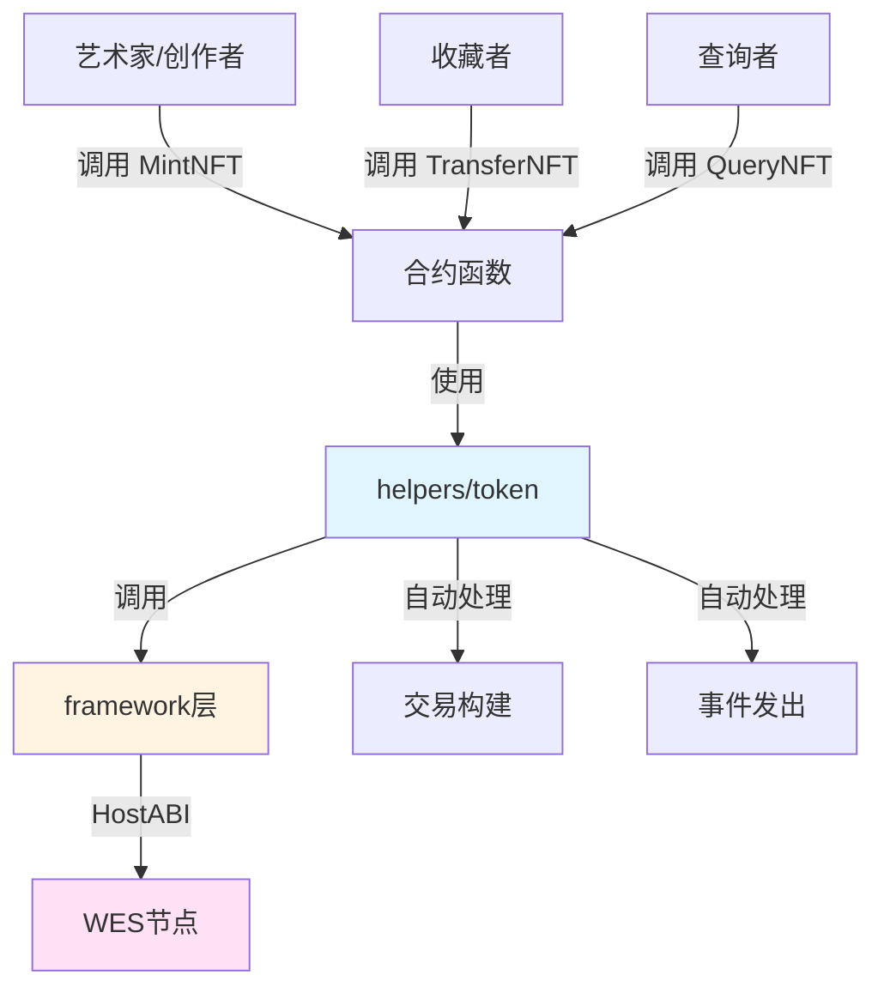

# 数字艺术NFT合约示例

**分类**: NFT 示例  
**难度**: ⭐⭐⭐ 高级  
**最后更新**: 2025-11-11

---

## 📋 概述

本示例展示如何使用 WES Contract SDK Go 构建数字艺术NFT合约。通过本示例，您可以学习如何使用 `helpers/token` 模块创建和管理NFT，实现数字艺术品的代币化。

---

## 🎯 核心功能

本示例实现了完整的数字艺术NFT功能：

| 功能 | 函数 | 说明 |
|------|------|------|
| ✅ **铸造NFT** | `MintNFT` | 铸造唯一的数字艺术NFT，包含元数据 |
| ✅ **转移NFT** | `TransferNFT` | 转移NFT所有权 |
| ✅ **查询NFT** | `QueryNFT` | 查询NFT的所有者信息 |

---

## 🏗️ 架构设计



**架构说明**：
- **合约层**：开发者编写的合约函数
- **Helpers层**：业务语义API，自动处理交易构建、事件发出
- **Framework层**：HostABI封装，提供基础原语
- **节点层**：WES节点，执行合约并上链

---

## 📚 功能详解

### 1. MintNFT - 铸造NFT

**功能说明**：使用 `token.Mint()` 铸造唯一的数字艺术NFT。

**参数格式**：
```json
{
  "to": "Cf1Kes6snEUeykiJJgrAtKPNPrAzPdPmSn",
  "token_id": "art_001",
  "name": "Sunset Over Mountains",
  "artist": "Alice",
  "description": "A beautiful sunset painting",
  "image_url": "https://example.com/artwork.jpg"
}
```

**SDK自动处理**：
- ✅ 交易构建（自动构建 UTXO 交易）
- ✅ 事件发出（自动发出 Mint 事件）

**⚠️ 注意**：实际应用中需要业务规则检查
- tokenID唯一性检查（确保每个NFT唯一）
- 元数据格式验证
- 铸造权限检查（谁可以铸造NFT）

**使用示例**：
```bash
wes contract call --address {contract_addr} \
  --function MintNFT \
  --params '{"to":"Cf1Kes6snEUeykiJJgrAtKPNPrAzPdPmSn","token_id":"art_001","name":"Sunset Over Mountains","artist":"Alice"}'
```

---

### 2. TransferNFT - 转移NFT

**功能说明**：使用 `token.Transfer()` 转移NFT所有权。

**参数格式**：
```json
{
  "to": "Df2Lft7toFVfjlKKhsBtLQOQsQbQeRnTn",
  "token_id": "art_001"
}
```

**SDK自动处理**：
- ✅ 余额检查（确保发送者拥有该NFT）
- ✅ 交易构建（自动构建 UTXO 交易）
- ✅ 事件发出（自动发出 Transfer 事件）

**使用示例**：
```bash
wes contract call --address {contract_addr} \
  --function TransferNFT \
  --params '{"to":"Df2Lft7toFVfjlKKhsBtLQOQsQbQeRnTn","token_id":"art_001"}'
```

---

### 3. QueryNFT - 查询NFT

**功能说明**：查询NFT的所有者信息。

**参数格式**：
```json
{
  "token_id": "art_001"
}
```

**⚠️ 注意**：这是一个简化实现
- 实际应用中，应该使用状态输出存储NFT所有权映射
- 或者遍历所有地址查找拥有该NFT的地址

**使用示例**：
```bash
wes contract call --address {contract_addr} \
  --function QueryNFT \
  --params '{"token_id":"art_001"}'
```

---

## 🚀 快速开始

### 1. 编译合约

```bash
cd nft/digital-art
bash build.sh
```

编译完成后会生成 `main.wasm` 文件。

### 2. 部署合约

```bash
# 使用 WES CLI 部署
wes contract deploy --wasm main.wasm
```

### 3. 调用合约

```bash
# 铸造NFT
wes contract call --address {contract_addr} \
  --function MintNFT \
  --params '{"to":"Cf1Kes6snEUeykiJJgrAtKPNPrAzPdPmSn","token_id":"art_001","name":"Sunset Over Mountains","artist":"Alice"}'

# 转移NFT
wes contract call --address {contract_addr} \
  --function TransferNFT \
  --params '{"to":"Df2Lft7toFVfjlKKhsBtLQOQsQbQeRnTn","token_id":"art_001"}'
```

---

## 📊 SDK vs 应用层职责

| 职责 | SDK 提供 | 应用层实现 |
|------|---------|-----------|
| **交易构建** | ✅ 自动处理 | - |
| **事件发出** | ✅ 自动处理 | - |
| **tokenID唯一性** | ❌ | ✅ 需要实现 |
| **元数据管理** | ❌ | ✅ 需要实现 |
| **铸造权限** | ❌ | ✅ 需要实现 |
| **NFT所有权映射** | ❌ | ✅ 需要实现（使用状态输出） |

---

## 💡 设计理念

### NFT vs 同质化代币

| 特性 | NFT | 同质化代币 |
|------|-----|-----------|
| **唯一性** | ✅ 每个NFT唯一 | ❌ 可互换 |
| **数量** | 1 | 任意数量 |
| **元数据** | ✅ 每个NFT有独特元数据 | ❌ 统一元数据 |
| **用途** | 艺术品、收藏品、游戏道具 | 货币、积分、股票 |

### SDK 提供"积木"

SDK 提供基础能力（Mint、Transfer），开发者可以：

- ✅ 直接使用基础功能创建NFT
- ✅ 添加业务规则实现定制需求
- ✅ 组合多个功能实现复杂场景

### 应用层搭建"建筑"

应用层在 SDK 基础上实现：

- ✅ NFT元数据管理（名称、作者、描述、图片URL等）
- ✅ NFT所有权映射（使用状态输出存储）
- ✅ 铸造权限管理（谁可以铸造NFT）
- ✅ NFT市场功能（拍卖、交易等）

---

## 🔗 相关文档

- [Token 模块文档](../../helpers/token/README.md) - Token 模块详细说明
- [Framework 文档](../../framework/README.md) - Framework 层说明
- [示例总览](../README.md) - 所有示例索引
- [示例总览](../README.md) - 示例组织结构规划

---

**最后更新**: 2025-11-11

