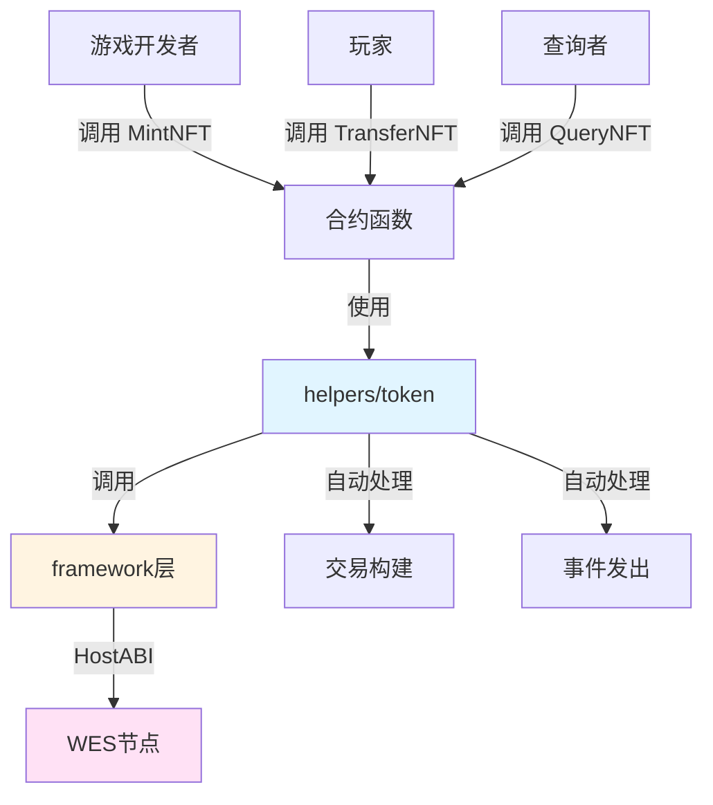

# 游戏道具NFT合约示例

**分类**: NFT 示例  
**难度**: ⭐⭐⭐ 高级  
**最后更新**: 2025-11-11

---

## 📋 概述

本示例展示如何使用 WES Contract SDK Go 构建游戏道具NFT合约。通过本示例，您可以学习如何使用 `helpers/token` 模块创建和管理游戏道具NFT，实现游戏装备、道具等的代币化。

---

## 🎯 核心功能

本示例实现了完整的游戏道具NFT功能：

| 功能 | 函数 | 说明 |
|------|------|------|
| ✅ **铸造NFT** | `MintNFT` | 铸造唯一的游戏道具NFT，包含元数据（类型、属性、等级等） |
| ✅ **转移NFT** | `TransferNFT` | 转移NFT所有权 |
| ✅ **查询NFT** | `QueryNFT` | 查询NFT的所有者信息 |

---

## 🏗️ 架构设计



**架构说明**：
- **合约层**：开发者编写的合约函数
- **Helpers层**：业务语义API，自动处理交易构建、事件发出
- **Framework层**：HostABI封装，提供基础原语
- **节点层**：WES节点，执行合约并上链

---

## 📚 功能详解

### 1. MintNFT - 铸造NFT

**功能说明**：使用 `token.Mint()` 铸造唯一的游戏道具NFT。

**参数格式**：
```json
{
  "to": "Cf1Kes6snEUeykiJJgrAtKPNPrAzPdPmSn",
  "token_id": "item_001",
  "name": "Legendary Sword",
  "type": "weapon",
  "level": 10,
  "attributes": "strength:100,agility:50",
  "description": "A powerful legendary sword",
  "image_url": "https://example.com/sword.jpg"
}
```

**SDK自动处理**：
- ✅ 交易构建（自动构建 UTXO 交易）
- ✅ 事件发出（自动发出 Mint 事件）

**⚠️ 注意**：实际应用中需要业务规则检查
- tokenID唯一性检查（确保每个NFT唯一）
- 元数据格式验证
- 铸造权限检查（谁可以铸造NFT）

**使用示例**：
```bash
wes contract call --address {contract_addr} \
  --function MintNFT \
  --params '{"to":"Cf1Kes6snEUeykiJJgrAtKPNPrAzPdPmSn","token_id":"item_001","name":"Legendary Sword","type":"weapon"}'
```

---

### 2. TransferNFT - 转移NFT

**功能说明**：使用 `token.Transfer()` 转移NFT所有权。

**参数格式**：
```json
{
  "to": "Df2Lft7toFVfjlKKhsBtLQOQsQbQeRnTn",
  "token_id": "item_001"
}
```

**使用示例**：
```bash
wes contract call --address {contract_addr} \
  --function TransferNFT \
  --params '{"to":"Df2Lft7toFVfjlKKhsBtLQOQsQbQeRnTn","token_id":"item_001"}'
```

---

### 3. QueryNFT - 查询NFT

**功能说明**：查询NFT的所有者信息。

**参数格式**：
```json
{
  "token_id": "item_001"
}
```

**使用示例**：
```bash
wes contract call --address {contract_addr} \
  --function QueryNFT \
  --params '{"token_id":"item_001"}'
```

---

## 🚀 快速开始

### 1. 编译合约

```bash
cd nft/gaming
bash build.sh
```

编译完成后会生成 `main.wasm` 文件。

### 2. 部署合约

```bash
# 使用 WES CLI 部署
wes contract deploy --wasm main.wasm
```

### 3. 调用合约

```bash
# 铸造NFT
wes contract call --address {contract_addr} \
  --function MintNFT \
  --params '{"to":"Cf1Kes6snEUeykiJJgrAtKPNPrAzPdPmSn","token_id":"item_001","name":"Legendary Sword","type":"weapon"}'
```

---

## 📊 SDK vs 应用层职责

| 职责 | SDK 提供 | 应用层实现 |
|------|---------|-----------|
| **交易构建** | ✅ 自动处理 | - |
| **事件发出** | ✅ 自动处理 | - |
| **tokenID唯一性** | ❌ | ✅ 需要实现 |
| **元数据管理** | ❌ | ✅ 需要实现 |
| **铸造权限** | ❌ | ✅ 需要实现 |
| **NFT所有权映射** | ❌ | ✅ 需要实现（使用状态输出） |
| **道具属性更新** | ❌ | ✅ 需要实现（使用状态输出） |

---

## 💡 设计理念

### 游戏道具NFT的特点

- ✅ **类型化**：可以按类型组织（如weapon、armor、potion等）
- ✅ **属性化**：可以存储道具属性（如strength、agility等）
- ✅ **等级化**：可以标记道具等级
- ✅ **可交易**：支持NFT市场交易

### SDK 提供"积木"

SDK 提供基础能力（Mint、Transfer），开发者可以：

- ✅ 直接使用基础功能创建游戏道具NFT
- ✅ 添加业务规则实现定制需求
- ✅ 组合多个功能实现复杂场景（如道具升级、合成等）

---

## 🔗 相关文档

- [Token 模块文档](../../helpers/token/README.md) - Token 模块详细说明
- [Framework 文档](../../framework/README.md) - Framework 层说明
- [示例总览](../README.md) - 所有示例索引
- [示例总览](../README.md) - 示例组织结构规划

---

**最后更新**: 2025-11-11
