# 身份证明NFT合约示例

**分类**: NFT 示例  
**难度**: ⭐⭐ 进阶  
**最后更新**: 2025-11-11

---

## 📋 概述

本示例展示如何使用 WES Contract SDK Go 构建身份证明NFT合约。通过本示例，您可以学习如何使用 `helpers/token` 模块创建和管理身份证明NFT，实现数字身份、身份认证等的链上管理。

---

## 🎯 核心功能

本示例实现了完整的身份证明NFT功能：

| 功能 | 函数 | 说明 |
|------|------|------|
| ✅ **铸造身份** | `MintIdentity` | 铸造唯一的身份证明NFT |
| ✅ **转移身份** | `TransferIdentity` | 转移身份所有权 |
| ✅ **查询身份** | `QueryIdentity` | 查询身份信息和所有者 |

---

## 🏗️ 架构设计

```mermaid
graph TB
    A[身份颁发机构] -->|调用 MintIdentity| B[合约函数]
    B -->|使用| C[helpers/token]
    C -->|调用| D[framework层]
    D -->|HostABI| E[WES节点]
    
    C -->|自动处理| F[交易构建]
    C -->|自动处理| G[事件发出]
    
    H[身份持有者] -->|调用 TransferIdentity| B
    I[查询者] -->|调用 QueryIdentity| B
    
    style C fill:#e1f5ff
    style D fill:#fff4e1
    style E fill:#ffe1f5
```



**架构说明**：
- **合约层**：开发者编写的合约函数
- **Token层**：业务语义API，自动处理交易构建、事件发出
- **Framework层**：HostABI封装，提供基础原语
- **节点层**：WES节点，执行合约并上链

---

## 📚 功能详解

### 1. MintIdentity - 铸造身份

**功能说明**：使用 `token.Mint()` 铸造唯一的身份证明NFT。

**参数格式**：
```json
{
  "to": "Df2Lft7toFVfjlKKhsBtLQOQsQbQeRnTn",
  "token_id": "ID_001",
  "identity_name": "Digital ID",
  "issuer": "Government Agency"
}
```

**特点**：
- 每个身份都有唯一的tokenID
- 身份包含元数据（名称、颁发机构等）
- 身份不可分割，转移时数量为1

**使用示例**：
```bash
wes contract call --address {contract_addr} \
  --function MintIdentity \
  --params '{"to":"Df2Lft7toFVfjlKKhsBtLQOQsQbQeRnTn","token_id":"ID_001","identity_name":"Digital ID","issuer":"Government Agency"}'
```

---

### 2. TransferIdentity - 转移身份

**功能说明**：使用 `token.Transfer()` 转移身份所有权。

**参数格式**：
```json
{
  "to": "Cf1Kes6snEUeykiJJgrAtKPNPrAzPdPmSn",
  "token_id": "ID_001"
}
```

**使用示例**：
```bash
wes contract call --address {contract_addr} \
  --function TransferIdentity \
  --params '{"to":"Cf1Kes6snEUeykiJJgrAtKPNPrAzPdPmSn","token_id":"ID_001"}'
```

---

### 3. QueryIdentity - 查询身份

**功能说明**：查询身份的详细信息和所有者。

**参数格式**：
```json
{
  "token_id": "ID_001"
}
```

**使用示例**：
```bash
wes contract call --address {contract_addr} \
  --function QueryIdentity \
  --params '{"token_id":"ID_001"}'
```

---

## 🚀 快速开始

### 1. 编译合约

```bash
cd nft/identity
bash build.sh
```

编译完成后会生成 `main.wasm` 文件。

### 2. 部署合约

```bash
# 使用 WES CLI 部署
wes contract deploy --wasm main.wasm
```

### 3. 调用合约

```bash
# 铸造身份
wes contract call --address {contract_addr} \
  --function MintIdentity \
  --params '{"to":"Df2Lft7toFVfjlKKhsBtLQOQsQbQeRnTn","token_id":"ID_001","identity_name":"Digital ID","issuer":"Government Agency"}'
```

---

## 📊 SDK vs 应用层职责

| 职责 | SDK 提供 | 应用层实现 |
|------|---------|-----------|
| **NFT铸造** | ✅ 自动处理 | - |
| **NFT转移** | ✅ 自动处理 | - |
| **交易构建** | ✅ 自动处理 | - |
| **事件发出** | ✅ 自动处理 | - |
| **身份验证** | ❌ | ✅ 需要实现（验证身份真实性） |
| **身份撤销** | ❌ | ✅ 需要实现（撤销机制） |

---

## 💡 设计理念

### 身份证明NFT的应用场景

- ✅ **数字身份**：政府颁发的数字身份
- ✅ **企业身份**：企业认证身份
- ✅ **社区身份**：社区成员身份
- ✅ **会员身份**：会员资格证明

### SDK 提供"积木"

SDK 提供基础能力（Mint、Transfer），开发者可以：

- ✅ 直接使用基础功能创建身份证明NFT应用
- ✅ 添加业务规则实现定制需求
- ✅ 组合多个功能实现复杂场景

---

## 🔗 相关文档

- [Token 模块文档](../../helpers/token/README.md) - Token 模块详细说明
- [Framework 文档](../../framework/README.md) - Framework 层说明
- [示例总览](../README.md) - 所有示例索引
- [示例总览](../README.md) - 示例组织结构规划

---

**最后更新**: 2025-11-11
