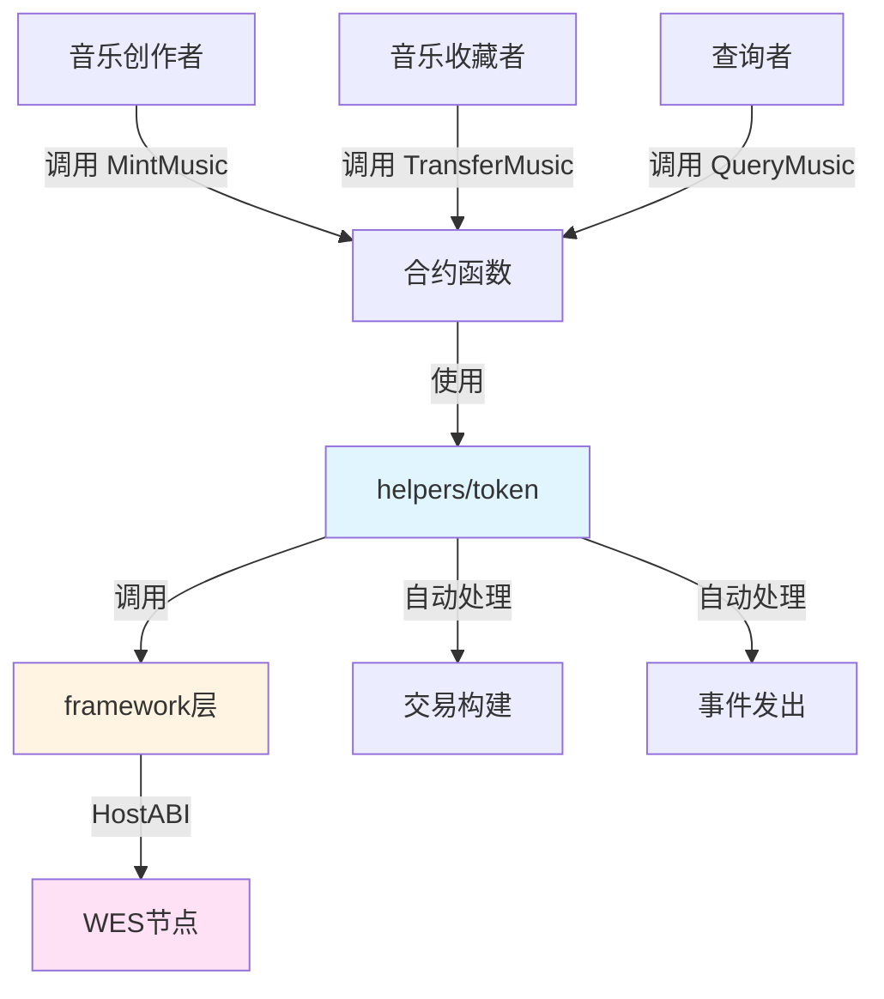

# 音乐作品NFT合约示例

**分类**: NFT 示例  
**难度**: ⭐⭐⭐ 高级  
**最后更新**: 2025-11-11

---

## 📋 概述

本示例展示如何使用 WES Contract SDK Go 构建音乐作品NFT合约。通过本示例，您可以学习如何使用 `helpers/token` 模块创建和管理音乐作品NFT，实现音乐版权、音乐收藏等的链上管理。

---

## 🎯 核心功能

本示例实现了完整的音乐作品NFT功能：

| 功能 | 函数 | 说明 |
|------|------|------|
| ✅ **铸造音乐** | `MintMusic` | 铸造唯一的音乐作品NFT |
| ✅ **转移音乐** | `TransferMusic` | 转移音乐作品所有权 |
| ✅ **查询音乐** | `QueryMusic` | 查询音乐作品信息和所有者 |

---

## 🏗️ 架构设计



**架构说明**：
- **合约层**：开发者编写的合约函数
- **Token层**：业务语义API，自动处理交易构建、事件发出
- **Framework层**：HostABI封装，提供基础原语
- **节点层**：WES节点，执行合约并上链

---

## 📚 功能详解

### 1. MintMusic - 铸造音乐

**功能说明**：使用 `token.Mint()` 铸造唯一的音乐作品NFT。

**参数格式**：
```json
{
  "to": "Df2Lft7toFVfjlKKhsBtLQOQsQbQeRnTn",
  "token_id": "MUSIC_001",
  "track_name": "My Song",
  "artist": "Artist Name"
}
```

**特点**：
- 每个音乐作品都有唯一的tokenID
- 音乐包含元数据（名称、艺术家等）
- 音乐不可分割，转移时数量为1

**使用示例**：
```bash
wes contract call --address {contract_addr} \
  --function MintMusic \
  --params '{"to":"Df2Lft7toFVfjlKKhsBtLQOQsQbQeRnTn","token_id":"MUSIC_001","track_name":"My Song","artist":"Artist Name"}'
```

---

### 2. TransferMusic - 转移音乐

**功能说明**：使用 `token.Transfer()` 转移音乐作品所有权。

**参数格式**：
```json
{
  "to": "Cf1Kes6snEUeykiJJgrAtKPNPrAzPdPmSn",
  "token_id": "MUSIC_001"
}
```

**使用示例**：
```bash
wes contract call --address {contract_addr} \
  --function TransferMusic \
  --params '{"to":"Cf1Kes6snEUeykiJJgrAtKPNPrAzPdPmSn","token_id":"MUSIC_001"}'
```

---

### 3. QueryMusic - 查询音乐

**功能说明**：查询音乐作品的详细信息和所有者。

**参数格式**：
```json
{
  "token_id": "MUSIC_001"
}
```

**使用示例**：
```bash
wes contract call --address {contract_addr} \
  --function QueryMusic \
  --params '{"token_id":"MUSIC_001"}'
```

---

## 🚀 快速开始

### 1. 编译合约

```bash
cd nft/music
bash build.sh
```

编译完成后会生成 `main.wasm` 文件。

### 2. 部署合约

```bash
# 使用 WES CLI 部署
wes contract deploy --wasm main.wasm
```

### 3. 调用合约

```bash
# 铸造音乐
wes contract call --address {contract_addr} \
  --function MintMusic \
  --params '{"to":"Df2Lft7toFVfjlKKhsBtLQOQsQbQeRnTn","token_id":"MUSIC_001","track_name":"My Song","artist":"Artist Name"}'
```

---

## 📊 SDK vs 应用层职责

| 职责 | SDK 提供 | 应用层实现 |
|------|---------|-----------|
| **NFT铸造** | ✅ 自动处理 | - |
| **NFT转移** | ✅ 自动处理 | - |
| **交易构建** | ✅ 自动处理 | - |
| **事件发出** | ✅ 自动处理 | - |
| **版权管理** | ❌ | ✅ 需要实现（版权验证、版税分配等） |
| **音乐播放** | ❌ | ✅ 需要实现（播放权限控制等） |

---

## 💡 设计理念

### 音乐作品NFT的应用场景

- ✅ **音乐版权**：音乐作品版权管理
- ✅ **音乐收藏**：限量版音乐收藏
- ✅ **音乐交易**：音乐作品交易市场
- ✅ **艺术家支持**：支持独立艺术家

### SDK 提供"积木"

SDK 提供基础能力（Mint、Transfer），开发者可以：

- ✅ 直接使用基础功能创建音乐作品NFT应用
- ✅ 添加业务规则实现定制需求
- ✅ 组合多个功能实现复杂场景

---

## 🔗 相关文档

- [Token 模块文档](../../helpers/token/README.md) - Token 模块详细说明
- [Framework 文档](../../framework/README.md) - Framework 层说明
- [示例总览](../README.md) - 所有示例索引
- [示例总览](../README.md) - 示例组织结构规划

---

**最后更新**: 2025-11-11
