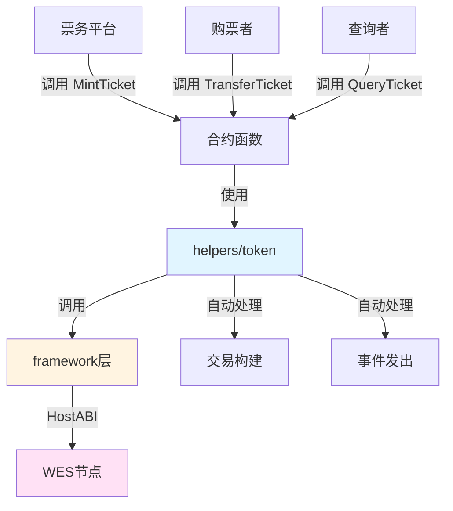

# 门票票务NFT合约示例

**分类**: NFT 示例  
**难度**: ⭐⭐ 进阶  
**最后更新**: 2025-11-11

---

## 📋 概述

本示例展示如何使用 WES Contract SDK Go 构建门票票务NFT合约。通过本示例，您可以学习如何使用 `helpers/token` 模块创建和管理门票NFT，实现演唱会、体育赛事、会议等的票务管理。

---

## 🎯 核心功能

本示例实现了完整的门票票务NFT功能：

| 功能 | 函数 | 说明 |
|------|------|------|
| ✅ **铸造门票** | `MintTicket` | 铸造唯一的门票NFT |
| ✅ **转移门票** | `TransferTicket` | 转移门票所有权 |
| ✅ **查询门票** | `QueryTicket` | 查询门票信息和所有者 |

---

## 🏗️ 架构设计



**架构说明**：
- **合约层**：开发者编写的合约函数
- **Token层**：业务语义API，自动处理交易构建、事件发出
- **Framework层**：HostABI封装，提供基础原语
- **节点层**：WES节点，执行合约并上链

---

## 📚 功能详解

### 1. MintTicket - 铸造门票

**功能说明**：使用 `token.Mint()` 铸造唯一的门票NFT。

**参数格式**：
```json
{
  "to": "Df2Lft7toFVfjlKKhsBtLQOQsQbQeRnTn",
  "token_id": "TICKET_001",
  "ticket_name": "Concert Ticket",
  "event": "Music Festival 2025"
}
```

**特点**：
- 每个门票都有唯一的tokenID
- 门票包含元数据（名称、活动等）
- 门票不可分割，转移时数量为1

**使用示例**：
```bash
wes contract call --address {contract_addr} \
  --function MintTicket \
  --params '{"to":"Df2Lft7toFVfjlKKhsBtLQOQsQbQeRnTn","token_id":"TICKET_001","ticket_name":"Concert Ticket","event":"Music Festival 2025"}'
```

---

### 2. TransferTicket - 转移门票

**功能说明**：使用 `token.Transfer()` 转移门票所有权。

**参数格式**：
```json
{
  "to": "Cf1Kes6snEUeykiJJgrAtKPNPrAzPdPmSn",
  "token_id": "TICKET_001"
}
```

**使用示例**：
```bash
wes contract call --address {contract_addr} \
  --function TransferTicket \
  --params '{"to":"Cf1Kes6snEUeykiJJgrAtKPNPrAzPdPmSn","token_id":"TICKET_001"}'
```

---

### 3. QueryTicket - 查询门票

**功能说明**：查询门票的详细信息和所有者。

**参数格式**：
```json
{
  "token_id": "TICKET_001"
}
```

**使用示例**：
```bash
wes contract call --address {contract_addr} \
  --function QueryTicket \
  --params '{"token_id":"TICKET_001"}'
```

---

## 🚀 快速开始

### 1. 编译合约

```bash
cd nft/tickets
bash build.sh
```

编译完成后会生成 `main.wasm` 文件。

### 2. 部署合约

```bash
# 使用 WES CLI 部署
wes contract deploy --wasm main.wasm
```

### 3. 调用合约

```bash
# 铸造门票
wes contract call --address {contract_addr} \
  --function MintTicket \
  --params '{"to":"Df2Lft7toFVfjlKKhsBtLQOQsQbQeRnTn","token_id":"TICKET_001","ticket_name":"Concert Ticket","event":"Music Festival 2025"}'
```

---

## 📊 SDK vs 应用层职责

| 职责 | SDK 提供 | 应用层实现 |
|------|---------|-----------|
| **NFT铸造** | ✅ 自动处理 | - |
| **NFT转移** | ✅ 自动处理 | - |
| **交易构建** | ✅ 自动处理 | - |
| **事件发出** | ✅ 自动处理 | - |
| **门票验证** | ❌ | ✅ 需要实现（验证门票有效性） |
| **门票使用** | ❌ | ✅ 需要实现（使用后标记） |

---

## 💡 设计理念

### 门票票务NFT的应用场景

- ✅ **演唱会**：音乐演唱会门票
- ✅ **体育赛事**：体育比赛门票
- ✅ **会议**：行业会议门票
- ✅ **展览**：艺术展览门票

### SDK 提供"积木"

SDK 提供基础能力（Mint、Transfer），开发者可以：

- ✅ 直接使用基础功能创建门票票务NFT应用
- ✅ 添加业务规则实现定制需求
- ✅ 组合多个功能实现复杂场景

---

## 🔗 相关文档

- [Token 模块文档](../../helpers/token/README.md) - Token 模块详细说明
- [Framework 文档](../../framework/README.md) - Framework 层说明
- [示例总览](../README.md) - 所有示例索引
- [示例总览](../README.md) - 示例组织结构规划

---

**最后更新**: 2025-11-11
