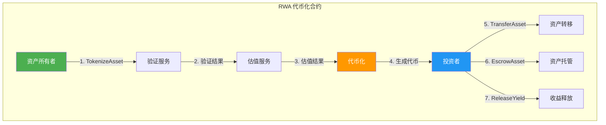
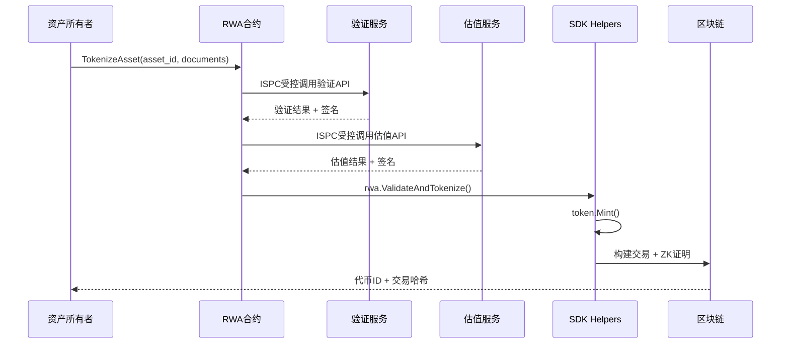
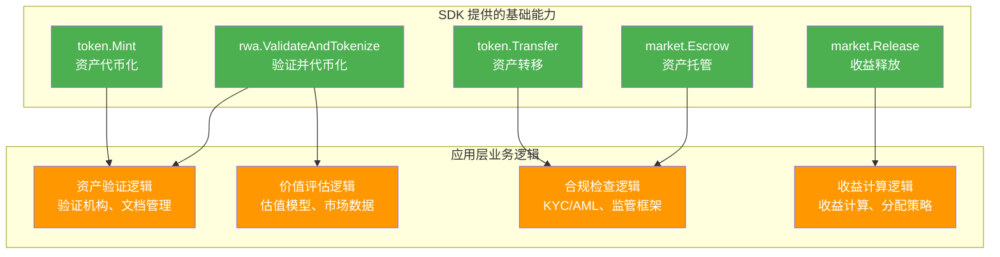

# RWA（现实世界资产）代币化示例

**版本**: 1.0  
**难度**: ⭐⭐⭐ 高级  
**最后更新**: 2025-11-11

---

## 📋 概述

本示例展示如何使用 WES Contract SDK Go 构建 RWA（Real World Assets，现实世界资产）代币化应用。

**核心特性**：
- ✅ **ISPC 创新**：利用受控外部交互机制，替代传统预言机
- ✅ **业务语义 API**：使用 helpers 层提供的业务语义接口
- ✅ **类型安全**：使用 framework 类型系统
- ✅ **完整功能**：资产验证、代币化、转移、托管、收益释放

---

## 🎯 功能列表

### 1. TokenizeAsset - 资产代币化

将现实世界资产（如房地产、股权、商品等）转换为数字代币。

**功能特点**：
- 🌟 **ISPC 受控外部交互**：直接调用外部验证和估值服务，无需传统预言机
- 🌟 **自动生成 ZK 证明**：验证和估值过程自动生成可验证性证明
- 🌟 **单次调用保证**：只有执行节点调用外部服务，验证节点只验证证明

**参数格式**:
```json
{
  "asset_id": "real_estate_001",
  "total_supply": 1000000,
  "token_id": "RWA_RE_001"
}
```

**使用场景**:
- 🏢 房地产代币化（商业地产、住宅房产）
- 📈 股权代币化（上市公司股票、私募股权）
- 🥇 商品代币化（黄金、石油、农产品）
- 🎨 艺术品代币化（名画、古董、收藏品）

---

### 2. TransferAsset - 资产转移

转移现实世界资产的代币份额。

**功能特点**：
- ✅ 支持部分份额转移
- ✅ 自动余额检查
- ✅ 自动交易构建

**参数格式**:
```json
{
  "to": "Cf1Kes6snEUeykiJJgrAtKPNPrAzPdPmSn",
  "token_id": "RWA_RE_001",
  "amount": 1000
}
```

**使用场景**:
- 💼 资产份额交易
- 💰 资产所有权转移
- 📊 资产转让

---

### 3. EscrowAsset - 资产托管

创建资产托管，将资产锁定在托管账户中。

**功能特点**：
- ✅ 资产安全锁定
- ✅ 支持条件释放
- ✅ 适用于交易、质押等场景

**参数格式**:
```json
{
  "buyer": "Cf1Kes6snEUeykiJJgrAtKPNPrAzPdPmSn",
  "seller": "Df2Lft7toFVfjlKKhsBtLQOQsQbQeRnTn",
  "token_id": "RWA_RE_001",
  "amount": 5000,
  "escrow_id": "escrow_001"
}
```

**使用场景**:
- 🏦 资产交易托管
- 🔒 资产质押
- 🛡️ 资产担保

---

### 4. ReleaseYield - 收益释放

创建分阶段收益释放计划。

**功能特点**：
- ✅ 支持分阶段释放
- ✅ 自动时间管理
- ✅ 适用于分红、租金分配等场景

**参数格式**:
```json
{
  "beneficiary": "Cf1Kes6snEUeykiJJgrAtKPNPrAzPdPmSn",
  "token_id": "RWA_RE_001",
  "total_amount": 10000,
  "vesting_id": "vesting_001"
}
```

**使用场景**:
- 💵 资产收益分配
- 📊 分红释放
- 🏠 租金分配

---

## 🏗️ 架构说明

### 功能架构图



### 数据流图



### SDK vs 应用层职责



---

## 🚀 编译和部署

### 前置要求

- Go 1.24+
- TinyGo 0.31+
- WES 节点运行中

### 编译

```bash
cd examples/rwa
bash build.sh
```

或手动编译：

```bash
tinygo build -o main.wasm \
  -target=wasi \
  -scheduler=none \
  -no-debug \
  -opt=2 \
  main.go
```

### 部署

```bash
# 使用 WES CLI 部署
wes contract deploy \
  --wasm main.wasm \
  --name "RWA Contract" \
  --init-params '{}'
```

---

## 💡 使用示例

### 1. 资产代币化

```bash
wes contract call \
  --address {contract_addr} \
  --function TokenizeAsset \
  --params '{
    "asset_id": "real_estate_001",
    "total_supply": 1000000,
    "token_id": "RWA_RE_001"
  }'
```

### 2. 资产转移

```bash
wes contract call \
  --address {contract_addr} \
  --function TransferAsset \
  --params '{
    "to": "Cf1Kes6snEUeykiJJgrAtKPNPrAzPdPmSn",
    "token_id": "RWA_RE_001",
    "amount": 1000
  }'
```

### 3. 资产托管

```bash
wes contract call \
  --address {contract_addr} \
  --function EscrowAsset \
  --params '{
    "buyer": "Cf1Kes6snEUeykiJJgrAtKPNPrAzPdPmSn",
    "seller": "Df2Lft7toFVfjlKKhsBtLQOQsQbQeRnTn",
    "token_id": "RWA_RE_001",
    "amount": 5000,
    "escrow_id": "escrow_001"
  }'
```

### 4. 收益释放

```bash
wes contract call \
  --address {contract_addr} \
  --function ReleaseYield \
  --params '{
    "beneficiary": "Cf1Kes6snEUeykiJJgrAtKPNPrAzPdPmSn",
    "token_id": "RWA_RE_001",
    "total_amount": 10000,
    "vesting_id": "vesting_001"
  }'
```

---

## 📊 ISPC 创新体现

### 传统方式 vs ISPC 方式

| 特性 | 传统方式 | ISPC 方式 |
|------|---------|----------|
| **外部数据获取** | 需要中心化预言机 | 直接调用外部服务 |
| **信任机制** | 依赖预言机信任 | 密码学验证佐证 |
| **成本** | 预言机服务费用 | 直接调用，成本更低 |
| **验证方式** | 所有节点重复调用 | 单次调用 + 多点验证 |
| **证明生成** | 无 | 自动生成 ZK 证明 |

### ISPC 工作流程

```
1. 声明外部状态预期
   ↓
2. 提供验证佐证（API签名、响应哈希）
   ↓
3. 运行时验证并记录到执行轨迹
   ↓
4. 查询已验证的外部状态数据
   ↓
5. 自动生成 ZK 证明（包含外部交互验证过程）
   ↓
6. 验证节点只验证证明，不重复调用外部服务
```

---

## ⚠️ 注意事项

### SDK 职责

✅ **SDK 提供**：
- 基础能力：Transfer、Mint、Escrow、Release
- ISPC 受控外部交互：ValidateAndTokenize
- 类型安全和错误处理

### 应用层职责

🔨 **应用层需要实现**：
- 资产验证逻辑：验证机构、文档管理、法律文件
- 价值评估逻辑：估值模型、市场数据
- 合规检查逻辑：KYC/AML、监管框架
- 收益计算逻辑：收益计算、分配策略

---

## 🔗 相关文档

- [RWA 模块文档](../../helpers/rwa/README.md) - RWA 模块详细说明
- [Token 模块文档](../../helpers/token/README.md) - Token 模块详细说明
- [Market 模块文档](../../helpers/market/README.md) - Market 模块详细说明
- [External 模块文档](../../helpers/external/README.md) - 外部系统集成说明
- [示例总览](../README.md) - 所有示例索引
- [示例总览](../README.md) - 示例组织结构规划

---

## 📖 设计理念

本示例展示了 **SDK 提供"积木"，应用层搭建"建筑"** 的设计理念：

- ✅ **SDK 提供基础能力**：Transfer、Mint、Escrow、Release
- ✅ **应用层实现业务逻辑**：资产验证、价值评估、合规检查、收益计算
- ✅ **清晰职责边界**：SDK 不包含特定业务逻辑，应用层基于 SDK 构建

---

**最后更新**: 2025-11-11
