# 住宅房产代币化合约示例

**分类**: RWA 示例  
**难度**: ⭐⭐⭐ 高级  
**最后更新**: 2025-11-11

---

## 📋 概述

本示例展示如何使用 WES Contract SDK Go 构建住宅房产代币化应用。通过本示例，您可以学习如何使用 `helpers/rwa` 模块进行住宅房产验证和代币化，实现高端住宅、别墅等的链上管理和交易。

---

## 🎯 核心功能

本示例实现了完整的住宅房产代币化功能：

| 功能 | 函数 | 说明 |
|------|------|------|
| ✅ **住宅代币化** | `TokenizeResidential` | 使用 ISPC 受控机制验证和代币化住宅房产 |
| ✅ **住宅转移** | `TransferResidential` | 转移住宅房产份额 |
| ✅ **住宅托管** | `EscrowResidential` | 创建住宅房产托管，适用于交易、质押 |
| ✅ **租金释放** | `ReleaseRent` | 创建分阶段租金释放计划 |

---

## 🏗️ 架构设计

```mermaid
graph TB
    A[房产所有者] -->|调用 TokenizeResidential| B[合约函数]
    B -->|使用| C[helpers/rwa]
    C -->|ISPC受控机制| D[外部验证服务]
    C -->|ISPC受控机制| E[外部估值服务]
    C -->|调用| F[helpers/token]
    F -->|调用| G[framework层]
    G -->|HostABI| H[WES节点]
    
    C -->|自动处理| I[ZK证明生成]
    C -->|自动处理| J[代币上链]
    
    style C fill:#e1f5ff
    style F fill:#e1f5ff
    style G fill:#fff4e1
    style H fill:#ffe1f5
```



**架构说明**：
- **合约层**：开发者编写的合约函数
- **RWA层**：使用 ISPC 受控机制调用外部服务
- **Token层**：业务语义API，自动处理交易构建、事件发出
- **Framework层**：HostABI封装，提供基础原语
- **节点层**：WES节点，执行合约并上链

---

## 📚 功能详解

### 1. TokenizeResidential - 住宅代币化

**功能说明**：使用 `rwa.ValidateAndTokenize()` 验证和代币化住宅房产。

**参数格式**：
```json
{
  "asset_id": "residential_001",
  "total_supply": 1000000,
  "token_id": "RESIDENTIAL_001"
}
```

**ISPC创新**：
- ✅ 无需传统预言机：直接调用外部验证和估值服务
- ✅ 自动生成ZK证明：验证和估值过程自动生成可验证性证明
- ✅ 单次调用保证：只有执行节点调用外部服务，验证节点只验证证明

**使用示例**：
```bash
wes contract call --address {contract_addr} \
  --function TokenizeResidential \
  --params '{"asset_id":"residential_001","total_supply":1000000,"token_id":"RESIDENTIAL_001"}'
```

---

### 2. TransferResidential - 住宅转移

**功能说明**：使用 `token.Transfer()` 转移住宅房产份额。

**参数格式**：
```json
{
  "to": "Df2Lft7toFVfjlKKhsBtLQOQsQbQeRnTn",
  "token_id": "RESIDENTIAL_001",
  "amount": 1000
}
```

**使用示例**：
```bash
wes contract call --address {contract_addr} \
  --function TransferResidential \
  --params '{"to":"Df2Lft7toFVfjlKKhsBtLQOQsQbQeRnTn","token_id":"RESIDENTIAL_001","amount":1000}'
```

---

### 3. EscrowResidential - 住宅托管

**功能说明**：使用 `market.Escrow()` 创建住宅房产托管。

**参数格式**：
```json
{
  "buyer": "Cf1Kes6snEUeykiJJgrAtKPNPrAzPdPmSn",
  "seller": "Df2Lft7toFVfjlKKhsBtLQOQsQbQeRnTn",
  "token_id": "RESIDENTIAL_001",
  "amount": 5000,
  "escrow_id": "escrow_001"
}
```

**使用示例**：
```bash
wes contract call --address {contract_addr} \
  --function EscrowResidential \
  --params '{"buyer":"Cf1Kes6snEUeykiJJgrAtKPNPrAzPdPmSn","seller":"Df2Lft7toFVfjlKKhsBtLQOQsQbQeRnTn","token_id":"RESIDENTIAL_001","amount":5000,"escrow_id":"escrow_001"}'
```

---

### 4. ReleaseRent - 租金释放

**功能说明**：使用 `market.Release()` 创建分阶段租金释放计划。

**参数格式**：
```json
{
  "beneficiary": "Df2Lft7toFVfjlKKhsBtLQOQsQbQeRnTn",
  "token_id": "RESIDENTIAL_001",
  "total_amount": 10000,
  "vesting_id": "vesting_001"
}
```

**使用示例**：
```bash
wes contract call --address {contract_addr} \
  --function ReleaseRent \
  --params '{"beneficiary":"Df2Lft7toFVfjlKKhsBtLQOQsQbQeRnTn","token_id":"RESIDENTIAL_001","total_amount":10000,"vesting_id":"vesting_001"}'
```

---

## 🚀 快速开始

### 1. 编译合约

```bash
cd rwa/real-estate/residential
bash build.sh
```

编译完成后会生成 `main.wasm` 文件。

### 2. 部署合约

```bash
# 使用 WES CLI 部署
wes contract deploy --wasm main.wasm
```

### 3. 调用合约

```bash
# 住宅代币化
wes contract call --address {contract_addr} \
  --function TokenizeResidential \
  --params '{"asset_id":"residential_001","total_supply":1000000,"token_id":"RESIDENTIAL_001"}'
```

---

## 📊 SDK vs 应用层职责

| 职责 | SDK 提供 | 应用层实现 |
|------|---------|-----------|
| **外部服务调用** | ✅ ISPC受控机制 | - |
| **ZK证明生成** | ✅ 自动处理 | - |
| **代币铸造** | ✅ 自动处理 | - |
| **房产验证逻辑** | ❌ | ✅ 需要实现（验证服务） |
| **房产估值逻辑** | ❌ | ✅ 需要实现（估值服务） |
| **租金计算** | ❌ | ✅ 需要实现（租金率、分配规则等） |

---

## 💡 设计理念

### 住宅房产代币化的优势

- ✅ **流动性提升**：房产可以分割和交易
- ✅ **透明度**：所有交易记录在链上
- ✅ **自动化**：租金分配可以自动化执行
- ✅ **全球化**：无需传统中介机构

### SDK 提供"积木"

SDK 提供基础能力（ValidateAndTokenize、Transfer、Escrow、Release），开发者可以：

- ✅ 直接使用基础功能创建住宅房产代币化应用
- ✅ 添加业务规则实现定制需求
- ✅ 组合多个功能实现复杂场景

---

## 🔗 相关文档

- [RWA 模块文档](../../../helpers/rwa/README.md) - RWA 模块详细说明
- [Token 模块文档](../../../helpers/token/README.md) - Token 模块详细说明
- [Market 模块文档](../../../helpers/market/README.md) - Market 模块详细说明
- [示例总览](../../README.md) - 所有示例索引
- [示例总览](../../README.md) - 示例组织结构规划

---

**最后更新**: 2025-11-11
