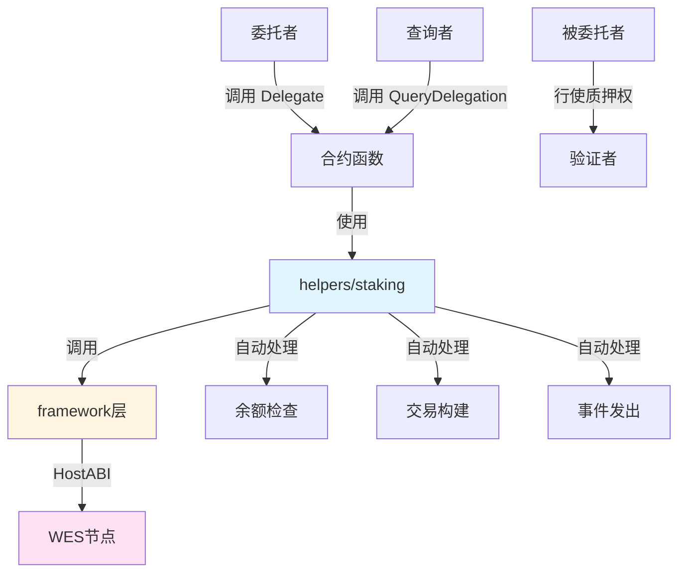

# 委托质押合约示例

**分类**: Staking 质押示例  
**难度**: ⭐⭐⭐ 高级  
**最后更新**: 2025-11-11

---

## 📋 概述

本示例展示如何使用 WES Contract SDK Go 构建委托质押合约。通过本示例，您可以学习如何使用 `helpers/staking` 模块实现质押权的委托和取消委托，适用于委托质押、收益分配等场景。

---

## 🎯 核心功能

本示例实现了完整的委托质押功能：

| 功能 | 函数 | 说明 |
|------|------|------|
| ✅ **委托质押** | `Delegate` | 将质押权委托给验证者 |
| ✅ **取消委托** | `Undelegate` | 取消委托，收回质押权 |
| ✅ **查询委托** | `QueryDelegation` | 查询委托关系的详细信息 |

---

## 🏗️ 架构设计



**架构说明**：
- **合约层**：开发者编写的合约函数
- **Staking层**：业务语义API，自动处理余额检查、交易构建、事件发出
- **Framework层**：HostABI封装，提供基础原语
- **节点层**：WES节点，执行合约并上链

---

## 📚 功能详解

### 1. Delegate - 委托质押

**功能说明**：使用 `staking.Delegate()` 将质押权委托给验证者。

**参数格式**：
```json
{
  "validator": "Cf1Kes6snEUeykiJJgrAtKPNPrAzPdPmSn",
  "delegatee": "Df2Lft7toFVfjlKKhsBtLQOQsQbQeRnTn",
  "amount": 10000
}
```

**特点**：
- 委托者仍持有代币，但质押权由被委托者行使
- 委托者可以获得质押收益
- 支持部分委托和全部委托

**使用示例**：
```bash
wes contract call --address {contract_addr} \
  --function Delegate \
  --params '{"validator":"Cf1Kes6snEUeykiJJgrAtKPNPrAzPdPmSn","delegatee":"Df2Lft7toFVfjlKKhsBtLQOQsQbQeRnTn","amount":10000}'
```

---

### 2. Undelegate - 取消委托

**功能说明**：使用 `staking.Undelegate()` 取消委托。

**参数格式**：
```json
{
  "validator": "Cf1Kes6snEUeykiJJgrAtKPNPrAzPdPmSn",
  "amount": 5000
}
```

**特点**：
- 支持部分取消委托或全部取消委托
- 取消委托后，质押权回到委托者手中

**⚠️ 注意**：这是一个简化实现
- 实际应用中，应该检查委托关系是否存在
- 验证取消委托数量（不能超过已委托数量）
- 检查锁定期（业务逻辑）

**使用示例**：
```bash
wes contract call --address {contract_addr} \
  --function Undelegate \
  --params '{"validator":"Cf1Kes6snEUeykiJJgrAtKPNPrAzPdPmSn","amount":5000}'
```

---

### 3. QueryDelegation - 查询委托信息

**功能说明**：查询委托关系的详细信息。

**参数格式**：
```json
{
  "validator": "Cf1Kes6snEUeykiJJgrAtKPNPrAzPdPmSn"
}
```

**⚠️ 注意**：这是一个简化实现
- 实际应用中，应该从状态输出查询委托关系信息
- 包括委托数量、委托时间、委托收益等

**使用示例**：
```bash
wes contract call --address {contract_addr} \
  --function QueryDelegation \
  --params '{"validator":"Cf1Kes6snEUeykiJJgrAtKPNPrAzPdPmSn"}'
```

---

## 🚀 快速开始

### 1. 编译合约

```bash
cd staking/delegation
bash build.sh
```

编译完成后会生成 `main.wasm` 文件。

### 2. 部署合约

```bash
# 使用 WES CLI 部署
wes contract deploy --wasm main.wasm
```

### 3. 调用合约

```bash
# 委托质押
wes contract call --address {contract_addr} \
  --function Delegate \
  --params '{"validator":"Cf1Kes6snEUeykiJJgrAtKPNPrAzPdPmSn","delegatee":"Df2Lft7toFVfjlKKhsBtLQOQsQbQeRnTn","amount":10000}'
```

---

## 📊 SDK vs 应用层职责

| 职责 | SDK 提供 | 应用层实现 |
|------|---------|-----------|
| **委托操作** | ✅ 自动处理 | - |
| **取消委托操作** | ✅ 自动处理 | - |
| **交易构建** | ✅ 自动处理 | - |
| **事件发出** | ✅ 自动处理 | - |
| **委托关系管理** | ❌ | ✅ 需要实现（使用状态输出） |
| **委托收益计算** | ❌ | ✅ 需要实现 |
| **锁定期检查** | ❌ | ✅ 需要实现 |

---

## 💡 设计理念

### 委托质押 vs 直接质押

| 特性 | 委托质押 | 直接质押 |
|------|---------|---------|
| **代币所有权** | 委托者持有 | 质押者持有 |
| **质押权** | 被委托者行使 | 质押者行使 |
| **收益分配** | 委托者获得 | 质押者获得 |
| **适用场景** | 委托给专业验证者 | 自己运行验证节点 |

### SDK 提供"积木"

SDK 提供基础能力（Delegate、Undelegate），开发者可以：

- ✅ 直接使用基础功能创建委托质押应用
- ✅ 添加业务规则实现定制需求
- ✅ 组合多个功能实现复杂场景

### 应用层搭建"建筑"

应用层在 SDK 基础上实现：

- ✅ 委托关系管理（使用状态输出存储）
- ✅ 委托收益计算（根据质押收益计算）
- ✅ 锁定期管理（委托和取消委托的锁定期）

---

## 🔗 相关文档

- [Staking 模块文档](../../helpers/staking/README.md) - Staking 模块详细说明
- [Framework 文档](../../framework/README.md) - Framework 层说明
- [示例总览](../README.md) - 所有示例索引
- [示例总览](../README.md) - 示例组织结构规划

---

**最后更新**: 2025-11-11

