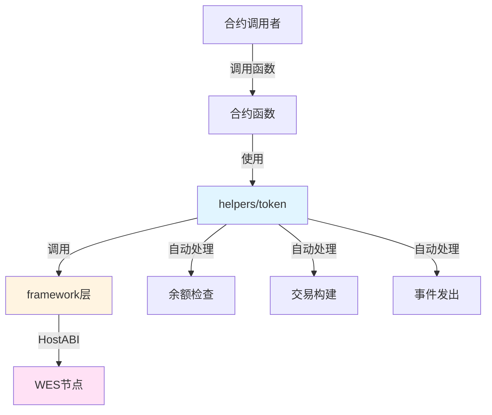

# ERC-20 兼容代币合约示例

**分类**: Token 代币示例  
**难度**: ⭐⭐ 进阶  
**最后更新**: 2025-11-11

---

## 📋 概述

本示例展示如何使用 WES Contract SDK Go 构建 ERC-20 兼容的代币合约。通过本示例，您可以学习如何使用 `helpers/token` 模块提供的业务语义API，简化代币合约的开发。

---

## 🎯 核心功能

本示例实现了完整的代币功能：

| 功能 | 函数 | 说明 |
|------|------|------|
| ✅ **转账** | `Transfer` | 代币转账，自动处理余额检查和找零 |
| ✅ **铸造** | `Mint` | 铸造新代币，向指定地址铸造指定数量 |
| ✅ **销毁** | `Burn` | 销毁代币，从调用者地址销毁指定数量 |
| ✅ **授权** | `Approve` | ERC-20风格授权，允许其他地址使用代币 |
| ✅ **冻结** | `Freeze` | 冻结指定地址的代币，适用于合规场景 |
| ✅ **空投** | `Airdrop` | 批量空投代币，一次性向多个地址空投 |

---

## 🏗️ 架构设计



**架构说明**：
- **合约层**：开发者编写的合约函数
- **Helpers层**：业务语义API，自动处理余额检查、交易构建、事件发出
- **Framework层**：HostABI封装，提供基础原语
- **节点层**：WES节点，执行合约并上链

---

## 📚 功能详解

### 1. Transfer - 转账

**功能说明**：使用 `token.Transfer()` 进行代币转账。

**参数格式**：
```json
{
  "to": "Cf1Kes6snEUeykiJJgrAtKPNPrAzPdPmSn",
  "amount": 1000
}
```

**SDK自动处理**：
- ✅ 余额检查（确保发送者余额充足）
- ✅ 交易构建（自动构建 UTXO 交易）
- ✅ 找零处理（自动处理找零 UTXO）
- ✅ 事件发出（自动发出 Transfer 事件）

**使用示例**：
```bash
wes contract call --address {contract_addr} \
  --function Transfer \
  --params '{"to":"Cf1Kes6snEUeykiJJgrAtKPNPrAzPdPmSn","amount":1000}'
```

---

### 2. Mint - 铸造

**功能说明**：使用 `token.Mint()` 铸造新代币。

**参数格式**：
```json
{
  "to": "Cf1Kes6snEUeykiJJgrAtKPNPrAzPdPmSn",
  "amount": 1000
}
```

**SDK自动处理**：
- ✅ 交易构建（自动构建 UTXO 交易）
- ✅ 事件发出（自动发出 Mint 事件）

**⚠️ 注意**：实际应用中需要权限检查，只有授权地址才能调用 Mint。

**使用示例**：
```bash
wes contract call --address {contract_addr} \
  --function Mint \
  --params '{"to":"Cf1Kes6snEUeykiJJgrAtKPNPrAzPdPmSn","amount":1000}'
```

---

### 3. Burn - 销毁

**功能说明**：使用 `token.Burn()` 销毁代币。

**参数格式**：
```json
{
  "amount": 500
}
```

**SDK自动处理**：
- ✅ 余额检查（确保调用者余额充足）
- ✅ 交易构建（自动构建 UTXO 交易）
- ✅ 事件发出（自动发出 Burn 事件）

**使用示例**：
```bash
wes contract call --address {contract_addr} \
  --function Burn \
  --params '{"amount":500}'
```

---

### 4. Approve - 授权

**功能说明**：使用 `token.Approve()` 授权其他地址使用代币，支持 ERC-20 风格的授权机制。

**参数格式**：
```json
{
  "spender": "Cf1Kes6snEUeykiJJgrAtKPNPrAzPdPmSn",
  "amount": 1000
}
```

**SDK自动处理**：
- ✅ 交易构建（自动构建 UTXO 交易）
- ✅ 事件发出（自动发出 Approve 事件）

**使用示例**：
```bash
wes contract call --address {contract_addr} \
  --function Approve \
  --params '{"spender":"Cf1Kes6snEUeykiJJgrAtKPNPrAzPdPmSn","amount":1000}'
```

---

### 5. Freeze - 冻结

**功能说明**：使用 `token.Freeze()` 冻结指定地址的代币，适用于合规、风控等场景。

**参数格式**：
```json
{
  "target": "Cf1Kes6snEUeykiJJgrAtKPNPrAzPdPmSn",
  "amount": 1000
}
```

**SDK自动处理**：
- ✅ 交易构建（自动构建 UTXO 交易）
- ✅ 事件发出（自动发出 Freeze 事件）

**⚠️ 注意**：实际应用中需要权限检查，只有授权地址才能调用 Freeze。

**使用示例**：
```bash
wes contract call --address {contract_addr} \
  --function Freeze \
  --params '{"target":"Cf1Kes6snEUeykiJJgrAtKPNPrAzPdPmSn","amount":1000}'
```

---

### 6. Airdrop - 空投

**功能说明**：使用 `token.Airdrop()` 批量空投代币，支持一次性向多个地址空投不同数量的代币。

**参数格式**：
```json
{
  "recipients": ["addr1", "addr2", "addr3"],
  "amounts": [100, 200, 300]
}
```

**SDK自动处理**：
- ✅ 批量交易构建（自动构建多个 UTXO 交易）
- ✅ 事件发出（自动发出多个 Transfer 事件）

**⚠️ 注意**：
- 本示例使用简化的 JSON 解析，实际应用中应使用完整的 JSON 解析库
- 批量空投可能涉及大量交易，需要注意 Gas 费用

**使用示例**：
```bash
wes contract call --address {contract_addr} \
  --function Airdrop \
  --params '{"recipients":["addr1","addr2"],"amounts":[100,200]}'
```

---

## 🚀 快速开始

### 1. 编译合约

```bash
cd token/erc20-token
bash build.sh
```

编译完成后会生成 `main.wasm` 文件。

### 2. 部署合约

```bash
# 使用 WES CLI 部署
wes contract deploy --wasm main.wasm
```

### 3. 调用合约

```bash
# 转账示例
wes contract call --address {contract_addr} \
  --function Transfer \
  --params '{"to":"Cf1Kes6snEUeykiJJgrAtKPNPrAzPdPmSn","amount":1000}'
```

---

## 📊 SDK vs 应用层职责

| 职责 | SDK 提供 | 应用层实现 |
|------|---------|-----------|
| **余额检查** | ✅ 自动处理 | - |
| **交易构建** | ✅ 自动处理 | - |
| **事件发出** | ✅ 自动处理 | - |
| **权限检查** | ❌ | ✅ 需要实现 |
| **业务规则** | ❌ | ✅ 需要实现 |
| **参数验证** | ⚠️ 基础验证 | ✅ 完整验证 |

---

## 💡 设计理念

### SDK 提供"积木"

SDK 提供基础能力（Transfer、Mint、Burn等），开发者可以：

- ✅ 直接使用基础功能
- ✅ 组合多个功能实现复杂场景
- ✅ 添加业务逻辑实现定制需求

### 应用层搭建"建筑"

应用层在 SDK 基础上实现：

- ✅ 权限控制（谁可以 Mint、Freeze）
- ✅ 业务规则（铸造上限、转账限制）
- ✅ 组合场景（AMM、借贷等）

---

## 🔗 相关文档

- [Token 模块文档](../../helpers/token/README.md) - Token 模块详细说明
- [Framework 文档](../../framework/README.md) - Framework 层说明
- [示例总览](../README.md) - 所有示例索引
- [示例总览](../README.md) - 示例组织结构规划

---

**最后更新**: 2025-11-11
