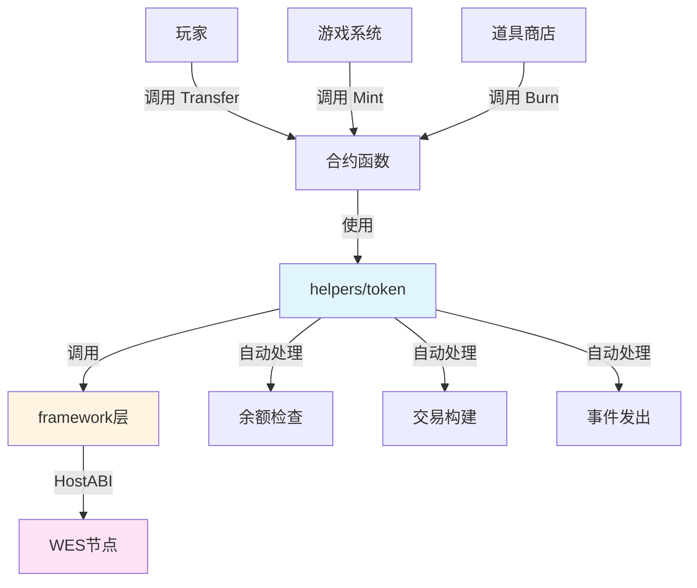

# 游戏货币合约示例

**分类**: Token 代币示例  
**难度**: ⭐⭐ 进阶  
**最后更新**: 2025-11-11

---

## 📋 概述

本示例展示如何使用 WES Contract SDK Go 构建游戏货币合约。游戏货币是一种专门用于游戏内交易的代币，支持游戏内购买、奖励发放等场景。通过本示例，您可以学习如何使用 `helpers/token` 模块实现游戏货币的核心功能。

---

## 🎯 核心功能

本示例实现了完整的游戏货币功能：

| 功能 | 函数 | 说明 |
|------|------|------|
| ✅ **转账** | `Transfer` | 游戏内转账 |
| ✅ **铸造** | `Mint` | 铸造新代币（奖励发放） |
| ✅ **销毁** | `Burn` | 销毁代币（道具购买） |
| ✅ **授权** | `Approve` | 授权其他地址使用代币 |
| ✅ **空投** | `Airdrop` | 批量空投代币（活动奖励） |

---

## 🏗️ 架构设计



**架构说明**：
- **合约层**：开发者编写的合约函数
- **Token层**：业务语义API，自动处理余额检查、交易构建、事件发出
- **Framework层**：HostABI封装，提供基础原语
- **节点层**：WES节点，执行合约并上链

---

## 📚 功能详解

### 1. Transfer - 转账

**功能说明**：使用 `token.Transfer()` 进行游戏内转账。

**参数格式**：
```json
{
  "to": "Df2Lft7toFVfjlKKhsBtLQOQsQbQeRnTn",
  "amount": 100
}
```

**应用场景**：
- 玩家之间的交易
- 游戏内商店购买
- 奖励发放

**使用示例**：
```bash
wes contract call --address {contract_addr} \
  --function Transfer \
  --params '{"to":"Df2Lft7toFVfjlKKhsBtLQOQsQbQeRnTn","amount":100}'
```

---

### 2. Mint - 铸造

**功能说明**：使用 `token.Mint()` 铸造新代币。

**参数格式**：
```json
{
  "to": "Cf1Kes6snEUeykiJJgrAtKPNPrAzPdPmSn",
  "amount": 1000
}
```

**应用场景**：
- 游戏奖励发放
- 任务完成奖励
- 活动奖励

**使用示例**：
```bash
wes contract call --address {contract_addr} \
  --function Mint \
  --params '{"to":"Cf1Kes6snEUeykiJJgrAtKPNPrAzPdPmSn","amount":1000}'
```

---

### 3. Burn - 销毁

**功能说明**：使用 `token.Burn()` 销毁代币。

**参数格式**：
```json
{
  "amount": 500
}
```

**应用场景**：
- 道具购买
- 游戏内消费
- 手续费支付

**使用示例**：
```bash
wes contract call --address {contract_addr} \
  --function Burn \
  --params '{"amount":500}'
```

---

### 4. Approve - 授权

**功能说明**：使用 `token.Approve()` 授权其他地址使用代币。

**参数格式**：
```json
{
  "spender": "Df2Lft7toFVfjlKKhsBtLQOQsQbQeRnTn",
  "amount": 1000
}
```

**应用场景**：
- 授权游戏系统使用代币
- 授权道具商店使用代币

**使用示例**：
```bash
wes contract call --address {contract_addr} \
  --function Approve \
  --params '{"spender":"Df2Lft7toFVfjlKKhsBtLQOQsQbQeRnTn","amount":1000}'
```

---

### 5. Airdrop - 空投

**功能说明**：使用 `token.Airdrop()` 批量空投代币。

**参数格式**：
```json
{
  "recipients": ["Cf1Kes6snEUeykiJJgrAtKPNPrAzPdPmSn", "Df2Lft7toFVfjlKKhsBtLQOQsQbQeRnTn"],
  "amounts": [100, 200]
}
```

**应用场景**：
- 活动奖励发放
- 新用户奖励
- 节日活动

**使用示例**：
```bash
wes contract call --address {contract_addr} \
  --function Airdrop \
  --params '{"recipients":["Cf1Kes6snEUeykiJJgrAtKPNPrAzPdPmSn","Df2Lft7toFVfjlKKhsBtLQOQsQbQeRnTn"],"amounts":[100,200]}'
```

---

## 🚀 快速开始

### 1. 编译合约

```bash
cd token/game-currency
bash build.sh
```

编译完成后会生成 `main.wasm` 文件。

### 2. 部署合约

```bash
# 使用 WES CLI 部署
wes contract deploy --wasm main.wasm
```

### 3. 调用合约

```bash
# 转账
wes contract call --address {contract_addr} \
  --function Transfer \
  --params '{"to":"Df2Lft7toFVfjlKKhsBtLQOQsQbQeRnTn","amount":100}'
```

---

## 📊 SDK vs 应用层职责

| 职责 | SDK 提供 | 应用层实现 |
|------|---------|-----------|
| **转账** | ✅ 自动处理 | - |
| **铸造** | ✅ 自动处理 | - |
| **销毁** | ✅ 自动处理 | - |
| **授权** | ✅ 自动处理 | - |
| **空投** | ✅ 自动处理 | - |
| **铸造权限** | ❌ | ✅ 需要实现（只有游戏系统可以铸造） |
| **总量控制** | ❌ | ✅ 需要实现 |
| **游戏逻辑** | ❌ | ✅ 需要实现（任务完成、奖励计算等） |

---

## 💡 设计理念

### 游戏货币的特点

- ✅ **游戏内交易**：玩家之间的交易
- ✅ **奖励发放**：任务完成、活动奖励
- ✅ **道具购买**：游戏内商店购买

### SDK 提供"积木"

SDK 提供基础能力（Transfer、Mint、Burn、Approve、Airdrop），开发者可以：

- ✅ 直接使用基础功能创建游戏货币
- ✅ 添加业务规则实现定制需求
- ✅ 组合多个功能实现复杂场景

### 应用层搭建"建筑"

应用层在 SDK 基础上实现：

- ✅ 游戏逻辑（任务完成、奖励计算等）
- ✅ 道具商店（使用 Burn 销毁代币购买道具）
- ✅ 活动系统（使用 Airdrop 批量发放奖励）

---

## 🔗 相关文档

- [Token 模块文档](../../helpers/token/README.md) - Token 模块详细说明
- [Framework 文档](../../framework/README.md) - Framework 层说明
- [示例总览](../README.md) - 所有示例索引
- [示例总览](../README.md) - 示例组织结构规划

---

**最后更新**: 2025-11-11
