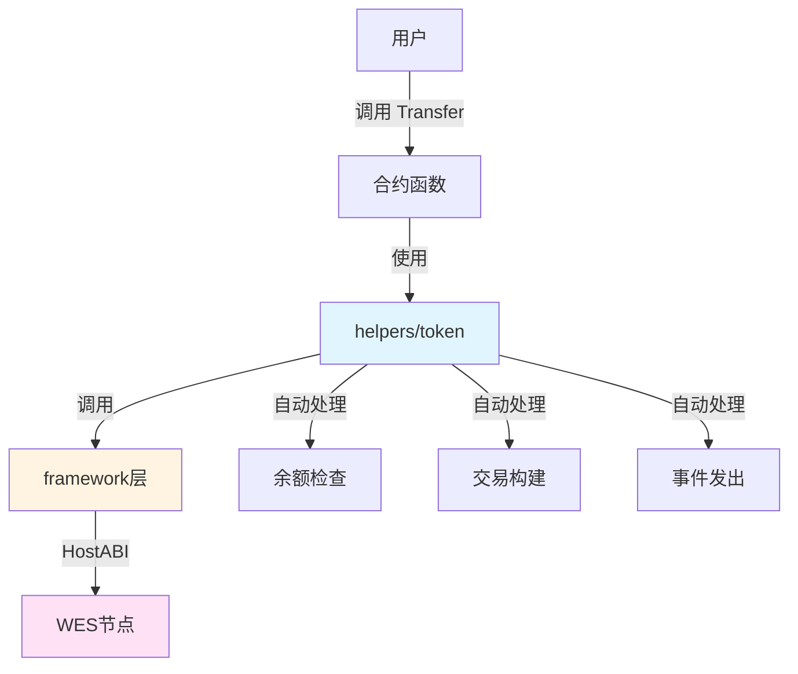

# 支付代币合约示例

**分类**: Token 代币示例  
**难度**: ⭐⭐ 进阶  
**最后更新**: 2025-11-11

---

## 📋 概述

本示例展示如何使用 WES Contract SDK Go 构建支付代币合约。支付代币是一种专门用于支付的代币，具有快速转账、低手续费等特点。通过本示例，您可以学习如何使用 `helpers/token` 模块实现支付代币的核心功能。

---

## 🎯 核心功能

本示例实现了完整的支付代币功能：

| 功能 | 函数 | 说明 |
|------|------|------|
| ✅ **转账** | `Transfer` | 快速转账，适合日常支付 |
| ✅ **铸造** | `Mint` | 铸造新代币 |
| ✅ **销毁** | `Burn` | 销毁代币 |
| ✅ **授权** | `Approve` | 授权其他地址使用代币 |
| ✅ **空投** | `Airdrop` | 批量空投代币 |

---

## 🏗️ 架构设计



**架构说明**：
- **合约层**：开发者编写的合约函数
- **Token层**：业务语义API，自动处理余额检查、交易构建、事件发出
- **Framework层**：HostABI封装，提供基础原语
- **节点层**：WES节点，执行合约并上链

---

## 📚 功能详解

### 1. Transfer - 转账

**功能说明**：使用 `token.Transfer()` 进行快速转账。

**参数格式**：
```json
{
  "to": "Df2Lft7toFVfjlKKhsBtLQOQsQbQeRnTn",
  "amount": 100
}
```

**特点**：
- 快速转账，适合日常支付
- 低手续费
- 自动处理余额检查和找零

**使用示例**：
```bash
wes contract call --address {contract_addr} \
  --function Transfer \
  --params '{"to":"Df2Lft7toFVfjlKKhsBtLQOQsQbQeRnTn","amount":100}'
```

---

### 2. Mint - 铸造

**功能说明**：使用 `token.Mint()` 铸造新代币。

**参数格式**：
```json
{
  "to": "Cf1Kes6snEUeykiJJgrAtKPNPrAzPdPmSn",
  "amount": 1000
}
```

**使用示例**：
```bash
wes contract call --address {contract_addr} \
  --function Mint \
  --params '{"to":"Cf1Kes6snEUeykiJJgrAtKPNPrAzPdPmSn","amount":1000}'
```

---

### 3. Burn - 销毁

**功能说明**：使用 `token.Burn()` 销毁代币。

**参数格式**：
```json
{
  "amount": 500
}
```

**使用示例**：
```bash
wes contract call --address {contract_addr} \
  --function Burn \
  --params '{"amount":500}'
```

---

### 4. Approve - 授权

**功能说明**：使用 `token.Approve()` 授权其他地址使用代币。

**参数格式**：
```json
{
  "spender": "Df2Lft7toFVfjlKKhsBtLQOQsQbQeRnTn",
  "amount": 1000
}
```

**使用示例**：
```bash
wes contract call --address {contract_addr} \
  --function Approve \
  --params '{"spender":"Df2Lft7toFVfjlKKhsBtLQOQsQbQeRnTn","amount":1000}'
```

---

### 5. Airdrop - 空投

**功能说明**：使用 `token.Airdrop()` 批量空投代币。

**参数格式**：
```json
{
  "recipients": ["Cf1Kes6snEUeykiJJgrAtKPNPrAzPdPmSn", "Df2Lft7toFVfjlKKhsBtLQOQsQbQeRnTn"],
  "amounts": [100, 200]
}
```

**使用示例**：
```bash
wes contract call --address {contract_addr} \
  --function Airdrop \
  --params '{"recipients":["Cf1Kes6snEUeykiJJgrAtKPNPrAzPdPmSn","Df2Lft7toFVfjlKKhsBtLQOQsQbQeRnTn"],"amounts":[100,200]}'
```

---

## 🚀 快速开始

### 1. 编译合约

```bash
cd token/payment-token
bash build.sh
```

编译完成后会生成 `main.wasm` 文件。

### 2. 部署合约

```bash
# 使用 WES CLI 部署
wes contract deploy --wasm main.wasm
```

### 3. 调用合约

```bash
# 转账
wes contract call --address {contract_addr} \
  --function Transfer \
  --params '{"to":"Df2Lft7toFVfjlKKhsBtLQOQsQbQeRnTn","amount":100}'
```

---

## 📊 SDK vs 应用层职责

| 职责 | SDK 提供 | 应用层实现 |
|------|---------|-----------|
| **转账** | ✅ 自动处理 | - |
| **铸造** | ✅ 自动处理 | - |
| **销毁** | ✅ 自动处理 | - |
| **授权** | ✅ 自动处理 | - |
| **空投** | ✅ 自动处理 | - |
| **铸造权限** | ❌ | ✅ 需要实现 |
| **总量控制** | ❌ | ✅ 需要实现 |

---

## 💡 设计理念

### 支付代币的特点

- ✅ **快速转账**：适合日常支付场景
- ✅ **低手续费**：降低支付成本
- ✅ **易于使用**：简单的转账接口

### SDK 提供"积木"

SDK 提供基础能力（Transfer、Mint、Burn、Approve、Airdrop），开发者可以：

- ✅ 直接使用基础功能创建支付代币
- ✅ 添加业务规则实现定制需求
- ✅ 组合多个功能实现复杂场景

---

## 🔗 相关文档

- [Token 模块文档](../../helpers/token/README.md) - Token 模块详细说明
- [Framework 文档](../../framework/README.md) - Framework 层说明
- [示例总览](../README.md) - 所有示例索引
- [示例总览](../README.md) - 示例组织结构规划

---

**最后更新**: 2025-11-11
